# Enhanced Chain Summarization Algorithm

## Table of Contents

- [Enhanced Chain Summarization Algorithm](#enhanced-chain-summarization-algorithm)
  - [Table of Contents](#table-of-contents)
  - [Overview](#overview)
  - [Architectural Overview](#architectural-overview)
  - [Fundamental Concepts](#fundamental-concepts)
    - [ChainAST Structure with Size Tracking](#chainast-structure-with-size-tracking)
    - [ChainAST Construction Process](#chainast-construction-process)
    - [Tool Call ID Normalization](#tool-call-id-normalization)
    - [Reasoning Content Cleanup](#reasoning-content-cleanup)
    - [Summarization Types](#summarization-types)
  - [Configuration Parameters](#configuration-parameters)
  - [Algorithm Operation](#algorithm-operation)
  - [Key Algorithm Components](#key-algorithm-components)
    - [1. Section Summarization](#1-section-summarization)
    - [2. Individual Body Pair Size Management](#2-individual-body-pair-size-management)
    - [3. Last Section Rotation](#3-last-section-rotation)
    - [4. QA Pair Management](#4-qa-pair-management)
  - [Summary Generation](#summary-generation)
  - [Helper Functions](#helper-functions)
    - [Content Detection Functions](#content-detection-functions)
  - [Code Architecture](#code-architecture)
  - [Full Process Overview](#full-process-overview)
  - [Usage Example](#usage-example)
  - [Edge Cases and Handling](#edge-cases-and-handling)
  - [Performance Considerations](#performance-considerations)
  - [Limitations](#limitations)

## Overview

The Enhanced Chain Summarization Algorithm manages context growth in conversation chains by selectively summarizing older message content while preserving recent interactions. The algorithm maintains conversation coherence by creating summarized body pairs rather than modifying existing messages. It uses configurable parameters to optimize context retention based on use cases and introduces byte-size tracking for precise content management.

Key features of the enhanced algorithm:

- **Size-aware processing** - Tracks byte size of all content to make optimal retention decisions
- **Section summarization** - Ensures all sections except the last ones consist of a header and a single body pair
- **Last section rotation** - Intelligently manages active conversation sections with size limits
- **QA pair summarization** - Focuses on question-answer sections when enabled
- **Body pair type preservation** - Maintains appropriate type for summarized content based on original types
- **Keep QA Sections** - Preserves a configurable number of recent QA sections without summarization
- **Concurrent processing** - Uses goroutines for efficient parallel summarization of sections and body pairs

## Architectural Overview

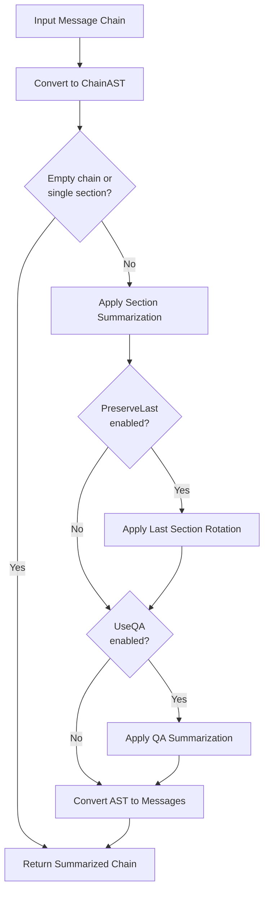

## Fundamental Concepts

### ChainAST Structure with Size Tracking

The algorithm operates on ChainAST structure from the `pentagi/pkg/cast` package that includes size tracking:

```
ChainAST
├── Sections[] (ChainSection)
    ├── Header
    │   ├── SystemMessage (optional)
    │   ├── HumanMessage (optional)
    │   └── Size() method
    ├── Body[] (BodyPair)
    │   ├── Type (Completion | RequestResponse | Summarization)
    │   ├── AIMessage
    │   ├── ToolMessages[] (for RequestResponse type)
    │   └── Size() method
    └── Size() method
```

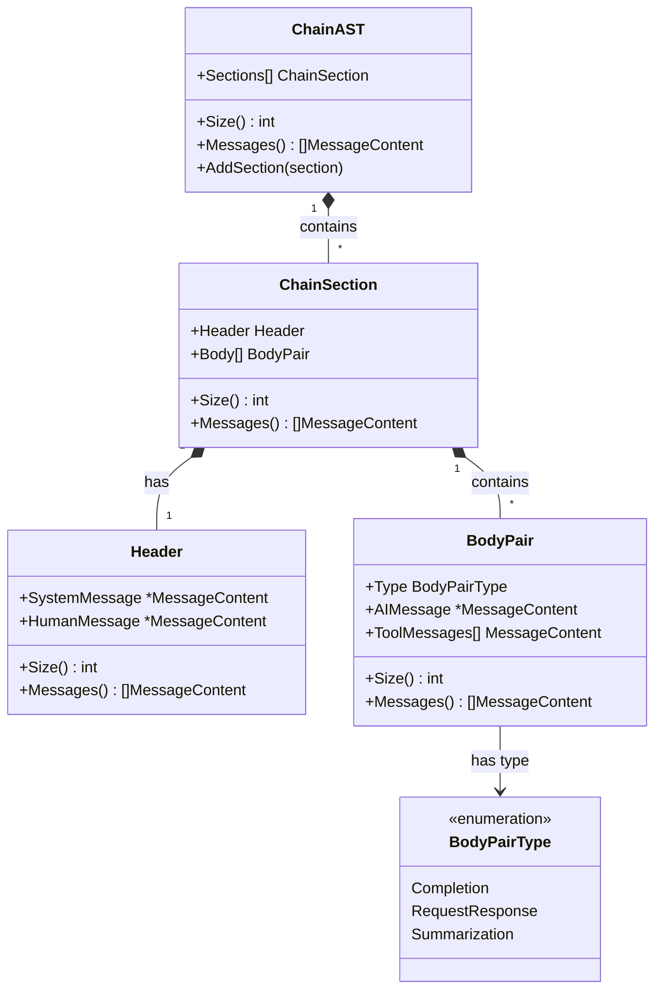

Each component (ChainAST, ChainSection, Header, BodyPair) provides a Size() method that enables precise content management decisions. Size calculation is handled internally by the cast package and considers all content types including text, binary data, and images.

The body pair types are critical for understanding the structure:
- **Completion**: Contains a single AI message with text content
- **RequestResponse**: Contains an AI message with tool calls and corresponding tool response messages
- **Summarization**: Contains a summary of previous messages

The algorithm leverages the cast package's constructor methods to ensure proper size calculation:

```go
// Creating components with automatic size calculation
header := cast.NewHeader(systemMsg, humanMsg)       // New header with size tracking
section := cast.NewChainSection(header, bodyPairs)  // New section with size tracking
summaryPair := cast.NewBodyPairFromCompletion(text)      // New Completion pair with text content
summaryPair := cast.NewBodyPairFromSummarization(text)   // New Summarization pair with text content
```

### ChainAST Construction Process

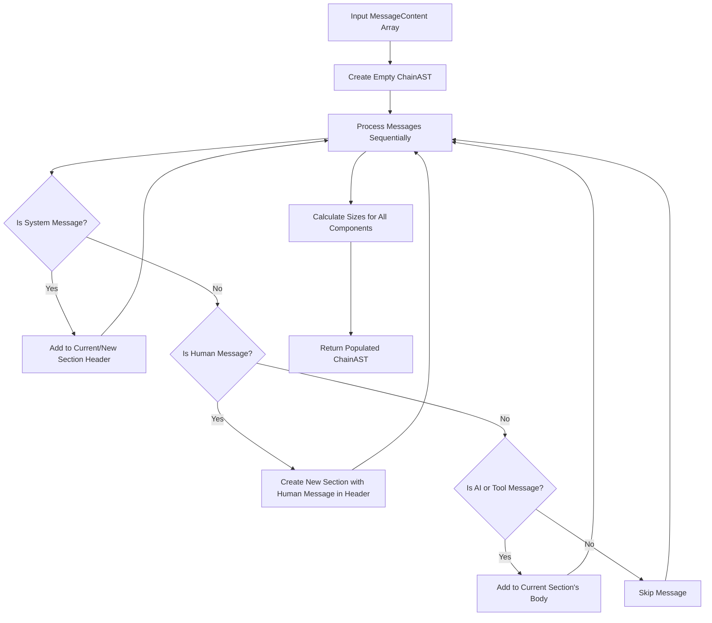

The ChainAST construction process analyzes the roles and types of messages in the chain, grouping them into logical sections with headers and body pairs.

### Tool Call ID Normalization

When switching between different LLM providers (e.g., from Gemini to Anthropic), tool call IDs may have different formats that are incompatible with the new provider's API. The `NormalizeToolCallIDs` method addresses this by validating and replacing incompatible IDs:

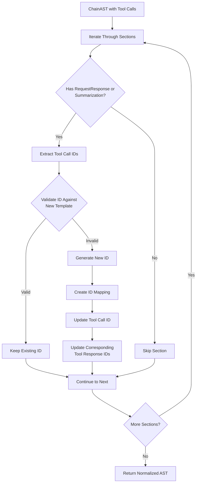

The normalization process:
1. **Validates** each tool call ID against the new provider's template using `ValidatePattern`
2. **Generates** new IDs only for those that don't match the template
3. **Preserves** IDs that already match to avoid unnecessary changes
4. **Updates** both tool calls and their corresponding responses to maintain consistency
5. **Supports** all body pair types: RequestResponse and Summarization

**Example Usage:**

```go
// After restoring a chain that may contain tool calls from a different provider
ast, err := cast.NewChainAST(chain, true)
if err != nil {
    return err
}

// Normalize to new provider's format (e.g., from "call_*" to "toolu_*")
err = ast.NormalizeToolCallIDs("toolu_{r:24:b}")
if err != nil {
    return err
}

// Chain now has compatible tool call IDs
normalizedChain := ast.Messages()
```

**Template Format Examples:**

| Provider | Template Format | Example ID |
|----------|----------------|------------|
| OpenAI/Gemini | `call_{r:24:x}` | `call_abc123def456ghi789jkl` |
| Anthropic | `toolu_{r:24:b}` | `toolu_A1b2C3d4E5f6G7h8I9j0K1l2` |
| Custom | `{prefix}_{r:N:charset}` | Defined per provider |

This feature is critical for assistant providers that may switch between different LLM providers while maintaining conversation history.

### Reasoning Content Cleanup

When switching between providers, reasoning content must also be cleared because it contains provider-specific data:

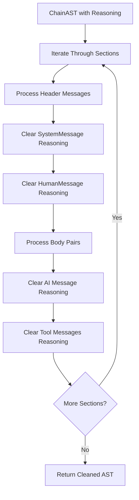

The cleanup process:
1. **Iterates** through all sections, headers, and body pairs
2. **Clears** `Reasoning` field from `TextContent` parts
3. **Clears** `Reasoning` field from `ToolCall` parts
4. **Preserves** all other content (text, arguments, function names, etc.)

**Why this is needed:**
- Reasoning content includes cryptographic signatures (especially Anthropic's extended thinking)
- These signatures are validated by the provider and will fail if sent to a different provider
- Reasoning blocks may contain provider-specific metadata

**Example Usage:**

```go
// After restoring and normalizing a chain
ast, err := cast.NewChainAST(chain, true)
if err != nil {
    return err
}

// First normalize tool call IDs
err = ast.NormalizeToolCallIDs(newTemplate)
if err != nil {
    return err
}

// Then clear provider-specific reasoning
err = ast.ClearReasoning()
if err != nil {
    return err
}

// Chain is now safe to use with the new provider
cleanedChain := ast.Messages()
```

**What gets cleared:**
- `TextContent.Reasoning` - Extended thinking signatures and content
- `ToolCall.Reasoning` - Per-tool reasoning (used by some providers)

**What stays preserved:**
- All text content
- Tool call IDs (after normalization)
- Function names and arguments
- Tool responses

This operation is automatically performed in `restoreChain()` when switching providers, ensuring compatibility across different LLM providers.

### Summarization Types

The algorithm supports three types of summarization:

1. **Section Summarization** - Ensures all sections except the last N ones consist of a header and a single body pair
2. **Last Section Rotation** - Manages size of the last (active) section by summarizing oldest pairs when size limits are exceeded
3. **QA Pair Summarization** - Creates a summary section containing essential question-answer exchanges when enabled

## Configuration Parameters

Summarization behavior is controlled through the `SummarizerConfig` structure:

```go
type SummarizerConfig struct {
    PreserveLast   bool  // Whether to manage the last section size
    UseQA          bool  // Whether to use QA pair summarization
    SummHumanInQA  bool  // Whether to summarize human messages in QA pairs
    LastSecBytes   int   // Maximum byte size for last section
    MaxBPBytes     int   // Maximum byte size for a single body pair
    MaxQASections  int   // Maximum QA pair sections to preserve
    MaxQABytes     int   // Maximum byte size for QA pair sections
    KeepQASections int   // Number of recent QA sections to keep without summarization
}
```

These parameters have default values defined as constants:

| Parameter | Field in SummarizerConfig | Default Constant | Default Value | Description |
|-----------|---------------------------|------------------|---------------|-------------|
| Preserve last section | `PreserveLast` | `preserveAllLastSectionPairs` | true | Whether to manage the last section size |
| Max last section size | `LastSecBytes` | `maxLastSectionByteSize` | 50 KB | Maximum size for the last section |
| Max single body pair size | `MaxBPBytes` | `maxSingleBodyPairByteSize` | 16 KB | Maximum size for a single body pair |
| Use QA summarization | `UseQA` | `useQAPairSummarization` | false | Whether to use QA pair summarization |
| Max QA sections | `MaxQASections` | `maxQAPairSections` | 10 | Maximum QA sections to keep |
| Max QA byte size | `MaxQABytes` | `maxQAPairByteSize` | 64 KB | Maximum size for QA sections |
| Summarize human in QA | `SummHumanInQA` | `summarizeHumanMessagesInQAPairs` | false | Whether to summarize human messages in QA pairs |
| Last section reserve percentage | N/A | `lastSectionReservePercentage` | 25% | Percentage of section size to reserve for future messages |
| Keep QA sections | `KeepQASections` | `keepMinLastQASections` | 1 | Number of most recent QA sections to preserve without summarization |

## Algorithm Operation

The enhanced algorithm operates in these sequential phases:

1. Convert input chain to ChainAST with size tracking
2. Apply section summarization to all sections except the last `KeepQASections` sections (with concurrent processing)
3. Apply last section rotation to multiple recent sections if enabled and size limits are exceeded
4. Apply QA pair summarization if enabled and limits are exceeded
5. Return the modified chain if it saves space

The primary algorithm is implemented through the `Summarizer` interface in the `pentagi/pkg/csum` package:

```go
// Summarizer interface for chain summarization
type Summarizer interface {
    SummarizeChain(
        ctx context.Context,
        handler tools.SummarizeHandler,
        chain []llms.MessageContent,
    ) ([]llms.MessageContent, error)
}

// Implementation is created using the NewSummarizer constructor
func NewSummarizer(config SummarizerConfig) Summarizer {
    // Sets defaults if not specified
    if config.PreserveLast {
        if config.LastSecBytes <= 0 {
            config.LastSecBytes = maxLastSectionByteSize
        }
    }

    if config.UseQA {
        if config.MaxQASections <= 0 {
            config.MaxQASections = maxQAPairSections
        }
        if config.MaxQABytes <= 0 {
            config.MaxQABytes = maxQAPairByteSize
        }
    }

    if config.MaxBPBytes <= 0 {
        config.MaxBPBytes = maxSingleBodyPairByteSize
    }

    if config.KeepQASections <= 0 {
        config.KeepQASections = keepMinLastQASections
    }

    return &summarizer{config: config}
}
```

The main algorithm flow:

```go
// Main algorithm flow
func (s *summarizer) SummarizeChain(
    ctx context.Context,
    handler tools.SummarizeHandler,
    chain []llms.MessageContent,
) ([]llms.MessageContent, error) {
    // Skip summarization for empty chains
    if len(chain) == 0 {
        return chain, nil
    }

    // Create ChainAST with automatic size calculation
    ast, err := cast.NewChainAST(chain, true)
    if err != nil {
        return chain, fmt.Errorf("failed to create ChainAST: %w", err)
    }

    // Apply different summarization strategies sequentially
    cfg := s.config

    // 0. All sections except last KeepQASections should have exactly one body pair
    err = summarizeSections(ctx, ast, handler, cfg.KeepQASections)
    if err != nil {
        return chain, fmt.Errorf("failed to summarize sections: %w", err)
    }

    // 1. Multiple last sections rotation - manage active conversation size
    if cfg.PreserveLast {
        percent := lastSectionReservePercentage
        lastSectionIndexLeft := len(ast.Sections) - 1
        lastSectionIndexRight := len(ast.Sections) - cfg.KeepQASections
        for sdx := lastSectionIndexLeft; sdx >= lastSectionIndexRight && sdx >= 0; sdx-- {
            err = summarizeLastSection(ctx, ast, handler, sdx, cfg.LastSecBytes, cfg.MaxBPBytes, percent)
            if err != nil {
                return chain, fmt.Errorf("failed to summarize last section %d: %w", sdx, err)
            }
        }
    }

    // 2. QA-pair summarization - focus on question-answer sections
    if cfg.UseQA {
        err = summarizeQAPairs(ctx, ast, handler, cfg.MaxQASections, cfg.MaxQABytes, cfg.SummHumanInQA)
        if err != nil {
            return chain, fmt.Errorf("failed to summarize QA pairs: %w", err)
        }
    }

    return ast.Messages(), nil
}
```

## Key Algorithm Components

### 1. Section Summarization

For all sections except the last `KeepQASections` sections, ensure they consist of a header and a single body pair:

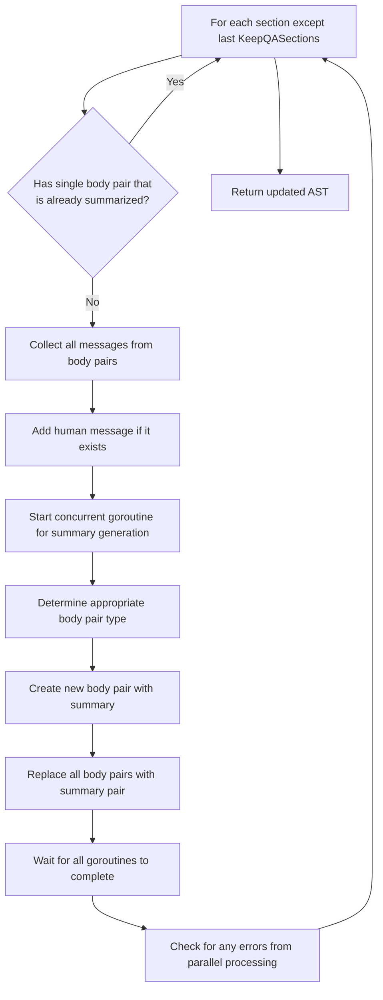

```go
// Summarize all sections except the last KeepQASections ones
func summarizeSections(
    ctx context.Context,
    ast *cast.ChainAST,
    handler tools.SummarizeHandler,
    keepQASections int,
) error {
    // Concurrent processing of sections summarization
    mx := sync.Mutex{}
    wg := sync.WaitGroup{}
    ch := make(chan error, max(len(ast.Sections)-keepQASections, 0))
    defer close(ch)

    // Process all sections except the last KeepQASections ones
    for i := 0; i < len(ast.Sections)-keepQASections; i++ {
        section := ast.Sections[i]

        // Skip if section already has just one of Summarization or Completion body pair
        if len(section.Body) == 1 && containsSummarizedContent(section.Body[0]) {
            continue
        }

        // Collect all messages from body pairs for summarization
        var messagesToSummarize []llms.MessageContent
        for _, pair := range section.Body {
            pairMessages := pair.Messages()
            messagesToSummarize = append(messagesToSummarize, pairMessages...)
        }

        // Skip if no messages to summarize
        if len(messagesToSummarize) == 0 {
            continue
        }

        // Add human message if it exists
        var humanMessages []llms.MessageContent
        if section.Header.HumanMessage != nil {
            humanMessages = append(humanMessages, *section.Header.HumanMessage)
        }

        wg.Add(1)
        go func(section *cast.ChainSection, i int) {
            defer wg.Done()

            // Generate summary
            summaryText, err := GenerateSummary(ctx, handler, humanMessages, messagesToSummarize)
            if err != nil {
                ch <- fmt.Errorf("section %d summary generation failed: %w", i, err)
                return
            }

            // Create an appropriate body pair based on the section type
            var summaryPair *cast.BodyPair
            switch t := determineTypeToSummarizedSection(section); t {
            case cast.Summarization:
                summaryPair = cast.NewBodyPairFromSummarization(summaryText)
            case cast.Completion:
                summaryPair = cast.NewBodyPairFromCompletion(SummarizedContentPrefix + summaryText)
            default:
                ch <- fmt.Errorf("invalid summarized section type: %d", t)
                return
            }

            mx.Lock()
            defer mx.Unlock()

            // Replace all body pairs with just the summary pair
            newSection := cast.NewChainSection(section.Header, []*cast.BodyPair{summaryPair})
            ast.Sections[i] = newSection
        }(section, i)
    }

    wg.Wait()

    // Check for any errors
    errs := make([]error, 0, len(ch))
    for edx := 0; edx < len(ch); edx++ {
        errs = append(errs, <-ch)
    }

    if len(errs) > 0 {
        return fmt.Errorf("failed to summarize sections: %w", errors.Join(errs...))
    }

    return nil
}
```

The `determineTypeToSummarizedSection` function decides which type to use for the summarized content based on the original section's body pair types:

```go
// determineTypeToSummarizedSection determines the type of each body pair to summarize
// based on the type of the body pairs in the section
// if all body pairs are Completion, return Completion, otherwise return Summarization
func determineTypeToSummarizedSection(section *cast.ChainSection) cast.BodyPairType {
    summarizedType := cast.Completion
    for _, pair := range section.Body {
        if pair.Type == cast.Summarization || pair.Type == cast.RequestResponse {
            summarizedType = cast.Summarization
            break
        }
    }

    return summarizedType
}
```

### 2. Individual Body Pair Size Management

Before handling the overall last section size, manage individual oversized body pairs:

**CRITICAL**: The last body pair in a section is **NEVER** summarized to preserve reasoning signatures required by providers like Gemini (thought_signature) and Anthropic (cryptographic signatures). Summarizing the last pair would remove these signatures and cause API errors.

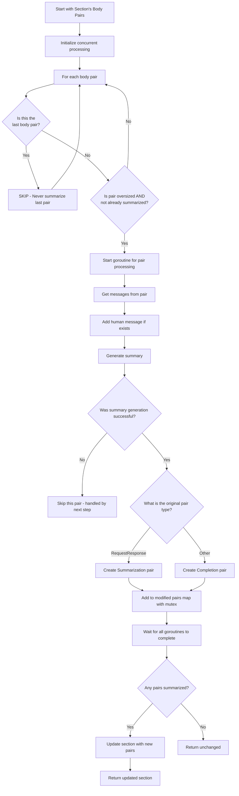

```go
// Handle oversized individual body pairs
func summarizeOversizedBodyPairs(
    ctx context.Context,
    section *cast.ChainSection,
    handler tools.SummarizeHandler,
    maxBodyPairBytes int,
    tcIDTemplate string,
) error {
    if len(section.Body) == 0 {
        return nil
    }

    // Concurrent processing of body pairs summarization
    // CRITICAL: Never summarize the last body pair to preserve reasoning signatures
    mx := sync.Mutex{}
    wg := sync.WaitGroup{}

    // Map of body pairs that have been summarized
    bodyPairsSummarized := make(map[int]*cast.BodyPair)

    // Process each body pair EXCEPT the last one
    for i, pair := range section.Body {
        // Always skip the last body pair to preserve reasoning signatures
        if i == len(section.Body)-1 {
            continue
        }

        // Skip pairs that are already summarized content or under the size limit
        if pair.Size() <= maxBodyPairBytes || containsSummarizedContent(pair) {
            continue
        }

        // Convert to messages
        pairMessages := pair.Messages()
        if len(pairMessages) == 0 {
            continue
        }

        // Add human message if it exists
        var humanMessages []llms.MessageContent
        if section.Header.HumanMessage != nil {
            humanMessages = append(humanMessages, *section.Header.HumanMessage)
        }

        wg.Add(1)
        go func(pair *cast.BodyPair, i int) {
            defer wg.Done()

            // Generate summary
            summaryText, err := GenerateSummary(ctx, handler, humanMessages, pairMessages)
            if err != nil {
                return // It's should collected next step in summarizeLastSection function
            }

            mx.Lock()
            defer mx.Unlock()

            // Create a new Summarization or Completion body pair with the summary
            // If the pair is a Completion, we need to create a new Completion pair
            // If the pair is a RequestResponse, we need to create a new Summarization pair
            if pair.Type == cast.RequestResponse {
                bodyPairsSummarized[i] = cast.NewBodyPairFromSummarization(summaryText)
            } else {
                bodyPairsSummarized[i] = cast.NewBodyPairFromCompletion(SummarizedContentPrefix + summaryText)
            }
        }(pair, i)
    }

    wg.Wait()

    // If any pairs were summarized, create a new section with the updated body
    // This ensures proper size calculation
    if len(bodyPairsSummarized) > 0 {
        for i, pair := range bodyPairsSummarized {
            section.Body[i] = pair
        }
        newSection := cast.NewChainSection(section.Header, section.Body)
        *section = *newSection
    }

    return nil
}
```

### 3. Last Section Rotation

For the specified section (which can be any of the last N sections in the active conversation), when it exceeds size limits:

**CRITICAL PRESERVATION RULE**: The last (most recent) body pair in a section is **ALWAYS** kept without summarization. This ensures:
1. **Reasoning signatures** (Gemini's thought_signature, Anthropic's cryptographic signatures) are preserved
2. **Latest tool calls** maintain their complete context including thinking content
3. **API compatibility** when the chain continues with the same provider

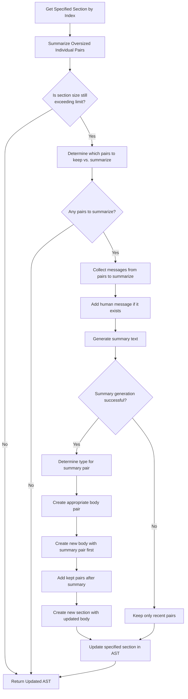

```go
// Manage specified section rotation when it exceeds size limit
func summarizeLastSection(
    ctx context.Context,
    ast *cast.ChainAST,
    handler tools.SummarizeHandler,
    numLastSection int,
    maxLastSectionBytes int,
    maxSingleBodyPairBytes int,
    reservePercent int,
) error {
    // Prevent out of bounds access
    if numLastSection >= len(ast.Sections) || numLastSection < 0 {
        return nil
    }

    lastSection := ast.Sections[numLastSection]

    // 1. First, handle oversized individual body pairs
    err := summarizeOversizedBodyPairs(ctx, lastSection, handler, maxSingleBodyPairBytes)
    if err != nil {
        return fmt.Errorf("failed to summarize oversized body pairs: %w", err)
    }

    // 2. If section is still under size limit, keep everything
    if lastSection.Size() <= maxLastSectionBytes {
        return nil
    }

    // 3. Determine which pairs to keep and which to summarize
    pairsToKeep, pairsToSummarize := determineLastSectionPairs(lastSection, maxLastSectionBytes, reservePercent)

    // 4. If we have pairs to summarize, create a summary
    if len(pairsToSummarize) > 0 {
        // Convert pairs to messages for summarization
        var messagesToSummarize []llms.MessageContent
        for _, pair := range pairsToSummarize {
            messagesToSummarize = append(messagesToSummarize, pair.Messages()...)
        }

        // Add human message if it exists
        var humanMessages []llms.MessageContent
        if lastSection.Header.HumanMessage != nil {
            humanMessages = append(humanMessages, *lastSection.Header.HumanMessage)
        }

        // Generate summary
        summaryText, err := GenerateSummary(ctx, handler, humanMessages, messagesToSummarize)
        if err != nil {
            // If summary generation fails, just keep the most recent messages
            lastSection.Body = pairsToKeep
            return fmt.Errorf("last section summary generation failed: %w", err)
        }

        // Create a body pair with appropriate type
        var summaryPair *cast.BodyPair
        sectionToSummarize := cast.NewChainSection(lastSection.Header, pairsToSummarize)
        switch t := determineTypeToSummarizedSection(sectionToSummarize); t {
        case cast.Summarization:
            summaryPair = cast.NewBodyPairFromSummarization(summaryText)
        case cast.Completion:
            summaryPair = cast.NewBodyPairFromCompletion(SummarizedContentPrefix + summaryText)
        default:
            return fmt.Errorf("invalid summarized section type: %d", t)
        }

        // Replace the body with summary pair followed by kept pairs
        newBody := []*cast.BodyPair{summaryPair}
        newBody = append(newBody, pairsToKeep...)

        // Create a new section with the same header but new body pairs
        newSection := cast.NewChainSection(lastSection.Header, newBody)

        // Update the specified section
        ast.Sections[numLastSection] = newSection
    }

    return nil
}
```

The `determineLastSectionPairs` function is a critical piece that decides which pairs to keep and which to summarize:

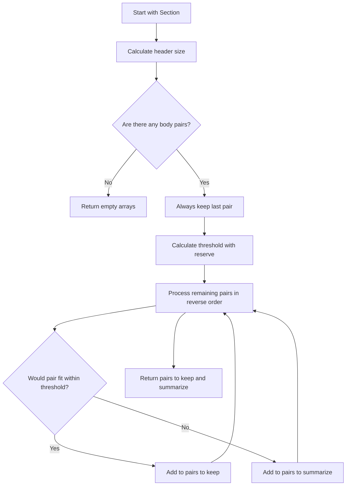

```go
// determineLastSectionPairs splits the last section's pairs into those to keep and those to summarize
func determineLastSectionPairs(
    section *cast.ChainSection,
    maxBytes int,
    reservePercent int,
) ([]*cast.BodyPair, []*cast.BodyPair) {
    // Implementation details...
    // Returns two slices: pairsToKeep and pairsToSummarize
}
```

### 4. QA Pair Management

When QA pair summarization is enabled:

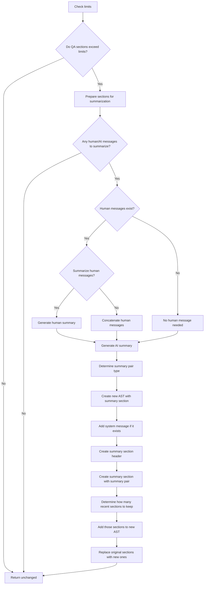

```go
// QA pair summarization function
func summarizeQAPairs(
    ctx context.Context,
    ast *cast.ChainAST,
    handler tools.SummarizeHandler,
    maxQASections int,
    maxQABytes int,
    summarizeHuman bool,
) error {
    // Skip if limits aren't exceeded
    if !exceedsQASectionLimits(ast, maxQASections, maxQABytes) {
        return nil
    }

    // Identify sections to summarize
    humanMessages, aiMessages := prepareQASectionsForSummarization(ast, maxQASections, maxQABytes)
    if len(humanMessages) == 0 && len(aiMessages) == 0 {
        return nil
    }

    // Generate human message summary if it exists and needed
    var humanMsg *llms.MessageContent
    if len(humanMessages) > 0 {
        if summarizeHuman {
            humanSummary, err := GenerateSummary(ctx, handler, humanMessages, nil)
            if err != nil {
                return fmt.Errorf("QA (human) summary generation failed: %w", err)
            }
            msg := llms.TextParts(llms.ChatMessageTypeHuman, humanSummary)
            humanMsg = &msg
        } else {
            humanMsg = &llms.MessageContent{
                Role: llms.ChatMessageTypeHuman,
            }
            for _, msg := range humanMessages {
                humanMsg.Parts = append(humanMsg.Parts, msg.Parts...)
            }
        }
    }

    // Generate summary
    aiSummary, err := GenerateSummary(ctx, handler, humanMessages, aiMessages)
    if err != nil {
        return fmt.Errorf("QA (ai) summary generation failed: %w", err)
    }

    // Create a new AST with summary + recent sections
    sectionsToKeep := determineRecentSectionsToKeep(ast, maxQASections, maxQABytes)

    // Create a summarization body pair with the generated summary
    var summaryPair *cast.BodyPair
    sectionsToSummarize := ast.Sections[:len(ast.Sections)-sectionsToKeep]
    switch t := determineTypeToSummarizedSections(sectionsToSummarize); t {
    case cast.Summarization:
        summaryPair = cast.NewBodyPairFromSummarization(aiSummary)
    case cast.Completion:
        summaryPair = cast.NewBodyPairFromCompletion(SummarizedContentPrefix + aiSummary)
    default:
        return fmt.Errorf("invalid summarized section type: %d", t)
    }

    // Create a new AST
    newAST := &cast.ChainAST{
        Sections: make([]*cast.ChainSection, 0, sectionsToKeep+1), // +1 for summary section
    }

    // Add the summary section (with system message if it exists)
    var systemMsg *llms.MessageContent
    if len(ast.Sections) > 0 && ast.Sections[0].Header.SystemMessage != nil {
        systemMsg = ast.Sections[0].Header.SystemMessage
    }

    summaryHeader := cast.NewHeader(systemMsg, humanMsg)
    summarySection := cast.NewChainSection(summaryHeader, []*cast.BodyPair{summaryPair})
    newAST.AddSection(summarySection)

    // Add the most recent sections that should be kept
    totalSections := len(ast.Sections)
    if sectionsToKeep > 0 && totalSections > 0 {
        for i := totalSections - sectionsToKeep; i < totalSections; i++ {
            // Copy the section but ensure no system message (already added in summary section)
            section := ast.Sections[i]
            newHeader := cast.NewHeader(nil, section.Header.HumanMessage)
            newSection := cast.NewChainSection(newHeader, section.Body)
            newAST.AddSection(newSection)
        }
    }

    // Replace the original AST with the new one
    ast.Sections = newAST.Sections

    return nil
}
```

## Summary Generation

The algorithm uses a `GenerateSummary` function to create summaries:

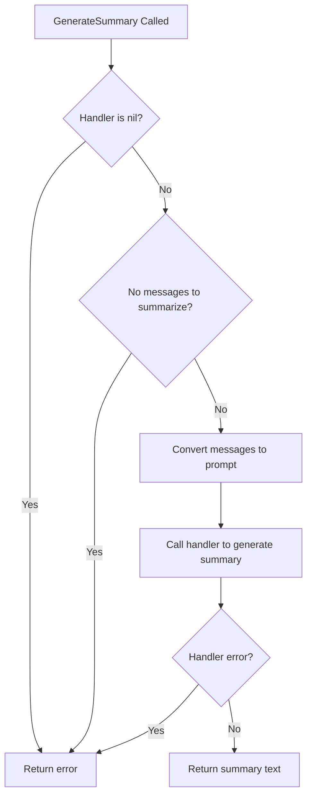

```go
// GenerateSummary generates a summary of the provided messages
func GenerateSummary(
    ctx context.Context,
    handler tools.SummarizeHandler,
    humanMessages []llms.MessageContent,
    aiMessages []llms.MessageContent,
) (string, error) {
    if handler == nil {
        return "", fmt.Errorf("summarizer handler cannot be nil")
    }

    if len(humanMessages) == 0 && len(aiMessages) == 0 {
        return "", fmt.Errorf("cannot summarize empty message list")
    }

    // Convert messages to text format optimized for summarization
    text := messagesToPrompt(humanMessages, aiMessages)

    // Generate the summary using provided summarizer handler
    summary, err := handler(ctx, text)
    if err != nil {
        return "", fmt.Errorf("summarization failed: %w", err)
    }

    return summary, nil
}
```

The `messagesToPrompt` function handles different summarization scenarios:

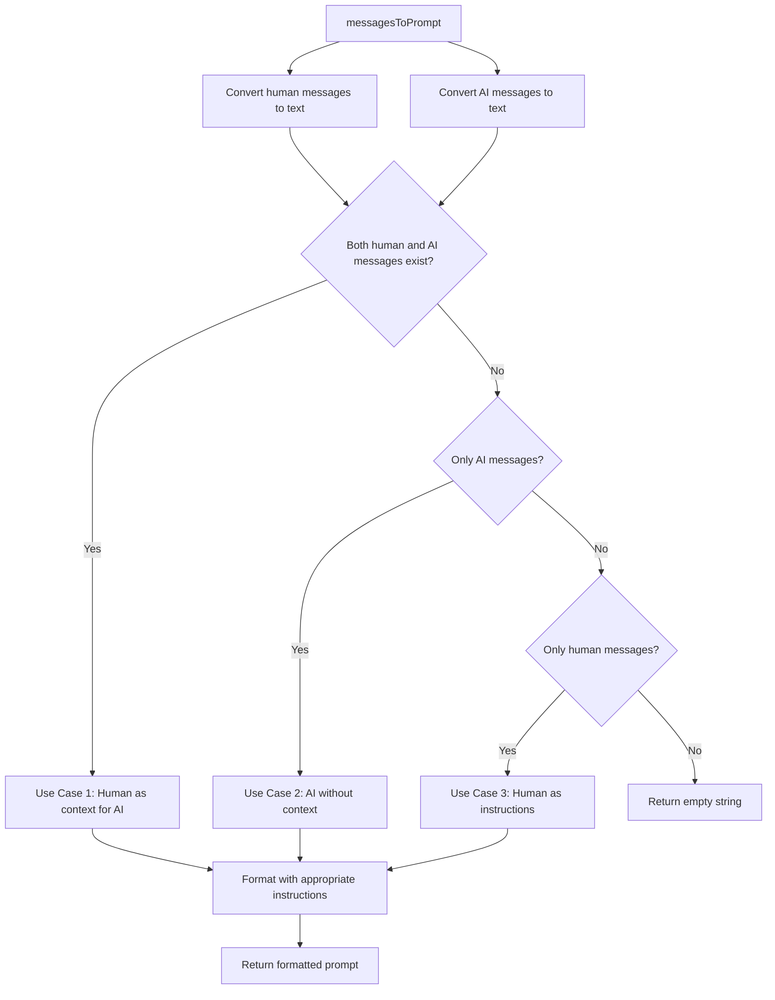

```go
// messagesToPrompt converts a slice of messages to a text representation
func messagesToPrompt(humanMessages []llms.MessageContent, aiMessages []llms.MessageContent) string {
    var buffer strings.Builder

    humanMessagesText := humanMessagesToText(humanMessages)
    aiMessagesText := aiMessagesToText(aiMessages)

    // Different cases based on available messages
    // case 1: use human messages as a context for ai messages
    if len(humanMessages) > 0 && len(aiMessages) > 0 {
        instructions := getSummarizationInstructions(1)
        buffer.WriteString(fmt.Sprintf("<instructions>%s</instructions>\n\n", instructions))
        buffer.WriteString(humanMessagesText)
        buffer.WriteString(aiMessagesText)
    }

    // case 2: use ai messages as a content to summarize without context
    if len(aiMessages) > 0 && len(humanMessages) == 0 {
        instructions := getSummarizationInstructions(2)
        buffer.WriteString(fmt.Sprintf("<instructions>%s</instructions>\n\n", instructions))
        buffer.WriteString(aiMessagesText)
    }

    // case 3: use human messages as a instructions to summarize them
    if len(humanMessages) > 0 && len(aiMessages) == 0 {
        instructions := getSummarizationInstructions(3)
        buffer.WriteString(fmt.Sprintf("<instructions>%s</instructions>\n\n", instructions))
        buffer.WriteString(humanMessagesText)
    }

    return buffer.String()
}
```

The algorithm includes detailed instructions for each summarization scenario through the `getSummarizationInstructions` function, which ensures appropriate summaries for different contexts.

## Helper Functions

The algorithm includes several important helper functions that support the summarization process:

### Content Detection Functions

```go
// containsSummarizedContent checks if a body pair contains summarized content
// Local helper function to avoid naming conflicts with test utilities
func containsSummarizedContent(pair *cast.BodyPair) bool {
    if pair == nil {
        return false
    }

    switch pair.Type {
    case cast.Summarization:
        return true
    case cast.RequestResponse:
        return false
    case cast.Completion:
        if pair.AIMessage == nil || len(pair.AIMessage.Parts) == 0 {
            return false
        }

        textContent, ok := pair.AIMessage.Parts[0].(llms.TextContent)
        if !ok {
            return false
        }

        if strings.HasPrefix(textContent.Text, SummarizedContentPrefix) {
            return true
        }

        return false
    default:
        return false
    }
}
```

This function is crucial for:
- **Avoiding double summarization**: Prevents already summarized content from being summarized again
- **Type-aware detection**: Handles different body pair types appropriately
- **Content prefix detection**: Recognizes summarized content by checking for the `SummarizedContentPrefix` marker
- **Robust checking**: Safely handles nil values and missing content

The function replaces the previous logic that only checked for `cast.Summarization` type, providing more comprehensive detection of summarized content across all body pair types.

## Code Architecture

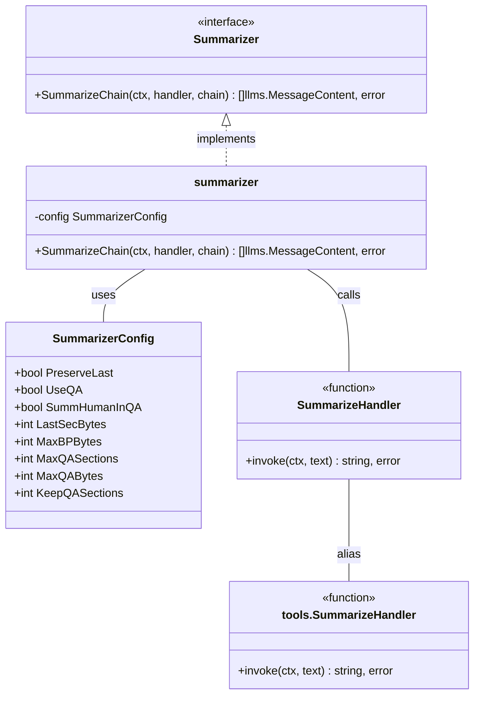

The algorithm is implemented through the `Summarizer` interface in the `pentagi/pkg/csum` package, which provides the `SummarizeChain` method. The implementation leverages the `ChainAST` structure from the `pentagi/pkg/cast` package for managing the chain structure.

## Full Process Overview

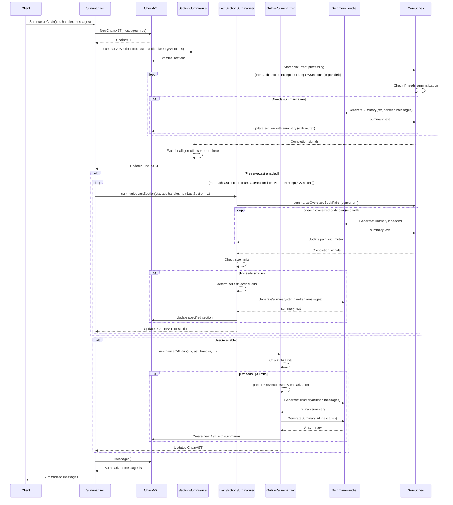

## Usage Example

```go
// Create a summarizer with custom configuration
config := csum.SummarizerConfig{
    PreserveLast:   true,
    LastSecBytes:   40 * 1024,
    MaxBPBytes:     16 * 1024,
    UseQA:          true,
    MaxQASections:  5,
    MaxQABytes:     30 * 1024,
    SummHumanInQA:  false,
    KeepQASections: 2,
}
summarizer := csum.NewSummarizer(config)

// Define a summary handler function
summaryHandler := func(ctx context.Context, text string) (string, error) {
    // Use your preferred LLM or summarization method here
    return llmClient.Summarize(ctx, text)
}

// Apply summarization to a message chain
newChain, err := summarizer.SummarizeChain(ctx, summaryHandler, originalChain)
if err != nil {
    log.Fatalf("Failed to summarize chain: %v", err)
}

// Use the summarized chain
for _, msg := range newChain {
    fmt.Printf("[%s] %s\n", msg.Role, getMessageText(msg))
}
```

## Edge Cases and Handling

| Edge Case | Handling Strategy |
|-----------|-------------------|
| Empty chain | Return unchanged immediately without processing |
| Very short chains | Return unchanged after section count check |
| Single section chains | Return unchanged after section count check |
| Empty sections to process | Skip summarization |
| Last section over size limit | Create a new section with summary pair followed by recent pairs |
| QA pairs over limit | Create summary section and keep most recent sections |
| KeepQASections larger than number of sections | No summarization performed, preserves all sections |
| Summary generation fails | Keep the most recent content and log the error |
| Chain with already summarized content | Detected during processing and handled appropriately |

## Performance Considerations

1. **Token Efficiency**
   - Summarization creates body pairs that reduce overall token count
   - Size-aware decisions prevent context growth while maintaining conversation coherence
   - Multiple last section rotation prevents unbounded growth in active conversations
   - Individual oversized pair handling prevents single large pairs from affecting summarization decisions
   - KeepQASections parameter preserves recent context while summarizing older content

2. **Memory Efficiency**
   - Leverages cast package's size tracking for precise memory management
   - Creates new components only when needed (using constructors)
   - Uses Messages() methods to extract content without duplication

3. **Processing Optimization**
   - **Concurrent Processing**: Uses goroutines for parallel summarization of sections and body pairs, significantly improving performance for large chains
   - **Error Handling**: Robust error collection and handling from parallel operations using channels and error joining
   - Short-circuit logic avoids unnecessary processing for simple chains
   - Handles empty or single-section chains efficiently
   - Uses built-in size tracking methods rather than recalculating sizes
   - Selective summarization with KeepQASections avoids redundant processing
   - **Multiple Last Sections**: Processes multiple recent sections in sequence for better active conversation management

## Limitations

1. **Semantic Coherence**
   - Quality of summaries depends entirely on the provided summarizer handler
   - Summarized content may lose detailed reasoning or discussion context

2. **Content Processing**
   - Binary and image content has size tracked but content isn't semantically analyzed
   - Tool calls and responses are included in text representation for summarization

3. **Implementation Considerations**
   - Depends on ChainAST's accuracy for section and message management
   - API changes in the cast package may require updates to summarization code
   - KeepQASections parameter may need balancing between context preservation and token efficiency
