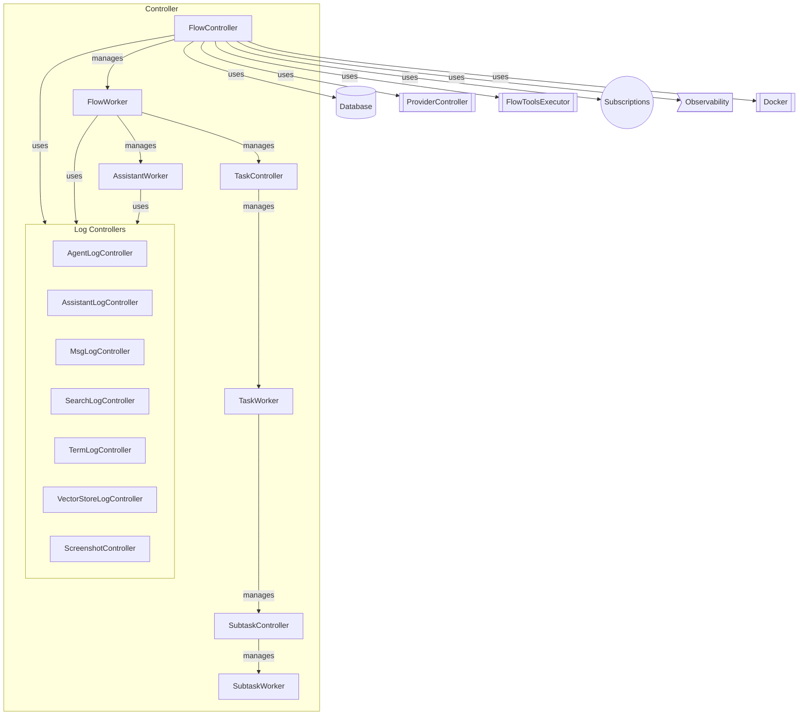
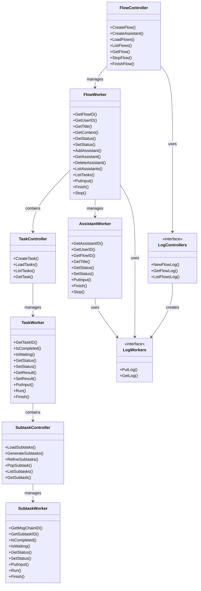
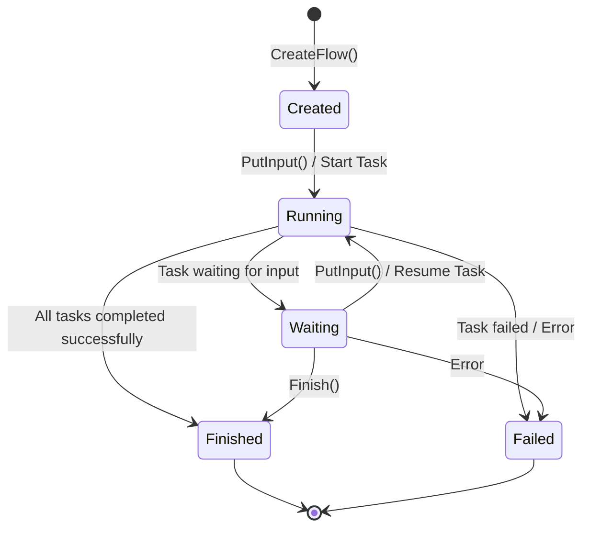
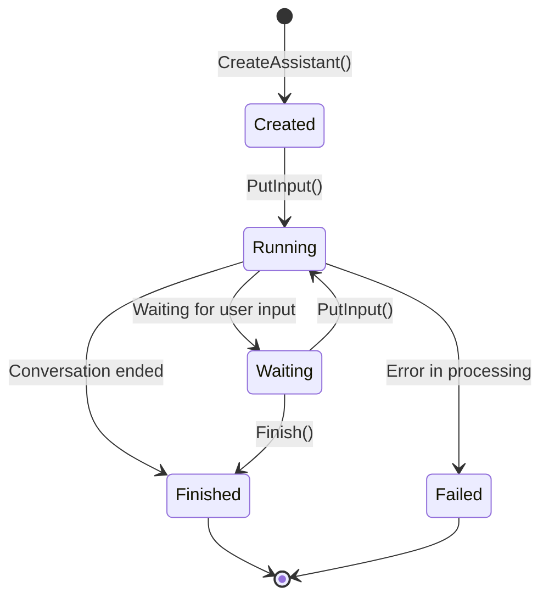
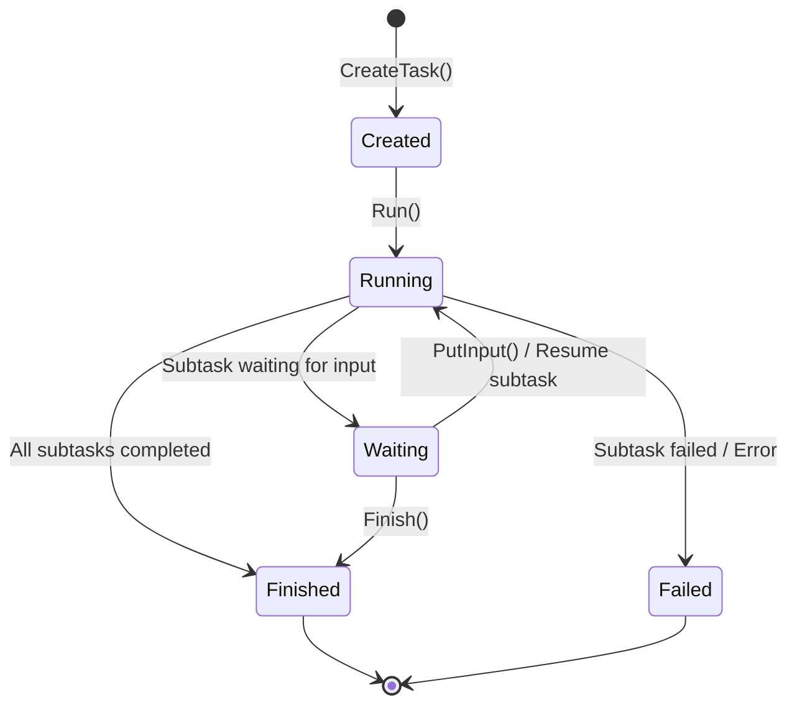
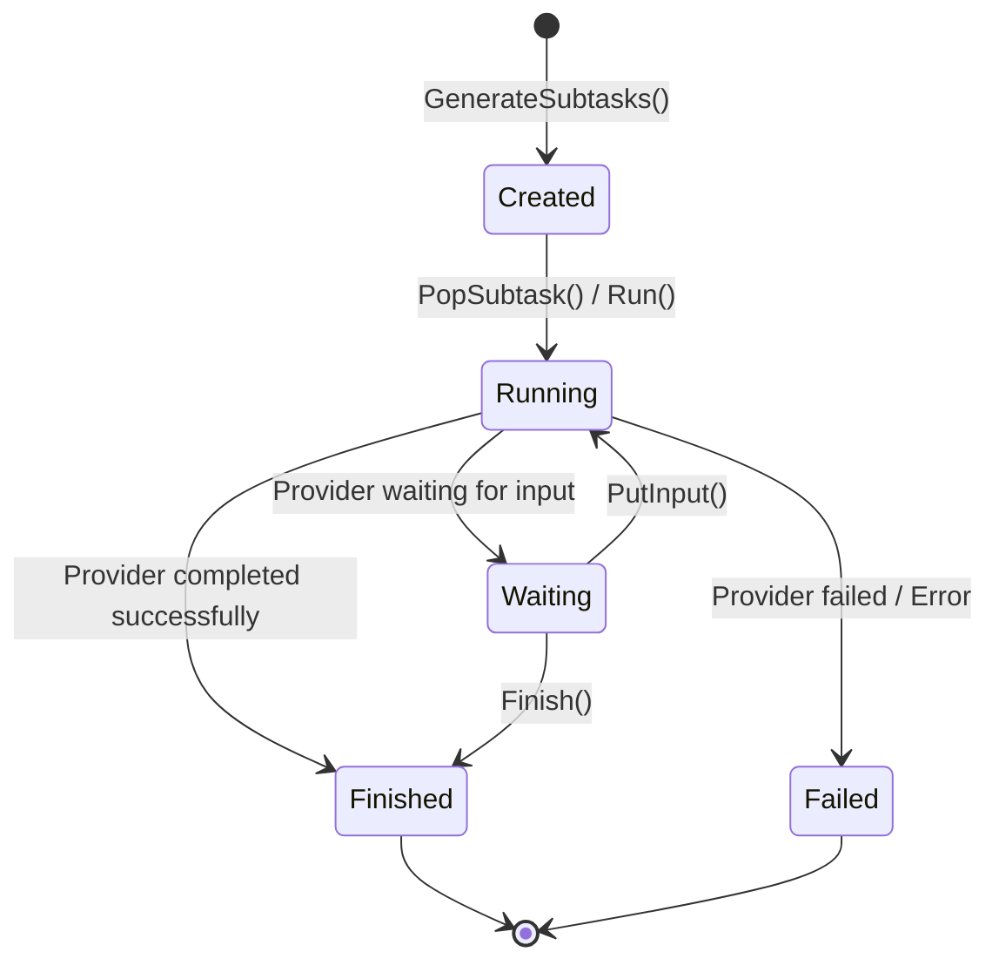
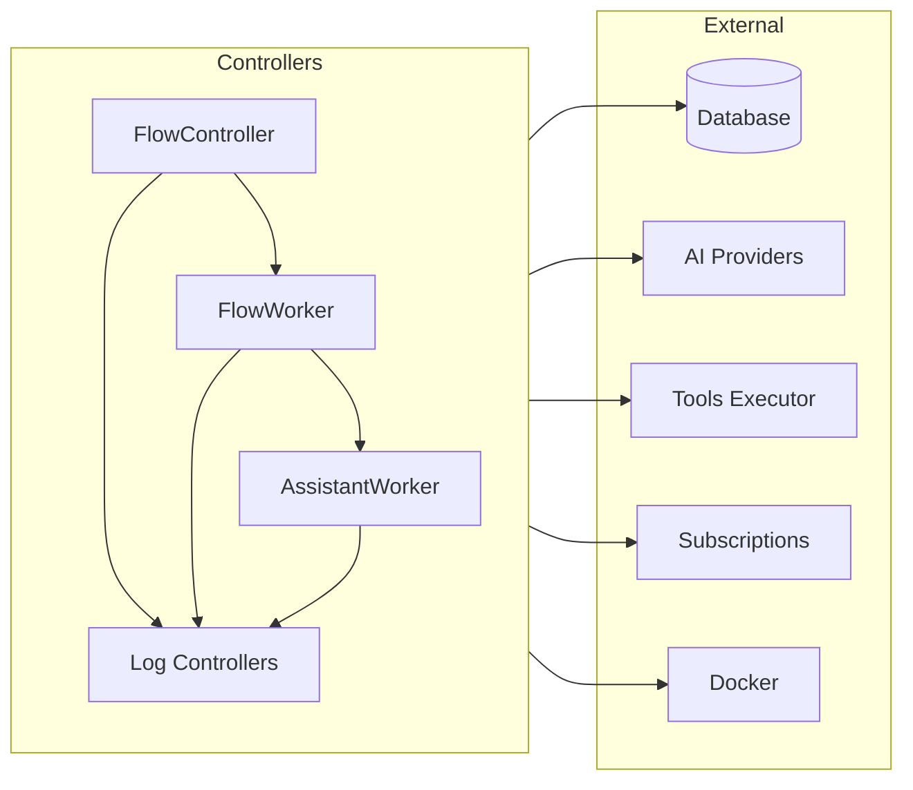

# Controller Package Documentation

## Table of Contents

- [Controller Package Documentation](#controller-package-documentation)
  - [Table of Contents](#table-of-contents)
  - [Overview and Role in the System](#overview-and-role-in-the-system)
    - [Key Responsibilities](#key-responsibilities)
    - [Architectural Integration](#architectural-integration)
      - [High-Level Architecture](#high-level-architecture)
    - [Role in the System](#role-in-the-system)
  - [Core Concepts and Main Interfaces](#core-concepts-and-main-interfaces)
    - [Main Interfaces and Their Hierarchy](#main-interfaces-and-their-hierarchy)
      - [Flow Management](#flow-management)
      - [Assistant Management](#assistant-management)
      - [Task and Subtask Management](#task-and-subtask-management)
      - [Log Management](#log-management)
        - [Agent Logs](#agent-logs)
        - [Assistant Logs](#assistant-logs)
        - [Message Logs](#message-logs)
        - [Search Logs](#search-logs)
        - [Terminal Logs](#terminal-logs)
        - [Vector Store Logs](#vector-store-logs)
        - [Screenshots](#screenshots)
      - [Supporting Types and Constants](#supporting-types-and-constants)
    - [Interface Hierarchy Diagram](#interface-hierarchy-diagram)
  - [Entity Lifecycle and State Management](#entity-lifecycle-and-state-management)
    - [Flow Lifecycle](#flow-lifecycle)
      - [States](#states)
      - [State Transitions](#state-transitions)
      - [State Management](#state-management)
      - [State Diagram](#state-diagram)
    - [Assistant Lifecycle](#assistant-lifecycle)
      - [States](#states-1)
      - [State Transitions](#state-transitions-1)
      - [State Management](#state-management-1)
    - [Task Lifecycle](#task-lifecycle)
      - [States](#states-2)
      - [State Transitions](#state-transitions-2)
      - [State Management](#state-management-2)
    - [Subtask Lifecycle](#subtask-lifecycle)
      - [States](#states-3)
      - [State Transitions](#state-transitions-3)
      - [State Management](#state-management-3)
    - [Error Handling and Event Publication](#error-handling-and-event-publication)
    - [Example: State Transition (Task)](#example-state-transition-task)
  - [Log Management and Event Publication](#log-management-and-event-publication)
    - [Log Types and Their Roles](#log-types-and-their-roles)
    - [Log Lifecycle and Operations](#log-lifecycle-and-operations)
      - [Special Features](#special-features)
    - [Event Publication](#event-publication)
    - [Log Worker Creation and Management](#log-worker-creation-and-management)
  - [Integration with Providers, Tools, and Subscriptions](#integration-with-providers-tools-and-subscriptions)
    - [Providers Integration](#providers-integration)
    - [Tools Integration](#tools-integration)
    - [Subscriptions and Event Publication](#subscriptions-and-event-publication)
    - [Dependency Injection and Context Propagation](#dependency-injection-and-context-propagation)
    - [Integration Flow Diagrams](#integration-flow-diagrams)
  - [Internal Structure and Concurrency Model](#internal-structure-and-concurrency-model)
    - [Mutex Usage and Thread Safety](#mutex-usage-and-thread-safety)
      - [Example: Controller Mutex Usage](#example-controller-mutex-usage)
      - [Example: Worker Mutex Usage](#example-worker-mutex-usage)
    - [State Storage and Management](#state-storage-and-management)
    - [Worker Goroutines and Channels](#worker-goroutines-and-channels)
      - [Assistant Streaming Example](#assistant-streaming-example)
  - [Extensibility, Error Handling, and Best Practices](#extensibility-error-handling-and-best-practices)
    - [Extensibility](#extensibility)
      - [Adding New Log Types](#adding-new-log-types)
    - [Error Handling](#error-handling)
      - [Error Handling Example](#error-handling-example)
    - [Best Practices](#best-practices)

## Overview and Role in the System

The `controller` package is a central part of the backend architecture, responsible for orchestrating the lifecycle and logic of flows, assistants, tasks, subtasks, and various types of logs in the system. It acts as a high-level service layer, mediating between the database, providers, tools, and the event subscription system.

### Key Responsibilities
- Managing the creation, loading, execution, and termination of flows and their associated entities (assistants, tasks, subtasks).
- Providing thread-safe controllers and workers for each logical entity (flow, assistant, task, subtask, logs, screenshots).
- Integrating with the database layer for persistent storage and retrieval of all entities.
- Interfacing with provider abstractions for LLMs, tools, and execution environments.
- Publishing events to the subscription system for real-time updates.
- Ensuring correct state transitions and error handling for all managed entities.
- Supporting both autonomous pentesting flows and interactive assistant conversations.

### Architectural Integration

The `controller` package interacts with the following key packages:
- `database`: For all persistent storage and retrieval operations.
- `providers` and `tools`: For LLM, tool execution, and agent chain management.
- `graph/subscriptions`: For publishing real-time events about entity changes.
- `observability/langfuse`: For tracing and logging of operations.
- `config`, `docker`, and `templates`: For configuration, container management, and prompt templating.

#### High-Level Architecture

The following diagram reflects the actual architecture of the `controller` package, showing all main controllers, their relationships, and integration points with other system components.



### Role in the System

The `controller` package is the main orchestrator for all user and system-initiated operations related to flows and their sub-entities. It ensures that all business logic, state transitions, and side effects (such as event publication and logging) are handled consistently and safely. It supports two main operational modes:

1. **Autonomous Pentesting Mode**: Complete flows with automated task generation and execution
2. **Interactive Assistant Mode**: Conversational AI assistants that can optionally use agents and tools

## Core Concepts and Main Interfaces

The `controller` package is built around a set of core concepts and interfaces that encapsulate the logic for managing flows, assistants, tasks, subtasks, and various types of logs. Each logical entity is represented by a controller (managing multiple entities) and a worker (managing a single entity instance).

### Main Interfaces and Their Hierarchy

#### Flow Management

```go
// flows.go
type FlowController interface {
    CreateFlow(
        ctx context.Context,
        userID int64,
        input string,
        prvtype provider.ProviderType,
        functions *tools.Functions,
    ) (FlowWorker, error)
    CreateAssistant(
        ctx context.Context,
        userID int64,
        flowID int64,
        input string,
        useAgents bool,
        prvtype provider.ProviderType,
        functions *tools.Functions,
    ) (AssistantWorker, error)
    LoadFlows(ctx context.Context) error
    ListFlows(ctx context.Context) []FlowWorker
    GetFlow(ctx context.Context, flowID int64) (FlowWorker, error)
    StopFlow(ctx context.Context, flowID int64) error
    FinishFlow(ctx context.Context, flowID int64) error
}

// flow.go
type FlowWorker interface {
    GetFlowID() int64
    GetUserID() int64
    GetTitle() string
    GetContext() *FlowContext
    GetStatus(ctx context.Context) (database.FlowStatus, error)
    SetStatus(ctx context.Context, status database.FlowStatus) error
    AddAssistant(ctx context.Context, aw AssistantWorker) error
    GetAssistant(ctx context.Context, assistantID int64) (AssistantWorker, error)
    DeleteAssistant(ctx context.Context, assistantID int64) error
    ListAssistants(ctx context.Context) []AssistantWorker
    ListTasks(ctx context.Context) []TaskWorker
    PutInput(ctx context.Context, input string) error
    Finish(ctx context.Context) error
    Stop(ctx context.Context) error
}
```

#### Assistant Management

```go
// assistant.go
type AssistantWorker interface {
    GetAssistantID() int64
    GetUserID() int64
    GetFlowID() int64
    GetTitle() string
    GetStatus(ctx context.Context) (database.AssistantStatus, error)
    SetStatus(ctx context.Context, status database.AssistantStatus) error
    PutInput(ctx context.Context, input string, useAgents bool) error
    Finish(ctx context.Context) error
    Stop(ctx context.Context) error
}
```

#### Task and Subtask Management

```go
// tasks.go
type TaskController interface {
    CreateTask(ctx context.Context, input string, updater FlowUpdater) (TaskWorker, error)
    LoadTasks(ctx context.Context, flowID int64, updater FlowUpdater) error
    ListTasks(ctx context.Context) []TaskWorker
    GetTask(ctx context.Context, taskID int64) (TaskWorker, error)
}

// task.go
type TaskWorker interface {
    GetTaskID() int64
    GetFlowID() int64
    GetUserID() int64
    GetTitle() string
    IsCompleted() bool
    IsWaiting() bool
    GetStatus(ctx context.Context) (database.TaskStatus, error)
    SetStatus(ctx context.Context, status database.TaskStatus) error
    GetResult(ctx context.Context) (string, error)
    SetResult(ctx context.Context, result string) error
    PutInput(ctx context.Context, input string) error
    Run(ctx context.Context) error
    Finish(ctx context.Context) error
}

// subtasks.go
type SubtaskController interface {
    LoadSubtasks(ctx context.Context, taskID int64, updater TaskUpdater) error
    GenerateSubtasks(ctx context.Context) error
    RefineSubtasks(ctx context.Context) error
    PopSubtask(ctx context.Context, updater TaskUpdater) (SubtaskWorker, error)
    ListSubtasks(ctx context.Context) []SubtaskWorker
    GetSubtask(ctx context.Context, subtaskID int64) (SubtaskWorker, error)
}

// subtask.go
type SubtaskWorker interface {
    GetMsgChainID() int64
    GetSubtaskID() int64
    GetTaskID() int64
    GetFlowID() int64
    GetUserID() int64
    GetTitle() string
    GetDescription() string
    IsCompleted() bool
    IsWaiting() bool
    GetStatus(ctx context.Context) (database.SubtaskStatus, error)
    SetStatus(ctx context.Context, status database.SubtaskStatus) error
    GetResult(ctx context.Context) (string, error)
    SetResult(ctx context.Context, result string) error
    PutInput(ctx context.Context, input string) error
    Run(ctx context.Context) error
    Finish(ctx context.Context) error
}
```

#### Log Management

The system includes seven different types of logs, each with its own controller and worker interfaces:

##### Agent Logs

```go
// alogs.go
type AgentLogController interface {
    NewFlowAgentLog(ctx context.Context, flowID int64, pub subscriptions.FlowPublisher) (FlowAgentLogWorker, error)
    ListFlowsAgentLog(ctx context.Context) ([]FlowAgentLogWorker, error)
    GetFlowAgentLog(ctx context.Context, flowID int64) (FlowAgentLogWorker, error)
}

// alog.go
type FlowAgentLogWorker interface {
    PutLog(
        ctx context.Context,
        initiator database.MsgchainType,
        executor database.MsgchainType,
        task string,
        result string,
        taskID *int64,
        subtaskID *int64,
    ) (int64, error)
    GetLog(ctx context.Context, msgID int64) (database.Agentlog, error)
}
```

##### Assistant Logs

```go
// aslogs.go
type AssistantLogController interface {
    NewFlowAssistantLog(
        ctx context.Context, flowID int64, assistantID int64, pub subscriptions.FlowPublisher,
    ) (FlowAssistantLogWorker, error)
    ListFlowsAssistantLog(ctx context.Context, flowID int64) ([]FlowAssistantLogWorker, error)
    GetFlowAssistantLog(ctx context.Context, flowID int64, assistantID int64) (FlowAssistantLogWorker, error)
}

// aslog.go
type FlowAssistantLogWorker interface {
    PutMsg(
        ctx context.Context,
        msgType database.MsglogType,
        taskID, subtaskID *int64,
        streamID int64,
        thinking, msg string,
    ) (int64, error)
    PutFlowAssistantMsg(
        ctx context.Context,
        msgType database.MsglogType,
        thinking, msg string,
    ) (int64, error)
    PutFlowAssistantMsgResult(
        ctx context.Context,
        msgType database.MsglogType,
        thinking, msg, result string,
        resultFormat database.MsglogResultFormat,
    ) (int64, error)
    StreamFlowAssistantMsg(
        ctx context.Context,
        chunk *providers.StreamMessageChunk,
    ) error
    UpdateMsgResult(
        ctx context.Context,
        msgID, streamID int64,
        result string,
        resultFormat database.MsglogResultFormat,
    ) error
}
```

##### Message Logs

```go
// msglogs.go
type MsgLogController interface {
    NewFlowMsgLog(ctx context.Context, flowID int64, pub subscriptions.FlowPublisher) (FlowMsgLogWorker, error)
    ListFlowsMsgLog(ctx context.Context) ([]FlowMsgLogWorker, error)
    GetFlowMsgLog(ctx context.Context, flowID int64) (FlowMsgLogWorker, error)
}

// msglog.go
type FlowMsgLogWorker interface {
    PutMsg(
        ctx context.Context,
        msgType database.MsglogType,
        taskID, subtaskID *int64,
        streamID int64,
        thinking, msg string,
    ) (int64, error)
    PutFlowMsg(
        ctx context.Context,
        msgType database.MsglogType,
        thinking, msg string,
    ) (int64, error)
    PutFlowMsgResult(
        ctx context.Context,
        msgType database.MsglogType,
        thinking, msg, result string,
        resultFormat database.MsglogResultFormat,
    ) (int64, error)
    PutTaskMsg(
        ctx context.Context,
        msgType database.MsglogType,
        taskID int64,
        thinking, msg string,
    ) (int64, error)
    PutTaskMsgResult(
        ctx context.Context,
        msgType database.MsglogType,
        taskID int64,
        thinking, msg, result string,
        resultFormat database.MsglogResultFormat,
    ) (int64, error)
    PutSubtaskMsg(
        ctx context.Context,
        msgType database.MsglogType,
        taskID, subtaskID int64,
        thinking, msg string,
    ) (int64, error)
    PutSubtaskMsgResult(
        ctx context.Context,
        msgType database.MsglogType,
        taskID, subtaskID int64,
        thinking, msg, result string,
        resultFormat database.MsglogResultFormat,
    ) (int64, error)
    UpdateMsgResult(
        ctx context.Context,
        msgID, streamID int64,
        result string,
        resultFormat database.MsglogResultFormat,
    ) error
}
```

##### Search Logs

```go
// slogs.go
type SearchLogController interface {
    NewFlowSearchLog(ctx context.Context, flowID int64, pub subscriptions.FlowPublisher) (FlowSearchLogWorker, error)
    ListFlowsSearchLog(ctx context.Context) ([]FlowSearchLogWorker, error)
    GetFlowSearchLog(ctx context.Context, flowID int64) (FlowSearchLogWorker, error)
}

// slog.go
type FlowSearchLogWorker interface {
    PutLog(
        ctx context.Context,
        initiator database.MsgchainType,
        executor database.MsgchainType,
        engine database.SearchengineType,
        query string,
        result string,
        taskID *int64,
        subtaskID *int64,
    ) (int64, error)
    GetLog(ctx context.Context, msgID int64) (database.Searchlog, error)
}
```

##### Terminal Logs

```go
// termlogs.go
type TermLogController interface {
    NewFlowTermLog(ctx context.Context, flowID int64, pub subscriptions.FlowPublisher) (FlowTermLogWorker, error)
    ListFlowsTermLog(ctx context.Context) ([]FlowTermLogWorker, error)
    GetFlowTermLog(ctx context.Context, flowID int64) (FlowTermLogWorker, error)
    GetFlowContainers(ctx context.Context, flowID int64) ([]database.Container, error)
}

// termlog.go
type FlowTermLogWorker interface {
    PutMsg(ctx context.Context, msgType database.TermlogType, msg string, containerID int64) (int64, error)
    GetMsg(ctx context.Context, msgID int64) (database.Termlog, error)
    GetContainers(ctx context.Context) ([]database.Container, error)
}
```

##### Vector Store Logs

```go
// vslogs.go
type VectorStoreLogController interface {
    NewFlowVectorStoreLog(ctx context.Context, flowID int64, pub subscriptions.FlowPublisher) (FlowVectorStoreLogWorker, error)
    ListFlowsVectorStoreLog(ctx context.Context) ([]FlowVectorStoreLogWorker, error)
    GetFlowVectorStoreLog(ctx context.Context, flowID int64) (FlowVectorStoreLogWorker, error)
}

// vslog.go
type FlowVectorStoreLogWorker interface {
    PutLog(
        ctx context.Context,
        initiator database.MsgchainType,
        executor database.MsgchainType,
        filter json.RawMessage,
        query string,
        action database.VecstoreActionType,
        result string,
        taskID *int64,
        subtaskID *int64,
    ) (int64, error)
    GetLog(ctx context.Context, msgID int64) (database.Vecstorelog, error)
}
```

##### Screenshots

```go
// screenshots.go
type ScreenshotController interface {
    NewFlowScreenshot(ctx context.Context, flowID int64, pub subscriptions.FlowPublisher) (FlowScreenshotWorker, error)
    ListFlowsScreenshot(ctx context.Context) ([]FlowScreenshotWorker, error)
    GetFlowScreenshot(ctx context.Context, flowID int64) (FlowScreenshotWorker, error)
}

// screenshot.go
type FlowScreenshotWorker interface {
    PutScreenshot(ctx context.Context, name, url string) (int64, error)
    GetScreenshot(ctx context.Context, screenshotID int64) (database.Screenshot, error)
}
```

#### Supporting Types and Constants

```go
// context.go
type FlowContext struct {
    DB database.Querier
    UserID    int64
    FlowID    int64
    FlowTitle string
    Executor  tools.FlowToolsExecutor
    Provider  providers.FlowProvider
    Publisher subscriptions.FlowPublisher
    TermLog    FlowTermLogWorker
    MsgLog     FlowMsgLogWorker
    Screenshot FlowScreenshotWorker
}

type TaskContext struct {
    TaskID    int64
    TaskTitle string
    TaskInput string
    FlowContext
}

type SubtaskContext struct {
    MsgChainID         int64
    SubtaskID          int64
    SubtaskTitle       string
    SubtaskDescription string
    TaskContext
}

// Updater interfaces for status propagation
type FlowUpdater interface {
    SetStatus(ctx context.Context, status database.FlowStatus) error
}

type TaskUpdater interface {
    SetStatus(ctx context.Context, status database.TaskStatus) error
}
```

### Interface Hierarchy Diagram



## Entity Lifecycle and State Management

The `controller` package implements a strict lifecycle and state management system for all major entities: flows, assistants, tasks, and subtasks. Each entity has a well-defined set of states, and transitions are managed through controller and worker methods, with all changes persisted to the database and broadcast via the subscription system.

### Flow Lifecycle

#### States
- `Created` (database.FlowStatusCreated)
- `Running` (database.FlowStatusRunning)
- `Waiting` (database.FlowStatusWaiting)
- `Finished` (database.FlowStatusFinished)
- `Failed` (database.FlowStatusFailed)

#### State Transitions
- Flows are created in the `Created` state.
- When tasks start running, flows transition to `Running`.
- If tasks are waiting for input, flows move to `Waiting`.
- On completion of all tasks, flows become `Finished`.
- On error, flows become `Failed`.

#### State Management
- Transitions are managed via `SetStatus` (FlowWorker), with updates persisted and events published.
- Flow state is influenced by task state (e.g., if tasks are waiting, the flow is waiting).
- Flows can be stopped (graceful termination) or finished (completion of all tasks).

#### State Diagram


### Assistant Lifecycle

#### States
- `Created` (database.AssistantStatusCreated)
- `Running` (database.AssistantStatusRunning)
- `Waiting` (database.AssistantStatusWaiting)
- `Finished` (database.AssistantStatusFinished)
- `Failed` (database.AssistantStatusFailed)

#### State Transitions
- Assistants are created in the `Created` state.
- When processing input, they transition to `Running`.
- If waiting for user input, they move to `Waiting`.
- On completion or user termination, they become `Finished`.
- On error, they become `Failed`.

#### State Management
- Transitions are managed via `SetStatus` (AssistantWorker).
- Assistants support streaming responses with real-time updates.
- Multiple assistants can exist within a single flow.
- Assistant execution can be stopped or finished independently.



### Task Lifecycle

#### States
- `Created` (database.TaskStatusCreated)
- `Running` (database.TaskStatusRunning)
- `Waiting` (database.TaskStatusWaiting)
- `Finished` (database.TaskStatusFinished)
- `Failed` (database.TaskStatusFailed)

#### State Transitions
- Tasks are created in the `Created` state when a flow receives input.
- They transition to `Running` when execution begins.
- If subtasks require input, tasks move to `Waiting`.
- On successful completion, tasks become `Finished`.
- On error, tasks become `Failed`.

#### State Management
- Transitions are managed via `SetStatus` (TaskWorker), with updates affecting the parent flow status.
- Task state is influenced by subtask state (e.g., if subtasks are waiting, the task is waiting).
- Tasks can be finished early or allowed to complete naturally.



### Subtask Lifecycle

#### States
- `Created` (database.SubtaskStatusCreated)
- `Running` (database.SubtaskStatusRunning)
- `Waiting` (database.SubtaskStatusWaiting)
- `Finished` (database.SubtaskStatusFinished)
- `Failed` (database.SubtaskStatusFailed)

#### State Transitions
- Subtasks are created in the `Created` state when generated by task planning.
- They transition to `Running` when execution begins.
- If they require additional input, subtasks move to `Waiting`.
- On successful completion, subtasks become `Finished`.
- On error, subtasks become `Failed`.

#### State Management
- Transitions are managed via `SetStatus` (SubtaskWorker), with updates affecting the parent task status.
- Subtasks are executed sequentially, with refinement between executions.
- Each subtask operates with its own message chain for AI provider communication.



### Error Handling and Event Publication

- All state transitions are atomic and include error handling with proper rollback mechanisms.
- Failed states are terminal and require manual intervention or restart.
- All state changes are published via the subscription system for real-time updates.
- Errors are logged with full context and propagated up the hierarchy.

### Example: State Transition (Task)

```go
func (tw *taskWorker) SetStatus(ctx context.Context, status database.TaskStatus) error {
    task, err := tw.taskCtx.DB.UpdateTaskStatus(ctx, database.UpdateTaskStatusParams{
        Status: status,
        ID:     tw.taskCtx.TaskID,
    })
    if err != nil {
        return fmt.Errorf("failed to set task %d status: %w", tw.taskCtx.TaskID, err)
    }

    subtasks, err := tw.taskCtx.DB.GetTaskSubtasks(ctx, tw.taskCtx.TaskID)
    if err != nil {
        return fmt.Errorf("failed to get task %d subtasks: %w", tw.taskCtx.TaskID, err)
    }

    tw.taskCtx.Publisher.TaskUpdated(ctx, task, subtasks)

    tw.mx.Lock()
    defer tw.mx.Unlock()

    switch status {
    case database.TaskStatusRunning:
        tw.completed = false
        tw.waiting = false
        err = tw.updater.SetStatus(ctx, database.FlowStatusRunning)
    case database.TaskStatusWaiting:
        tw.completed = false
        tw.waiting = true
        err = tw.updater.SetStatus(ctx, database.FlowStatusWaiting)
    case database.TaskStatusFinished, database.TaskStatusFailed:
        tw.completed = true
        tw.waiting = false
        err = tw.updater.SetStatus(ctx, database.FlowStatusWaiting)
    }

    return err
}
```

## Log Management and Event Publication

The `controller` package manages seven distinct types of logs, each serving specific purposes in the penetration testing workflow. All logs are handled through a consistent controller/worker pattern and support real-time event publication.

### Log Types and Their Roles

1. **Message Logs** (`MsgLogController`/`FlowMsgLogWorker`)
   - Records all AI agent communications and reasoning
   - Supports thinking/reasoning capture for transparency
   - Handles different message types (input, output, report, etc.)
   - Supports result formatting (plain text, markdown, JSON)

2. **Assistant Logs** (`AssistantLogController`/`FlowAssistantLogWorker`)
   - Records conversations with interactive AI assistants
   - Supports real-time streaming for live chat experiences
   - Manages multiple assistants per flow
   - Includes streaming message chunks for progressive updates

3. **Agent Logs** (`AgentLogController`/`FlowAgentLogWorker`)
   - Records interactions between different AI agents
   - Tracks task delegation and agent communication
   - Identifies initiator and executor agents
   - Links to specific tasks and subtasks

4. **Search Logs** (`SearchLogController`/`FlowSearchLogWorker`)
   - Records web searches and OSINT operations
   - Tracks different search engines (Google, DuckDuckGo, etc.)
   - Stores search queries and results
   - Essential for reconnaissance phases

5. **Terminal Logs** (`TermLogController`/`FlowTermLogWorker`)
   - Records all command-line interactions
   - Tracks input/output from pentesting tools
   - Associates with specific Docker containers
   - Critical for audit trail and debugging

6. **Vector Store Logs** (`VectorStoreLogController`/`FlowVectorStoreLogWorker`)
   - Records vector database operations
   - Tracks similarity searches and embeddings
   - Supports query filtering and metadata
   - Used for knowledge management and context retrieval

7. **Screenshots** (`ScreenshotController`/`FlowScreenshotWorker`)
   - Captures visual evidence during testing
   - Stores screenshot URLs and metadata
   - Links to specific flow contexts
   - Essential for reporting and documentation

### Log Lifecycle and Operations

All log types follow a consistent pattern:

1. **Creation**: Log workers are created per flow by their respective controllers
2. **Logging**: Messages/events are recorded via `PutLog()` or similar methods
3. **Retrieval**: Historical logs can be retrieved via `GetLog()` methods
4. **Event Publication**: Every log operation triggers real-time events
5. **Cleanup**: Log workers are cleaned up when flows are finished

#### Special Features

- **Message Truncation**: Long messages are truncated to prevent database bloat
- **Thread Safety**: All log operations are protected by mutexes
- **Streaming Support**: Assistant logs support real-time streaming updates
- **Context Linking**: Most logs can be linked to specific tasks and subtasks

### Event Publication

Every log operation publishes corresponding events:

```go
// Example events published by log workers
pub.MessageLogAdded(ctx, msgLog)
pub.AgentLogAdded(ctx, agentLog)
pub.AssistantLogAdded(ctx, assistantLog)
pub.AssistantLogUpdated(ctx, assistantLog, isStreaming)
pub.SearchLogAdded(ctx, searchLog)
pub.TerminalLogAdded(ctx, termLog)
pub.VectorStoreLogAdded(ctx, vectorLog)
pub.ScreenshotAdded(ctx, screenshot)
```

### Log Worker Creation and Management

Log controllers maintain thread-safe maps of workers:

```go
// Example from MsgLogController
func (mlc *msgLogController) NewFlowMsgLog(
    ctx context.Context,
    flowID int64,
    pub subscriptions.FlowPublisher,
) (FlowMsgLogWorker, error) {
    mlc.mx.Lock()
    defer mlc.mx.Unlock()

    flw := NewFlowMsgLogWorker(mlc.db, flowID, pub)
    mlc.flows[flowID] = flw
    return flw, nil
}
```

## Integration with Providers, Tools, and Subscriptions

The `controller` package is deeply integrated with external providers (LLM, tools), the tools execution layer, and the event subscription system. This integration is essential for orchestrating complex flows, executing tasks and subtasks, and providing real-time updates to clients.

### Providers Integration

- The package uses the `providers.ProviderController` interface to create and manage provider instances for each flow and assistant.
- Providers are responsible for LLM operations, agent chain management, and tool execution.
- Each flow is associated with a `FlowProvider`, and assistants have their own `AssistantProvider`.
- Providers are injected into contexts and are accessible to all workers.
- Support for multiple provider types (OpenAI, Anthropic, etc.) through abstract interfaces.

### Tools Integration

- The `tools.FlowToolsExecutor` is created for each flow and is responsible for executing tool calls within the flow context.
- The executor is configured with the provider's image, embedder, and all log providers.
- Tools are invoked as part of agent chain execution and are tightly coupled with the flow's lifecycle.
- Tools can access all logging capabilities for audit trails and debugging.

### Subscriptions and Event Publication

- The `subscriptions.FlowPublisher` is created for each flow and publishes all significant events.
- The publisher is injected into all log workers and used to notify subscribers in real time.
- Events include entity creation, updates, log additions, and state changes.
- The event system is decoupled from core logic, ensuring atomic operations.

### Dependency Injection and Context Propagation

All dependencies are injected through constructor parameters and context objects:

```go
type flowWorkerCtx struct {
    db     database.Querier
    cfg    *config.Config
    docker docker.DockerClient
    provs  providers.ProviderController
    subs   subscriptions.SubscriptionsController

    flowProviderControllers
}

type flowProviderControllers struct {
    mlc  MsgLogController
    aslc AssistantLogController
    alc  AgentLogController
    slc  SearchLogController
    tlc  TermLogController
    vslc VectorStoreLogController
    sc   ScreenshotController
}
```

### Integration Flow Diagrams



## Internal Structure and Concurrency Model

The `controller` package is designed for safe concurrent operation in a multi-user, multi-flow environment. All controllers and workers use mutexes to ensure thread safety for all mutable state.

### Mutex Usage and Thread Safety

- Each controller contains a `*sync.Mutex` or `*sync.RWMutex` to guard access to internal maps and state.
- All public methods that mutate or read shared state acquire the mutex for the duration of the operation.
- Workers also use mutexes to protect their internal state, especially for status flags and log operations.
- This design prevents race conditions and ensures that all operations are atomic and consistent.

#### Example: Controller Mutex Usage
```go
type flowController struct {
    db     database.Querier
    mx     *sync.Mutex
    flows  map[int64]FlowWorker
    // ... other dependencies ...
}

func (fc *flowController) CreateFlow(...) (FlowWorker, error) {
    fc.mx.Lock()
    defer fc.mx.Unlock()
    // ... mutate fc.flows ...
}
```

#### Example: Worker Mutex Usage
```go
type flowMsgLogWorker struct {
    db     database.Querier
    mx     *sync.Mutex
    flowID int64
    pub    subscriptions.FlowPublisher
}

func (mlw *flowMsgLogWorker) PutMsg(...) (int64, error) {
    mlw.mx.Lock()
    defer mlw.mx.Unlock()
    // ... perform log operation ...
}
```

### State Storage and Management

- Controllers maintain maps of active workers for fast lookup and management.
- All access to these maps is guarded by mutexes.
- Workers encapsulate all state and dependencies for a single entity.
- Context objects (`FlowContext`, `TaskContext`, `SubtaskContext`) pass dependencies down the hierarchy.

### Worker Goroutines and Channels

- `FlowWorker` and `AssistantWorker` use goroutines and channels to process input asynchronously.
- Dedicated goroutines run worker loops, processing input and managing execution.
- Synchronization is achieved using mutexes, channels, and wait groups for clean shutdown.
- Background processing enables responsive user interactions while maintaining system stability.

#### Assistant Streaming Example
```go
// Assistant log worker supports streaming for real-time chat
func (aslw *flowAssistantLogWorker) workerMsgUpdater(
    msgID, streamID int64,
    ch chan *providers.StreamMessageChunk,
) {
    // Processes streaming chunks in background goroutine
    for chunk := range ch {
        // Update database and publish events in real-time
        processChunk(chunk)
    }
}
```

## Extensibility, Error Handling, and Best Practices

The `controller` package is designed for extensibility, robust error handling, and safe integration into larger systems.

### Extensibility

- All major entities are abstracted via interfaces, making it easy to add new types or extend existing ones.
- New log types can be added by following the established controller/worker pattern.
- The pattern is consistent across all log types: Controller manages multiple workers, Worker handles single entity.
- Dependency injection via context and constructor parameters allows for easy testing and mocking.
- The use of context objects enables flexible propagation of dependencies and state.

#### Adding New Log Types
To add a new log type, follow this pattern:
1. Create `LogController` interface and `LogWorker` interface
2. Implement controller with thread-safe worker map
3. Implement worker with mutex protection and event publication
4. Add to `flowProviderControllers` struct
5. Integrate into flow worker creation process

### Error Handling

- All public methods return errors, wrapped with context using `fmt.Errorf`.
- Errors are logged using `logrus` and propagated up the call stack.
- State transitions on error are explicit: entities are set to `Failed` states.
- Defensive checks are used throughout (nil checks, state verification, etc.).
- The `wrapErrorEndSpan` utility provides consistent error handling with observability.

#### Error Handling Example
```go
func wrapErrorEndSpan(ctx context.Context, span langfuse.Span, msg string, err error) error {
    logrus.WithContext(ctx).WithError(err).Error(msg)
    err = fmt.Errorf("%s: %w", msg, err)
    span.End(
        langfuse.WithEndSpanStatus(err.Error()),
        langfuse.WithEndSpanLevel(langfuse.ObservationLevelError),
    )
    return err
}
```

### Best Practices

1. **Always use contexts**: All operations accept and propagate context for cancellation and tracing.
2. **Mutex discipline**: Always use defer for mutex unlocking to prevent deadlocks.
3. **Error wrapping**: Provide meaningful error messages with full context.
4. **Event publication**: Publish events after successful database operations.
5. **State consistency**: Ensure database and in-memory state remain synchronized.
6. **Resource cleanup**: Implement proper cleanup in `Finish()` methods.
7. **Observability**: Use tracing and logging for all significant operations.

The controller package provides a robust foundation for managing complex AI-driven penetration testing workflows while maintaining reliability, observability, and extensibility.
