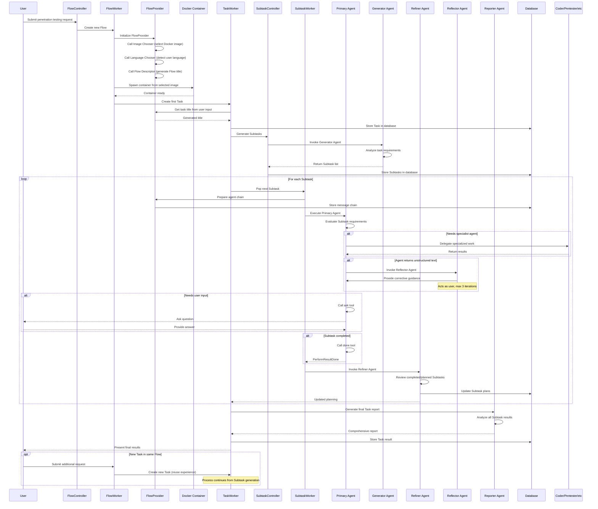
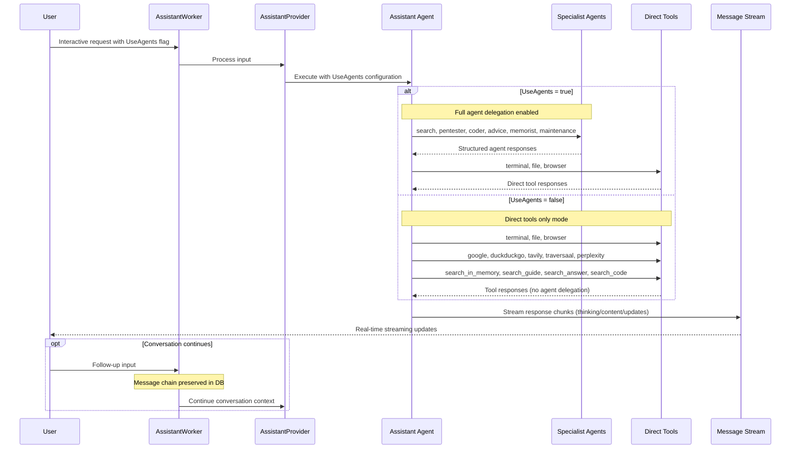
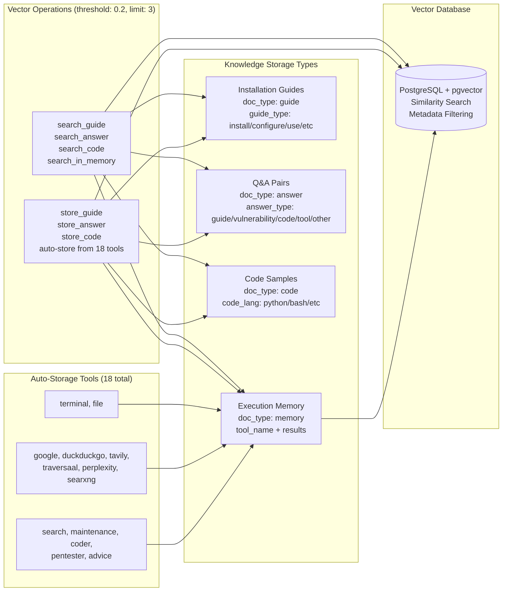
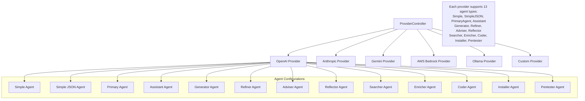
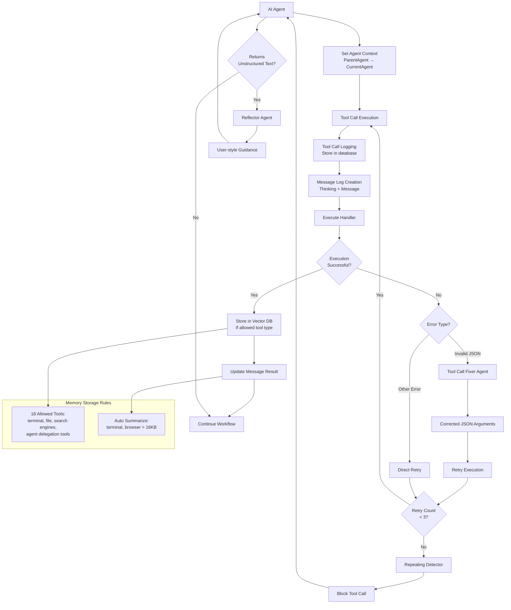
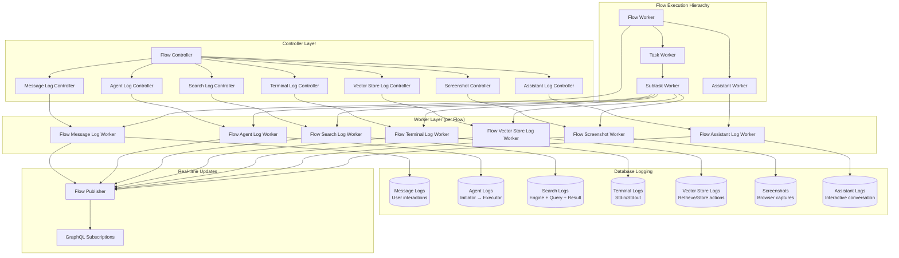
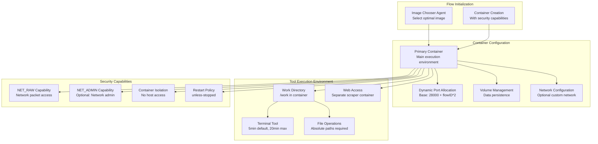
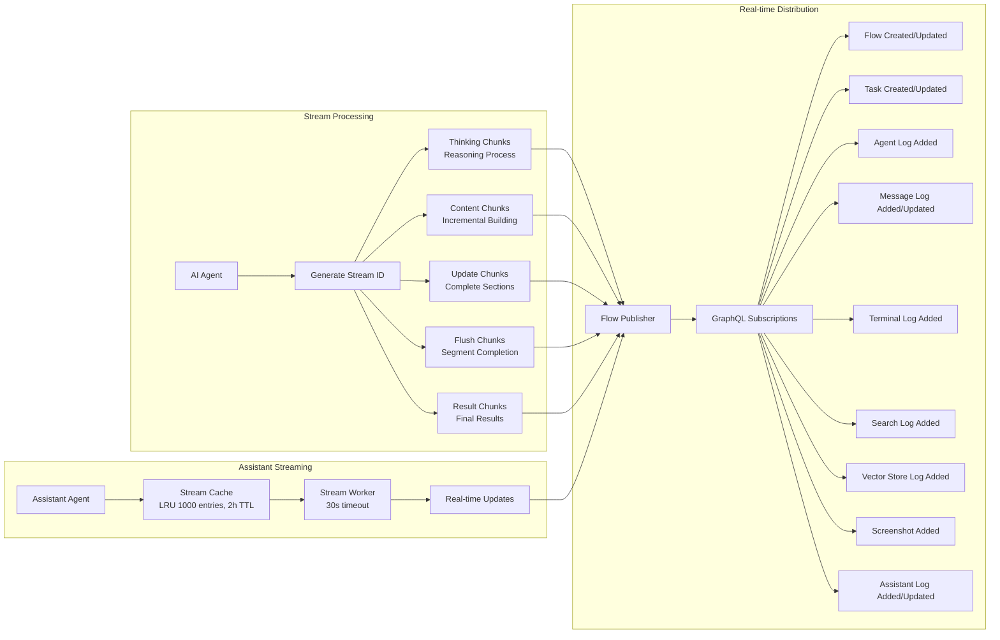

# Flow Execution in PentAGI

This document describes the internal architecture and execution workflow of Flow in PentAGI, an autonomous penetration testing system that leverages AI agents to perform complex security testing workflows.

## 1. Core Concepts and Terminology

### Hierarchy
- **Flow** - Top-level workflow representing a complete penetration testing session
- **Task** - Major unit of work within a Flow, representing a significant phase of testing
- **Subtask** - Specific assignment executed by AI agents within a Task
- **Action** - Individual operation performed by agents (commands, searches, analyses)

### Workers
- **FlowWorker** - Manages the complete lifecycle of a Flow, coordinates Tasks
- **TaskWorker** - Executes individual Tasks, manages Subtask generation and refinement
- **SubtaskWorker** - Handles execution of specific Subtasks via AI agents
- **AssistantWorker** - Manages interactive assistant mode within a Flow

### Providers
- **FlowProvider** - Core interface for Flow execution, agent coordination and orchestration
- **AssistantProvider** - Specialized provider for assistant mode interactions
- **ProviderController** - Factory for creating and managing different LLM providers

### AI Agents
- **Primary Agent** - Main orchestrator that coordinates all other agents within a Subtask
- **Generator Agent** - Decomposes Tasks into ordered lists of Subtasks (max 15)
- **Refiner Agent** - Reviews and updates Subtask plans based on execution results
- **Reporter Agent** - Creates comprehensive final reports for completed Tasks
- **Coder Agent** - Writes and maintains code for specific requirements
- **Pentester Agent** - Performs penetration testing and vulnerability assessment
- **Installer Agent** - Manages environment setup and tool installation
- **Memorist Agent** - Handles long-term memory storage and retrieval
- **Searcher Agent** - Conducts internet research and information gathering
- **Enricher Agent** - Enhances information from multiple sources
- **Adviser Agent** - Provides expert guidance and recommendations
- **Reflector Agent** - Corrects agents that return unstructured text instead of tool calls
- **Assistant Agent** - Provides interactive assistance with two modes (UseAgents flag)

### Tools and Capabilities by Category
- **Environment Tools** - Terminal commands, file operations within Docker containers
  - `terminal` - Command execution with 5min default, 20min hard limit
  - `file` - Read/write operations with absolute path requirements
  
- **Search Network Tools** - External information sources
  - `browser` - Web scraping with screenshot capture  
  - `google` - Google Custom Search API integration
  - `duckduckgo` - Anonymous search engine
  - `tavily` - Advanced research with citations
  - `traversaal` - Structured Q&A search
  - `perplexity` - AI-powered comprehensive research
  - `searxng` - Privacy-focused meta search engine
  
- **Vector Database Tools** - Semantic search in long-term memory
  - `search_in_memory` - General execution memory search
  - `search_guide` / `store_guide` - Installation guides (doc_type: guide)
  - `search_answer` / `store_answer` - Q&A pairs (doc_type: answer)
  - `search_code` / `store_code` - Code samples (doc_type: code)
  
- **Agent Tools** - Delegation to specialist agents
  - `search`, `maintenance`, `coder`, `pentester`, `advice`, `memorist`
  
- **Result Storage Tools** - Agent result delivery
  - `maintenance_result`, `code_result`, `hack_result`, `memorist_result`
  - `search_result`, `enricher_result`, `report_result`, `subtask_list`
  
- **Barrier Tools** - Control flow termination  
  - `done` - Complete subtask, `ask` - Request user input (configurable via ASK_USER env)

### Execution Context
- **Message Chain** - Conversation history maintained for each agent interaction
- **Execution Context** - Comprehensive state including completed/planned Subtasks
- **Docker Environment** - Isolated container for secure tool execution
- **Vector Store** - Long-term semantic memory for knowledge retention

### Performance Results
- **PerformResultDone** - Subtask completed successfully via `done` tool
- **PerformResultWaiting** - Subtask paused for user input via `ask` tool
- **PerformResultError** - Subtask failed due to unrecoverable errors

## 2. Main Flow Execution Process

## 3. AI Agent Interactions and Capabilities

```mermaid
graph TD
    subgraph "Primary Execution Flow"
        PA[Primary Agent<br/>Orchestrator] --> Coder[Coder Agent<br/>Development Specialist]
        PA --> Pentester[Pentester Agent<br/>Security Testing Specialist]
        PA --> Installer[Installer Agent<br/>Infrastructure Maintenance]
        PA --> Memorist[Memorist Agent<br/>Long-term Memory Specialist]
        PA --> Searcher[Searcher Agent<br/>Information Retrieval Specialist]
        PA --> Adviser[Adviser Agent<br/>Technical Solution Expert]
    end
    
    subgraph "Assistant Modes"
        AssistantUA[Assistant Agent<br/>UseAgents=true] --> PA
        AssistantUA --> Coder
        AssistantUA --> Pentester
        AssistantUA --> Installer
        AssistantUA --> Memorist
        AssistantUA --> Searcher
        
        AssistantDirect[Assistant Agent<br/>UseAgents=false] --> DirectTools[Direct Tools Only]
    end
    
    subgraph "Specialist Agent Tools"
        Coder --> Terminal[Terminal Tool]
        Coder --> File[File Tool]
        Coder --> CodeSearch[Search/Store Code]
        
        Pentester --> Terminal
        Pentester --> File
        Pentester --> Browser[Browser Tool]
        Pentester --> GuideSearch[Search/Store Guides]
        
        Installer --> Terminal
        Installer --> File
        Installer --> Browser
        Installer --> GuideSearch
        
        Memorist --> Terminal
        Memorist --> File
        Memorist --> VectorDB[Vector Database<br/>Memory Search]
    end
    
    subgraph "Search Tool Hierarchy"
        Searcher --> MemoryFirst[Priority 1: Memory Tools]
        MemoryFirst --> AnswerSearch[Search Answers]
        MemoryFirst --> VectorDB
        
        Searcher --> ReconTools[Priority 3-4: Reconnaissance]
        ReconTools --> Google[Google Search]
        ReconTools --> DuckDuckGo[DuckDuckGo Search]
        ReconTools --> Browser
        
        Searcher --> DeepAnalysis[Priority 5: Deep Analysis]
        DeepAnalysis --> Tavily[Tavily Search]
        DeepAnalysis --> Perplexity[Perplexity Search]
        DeepAnalysis --> Traversaal[Traversaal Search]
        
        Searcher --> MetaSearch[Meta Search Engine]
        MetaSearch --> Searxng[Searxng - Privacy Meta Search]
    end
    
    subgraph "Advice Chain"
        Adviser --> Enricher[Enricher Agent<br/>Context Enhancement]
        Enricher --> Memorist
        Enricher --> Searcher
    end
    
    subgraph "Error Correction"
        Reflector[Reflector Agent<br/>Unstructured Response Corrector]
        PA -.->|No tool calls| Reflector
        Reflector -.->|Corrected instruction| PA
    end
    
    subgraph "Barrier Functions"
        Done[done Tool<br/>Complete Subtask]
        Ask[ask Tool<br/>Request User Input]
    end
    
    PA --> Done
    PA --> Ask
    
    subgraph "Execution Environment"
        Terminal --> DockerContainer[Docker Container<br/>Isolated Environment]
        File --> DockerContainer
        Browser --> WebScraper[Web Scraper Container]
    end
    
    subgraph "Vector Storage Types"
        VectorDB --> GuideStore[Guide Storage<br/>doc_type: guide]
        VectorDB --> AnswerStore[Answer Storage<br/>doc_type: answer]
        VectorDB --> CodeStore[Code Storage<br/>doc_type: code]
        VectorDB --> MemoryStore[Memory Storage<br/>doc_type: memory]
    end
```

## 4. Supporting Workflows

### Assistant Mode Workflow

### Vector Database (RAG) Integration

### Multi-Provider LLM Integration

### Tool Execution and Context Management

### Comprehensive Logging Architecture

### Docker Container Management

## 5. Complex Interaction Patterns

### Message Chain Management
Each AI agent interaction is managed through typed message chains that maintain conversation context:

**Chain Types by Agent**:
- `MsgchainTypePrimaryAgent` - Primary Agent orchestration chains
- `MsgchainTypeGenerator` - Subtask generation chains  
- `MsgchainTypeRefiner` - Subtask refinement chains
- `MsgchainTypeReporter` - Final report generation chains
- `MsgchainTypeCoder` - Code development chains
- `MsgchainTypePentester` - Security testing chains
- `MsgchainTypeInstaller` - Infrastructure maintenance chains
- `MsgchainTypeMemorist` - Memory operation chains
- `MsgchainTypeSearcher` - Information retrieval chains
- `MsgchainTypeAdviser` - Expert consultation chains
- `MsgchainTypeReflector` - Response correction chains
- `MsgchainTypeAssistant` - Interactive assistance chains
- `MsgchainTypeSummarizer` - Context summarization chains
- `MsgchainTypeToolCallFixer` - Tool argument repair chains

**Chain Properties**:
- **Serialized to JSON** and stored in the database for persistence
- **Summarized periodically** to prevent context window overflow
- **Restored on system restart** to maintain continuity
- **Type-specific retrieval** for agent-specific context loading

### Agent Context Tracking
The system maintains agent execution context through the call chain:

**Agent Context Structure**:
- **ParentAgentType** - The agent that initiated the current operation
- **CurrentAgentType** - The agent currently executing  

**Context Propagation**:
- Set via `PutAgentContext(ctx, agentType)` when invoking agents
- Retrieved via `GetAgentContext(ctx)` for logging and tracing
- Used for vector store logging to track agent delegation chains
- Enables observability of inter-agent communication patterns

**Message Chain Types** (tracks agent interactions):
- `MsgchainTypePrimaryAgent`, `MsgchainTypeGenerator`, `MsgchainTypeRefiner`
- `MsgchainTypeReporter`, `MsgchainTypeCoder`, `MsgchainTypePentester` 
- `MsgchainTypeInstaller`, `MsgchainTypeMemorist`, `MsgchainTypeSearcher`
- `MsgchainTypeAdviser`, `MsgchainTypeReflector`, `MsgchainTypeEnricher`
- `MsgchainTypeAssistant`, `MsgchainTypeSummarizer`, `MsgchainTypeToolCallFixer`

### Agent Chain Execution Loop
The Primary Agent follows a sophisticated execution pattern:

1. **Context Preparation** - Loads execution context including completed/planned Subtasks
2. **Tool Call Loop** - Iteratively calls LLM with available tools until completion
3. **Function Execution** - Executes tool calls with retry logic and error handling
4. **Repeating Detection** - Prevents infinite loops by detecting repeated tool calls (threshold: 3)
5. **Reflection Mechanism** - If no tools are called, invokes Reflector Agent for guidance
6. **Barrier Functions** - Special tools (`done`, `ask`) that control execution flow

### Reflector Agent Correction Mechanism
A critical system component that handles agent errors:

- **Triggers when** - Any agent returns unstructured text instead of structured tool calls
- **Maximum iterations** - Limited to 3 reflector calls per chain to prevent loops
- **Response style** - Acts as the user providing direct, concise guidance
- **Correction process** - Analyzes the unstructured response and guides agent to proper tool usage
- **Barrier tool emphasis** - Specifically reminds agents about completion tools (`done`, `ask`)
- **Assistant exception** - Assistant agents return natural text responses to users, not tool calls
- **Final response mode** - Assistants use completion mode for user-facing communication
- **Context isolation** - Assistants use `nil` taskID/subtaskID when accessing agent handlers
- **Cross-flow operation** - Assistants can access Flow-level context without specific Task/Subtask binding

### Subtask Lifecycle States
Subtasks progress through well-defined states:
- **Created** - Initially generated by Generator Agent
- **Running** - Currently being executed by Primary Agent
- **Waiting** - Paused for user input via `ask` tool
- **Finished** - Successfully completed via `done` tool
- **Failed** - Terminated due to errors

### Error Handling and Recovery
The system implements comprehensive error handling:

**Multi-layer Error Correction**:
- **Tool Call Retries** - Failed LLM calls retried up to 3 times with 5-second delays
- **Tool Call Fixer** - Invalid JSON arguments automatically corrected using schema validation
- **Reflector Correction** - Unstructured responses redirected to proper tool call format
- **Chain Consistency** - Adds default responses to incomplete tool calls after interruptions
- **Repeating Detection** - Prevents infinite loops by limiting identical tool calls to 3 attempts

**Chain Consistency Mechanism**:
- **Triggered on errors** - System interruptions or context cancellations
- **Fallback responses** - Adds default content for unresponded tool calls
- **Message integrity** - Maintains valid conversation structure
- **AST-based processing** - Uses Chain AST for structured message analysis

**System Resilience**:
- **Graceful Degradation** - Falls back to simpler operations when complex ones fail
- **Context Preservation** - Maintains state across system restarts
- **Container cleanup** - Automatic resource cleanup on failures
- **Flow status management** - Proper state transitions on errors

### Task Refinement Process
The Refiner Agent uses a sophisticated analysis approach:
1. **Reviews completed Subtasks** and their execution results
2. **Analyzes remaining planned Subtasks** for relevance
3. **Considers overall Task progress** and user requirements
4. **Updates the Subtask plan** by removing obsolete tasks and adding necessary ones
5. **Maintains execution efficiency** by limiting total Subtasks to 15 maximum
6. **Dynamic limit calculation** - Available slots = 15 minus completed Subtasks count
7. **Completion detection** - Returns empty list when Task objectives are achieved

### Memory and Knowledge Management
The system maintains multiple types of persistent knowledge with PostgreSQL + pgvector:

**Vector Store Types**:
- **Memory Storage** (`doc_type: memory`) - Tool execution results and agent observations
- **Guide Storage** (`doc_type: guide`) - Installation and configuration procedures
- **Answer Storage** (`doc_type: answer`) - Q&A pairs for common scenarios  
- **Code Storage** (`doc_type: code`) - Programming language-specific code samples

**Technical Parameters**:
- **Similarity Threshold**: 0.2 for all vector searches
- **Result Limits**: 3 documents maximum per search
- **Memory Storage Tools**: 18 tools automatically store results (terminal, file, all search engines, all agent tools)
- **Summarization Eligible**: Only `terminal` and `browser` tools results are auto-summarized when > 16KB

### Search Tool Priority System
The Searcher Agent follows a strict hierarchy for information retrieval:

1. **Priority 1-2: Memory Tools** - Always check internal knowledge first
   - `search_answer` - Primary tool for accessing existing knowledge
   - `memorist` - Retrieves task/subtask execution history
   
2. **Priority 3-4: Reconnaissance Tools** - Fast source discovery
   - `google` and `duckduckgo` - Rapid link collection and basic searches
   - `browser` - Targeted content extraction from specific URLs
   
3. **Priority 5: Deep Analysis Tools** - Complex research synthesis
   - `traversaal` - Structured answers for common questions
   - `tavily` - Research-grade exploration of technical topics
   - `perplexity` - Comprehensive analysis with advanced reasoning

**Available Search Engines**: Google, DuckDuckGo, Tavily, Traversaal, Perplexity, Searxng

**Search Engine Configurations**:
- **Google** - Custom Search API with CX key and language restrictions
- **DuckDuckGo** - Anonymous search with VQD token authentication
- **Tavily** - Advanced research with raw content and citations
- **Perplexity** - AI-powered synthesis with configurable context size
- **Traversaal** - Structured Q&A responses with web links
- **Searxng** - Meta search aggregating multiple engines with privacy focus

**Action Economy Rules**: Maximum 3-5 search actions per query, stop immediately when sufficient information is found

### Summarization Protocol
A critical system-wide mechanism for context management:

- **Two Summary Types**:
  1. **Tool Call Summary** - AI message with only `SummarizationToolName` tool call
  2. **Prefixed Summary** - AI message starting with `SummarizedContentPrefix`
  
- **Agent Handling Rules**:
  - Must treat summaries as **historical records** of actual past events
  - Extract useful information to inform current strategy
  - **Never mimic** summary formats or use summarization tools
  - Continue using structured tool calls for all actions
  
- **System Benefits**:
  - Prevents context window overflow during long conversations
  - Maintains conversation coherence across system restarts
  - Preserves critical execution context while reducing token usage

### Real-time Communication System

### Multi-tenancy and Security
The architecture supports multiple users with isolation:
- **User-specific providers** - Each user can configure their own LLM providers
- **Flow isolation** - Docker containers provide security boundaries
- **Resource management** - Containers are automatically cleaned up
- **Access control** - Database queries are user-scoped

### Specialized System Prompts
The system uses 25+ dedicated prompt types for specific functions:

**System Function Prompts**:
- **Image Chooser** - Selects optimal Docker image, fallback to `vxcontrol/kali-linux` for pentest
- **Language Chooser** - Detects user's preferred language for responses  
- **Flow Descriptor** - Generates concise Flow titles (max 20 characters)
- **Task Descriptor** - Creates descriptive Task titles (max 150 characters)  
- **Tool Call Fixer** - Repairs invalid JSON arguments using schema validation
- **Execution Context** - Templates for full/short context summaries
- **Execution Logs** - Formats chronological action histories for summarization

**Agent System Prompts** (13 types):
- **Primary Agent** - Team orchestration with delegation capabilities
- **Assistant** - Interactive mode with UseAgents flag configuration
- **Specialist Agents** - Pentester, Coder, Installer, Searcher, Memorist, Adviser
- **Meta Agents** - Generator, Refiner, Reporter, Enricher, Reflector, Summarizer

**Question Templates** (13 types):
- Structured input templates for each agent's human interaction patterns
- Context-specific variable injection for Task/Subtask/Flow information
- Formatted data presentation for optimal agent comprehension

**Critical Prompt Features**:
- **XML Semantic Delimiters** - Structured sections like `<memory_protocol>`, `<terminal_protocol>`
- **Summarization Awareness** - Universal protocol for handling historical summaries  
- **Tool Placeholder System** - `{{.ToolPlaceholder}}` injection at prompt end
- **Template Variable System** - 50+ variables for dynamic content injection

### Performance Optimizations and Limits
Several mechanisms ensure efficient execution:

**Execution Limits**:
- **Subtask Limits** - Maximum 15 Subtasks per Task (TasksNumberLimit)
- **Refiner Calculations** - Available slots = 15 minus completed Subtasks count
- **Reflector Iterations** - Maximum 3 corrections per agent chain
- **Tool Call Retries** - Maximum 3 attempts for failed executions
- **Repeating Detection** - Blocks repeated tool calls after 3 attempts
- **Search Action Economy** - Searcher limited to 3-5 actions per query

**Timeout Configuration**:
- **Terminal Operations** - Default 5 minutes, hard limit 20 minutes
- **LLM API Calls** - 3 retries with 5-second delays between attempts  
- **Vector Search** - Threshold 0.2, max 3 results per query
- **Tool Result Summarization** - Triggered at 16KB result size
- **Flow Input Processing** - 1 second timeout for input queueing
- **Assistant Input** - 2 second timeout for assistant input queueing

**Container Resource Management**:
- **Port Allocation** - 2 ports per Flow starting from base 28000
- **Volume Management** - Per-flow data directories with cleanup
- **Network Isolation** - Optional custom Docker networks
- **Image Fallback** - Automatic fallback to default Debian image

**Memory Optimization**:
- **Message summarization** - Prevents context window overflow
- **Tool argument limits** - 1KB limit for individual argument values  
- **Connection pooling** - Database connections are reused
- **Automatic cleanup** - Containers removed after Flow completion

### User Interaction Flow (`ask` Tool)
Critical mechanism for human-in-the-loop operations:

**Ask User Workflow**:
1. **Primary Agent** calls `ask` tool with question for user
2. **PerformResultWaiting** returned to SubtaskWorker
3. **Subtask status** set to `SubtaskStatusWaiting`  
4. **Task status** propagated to `TaskStatusWaiting`
5. **Flow status** propagated to `FlowStatusWaiting`
6. **User provides input** via Flow interface
7. **Input processed** through `updateMsgChainResult` with `AskUserToolName`
8. **Subtask continues** execution with user's response

**Configuration**:
- **ASK_USER environment variable** - Controls availability of `ask` tool
- **Default**: false (disabled by default)
- **Primary Agent only** - Only available in PrimaryExecutor configuration
- **Barrier function** - Causes execution flow pause until user responds

### Browser and Screenshot System
The browser tool provides advanced web interaction capabilities:

**Browser Actions**:
- **Markdown Extraction** - Clean text content from web pages  
- **HTML Content** - Raw HTML for detailed analysis
- **Link Extraction** - Collect all URLs from pages for further navigation

**Screenshot Integration**:
- **Automatic Screenshots** - Every browser action captures page screenshot
- **Dual Scraper Support** - Private URL scraper for internal networks, public for external
- **Screenshot Storage** - Organized by Flow ID with timestamp naming
- **Minimum Content Sizes** - MD: 50 bytes, HTML: 300 bytes, Images: 2048 bytes

**Network Resolution**:
- **IP Analysis** - Automatic detection of private vs public targets
- **Scraper Selection** - Private scraper for internal IPs, public for external
- **Security Isolation** - Web scraping isolated from main execution container

## Summary

The Flow execution system represents a sophisticated orchestration platform that combines multiple AI agents, tools, and infrastructure components to deliver autonomous penetration testing capabilities. Key architectural highlights include:

### System Robustness
- **Triple-layer error handling** - Tool call fixing, reflector correction, and retry mechanisms
- **Context preservation** - Typed message chains with summarization for long-running operations
- **Resource limits** - Bounded execution with configurable timeouts and iteration limits
- **Isolation guarantees** - Docker containers provide security boundaries for all operations

### Agent Specialization
- **Role-based delegation** - Each agent has specific expertise and tool access
- **Memory-first approach** - All agents check vector storage before external operations  
- **Structured communication** - Exclusive use of tool calls except Assistant final responses
- **Adaptive planning** - Generator creates initial plans, Refiner optimizes based on results
- **Context propagation** - Parent/Current agent tracking for delegation chains
- **Categorized tools** - 6 tool categories with specific access patterns

### Operational Flexibility
- **Multi-provider LLM support** - Different models optimized for different agent types
- **Assistant dual modes** - UseAgents flag enables delegation or direct tool access
- **Flow continuity** - System can resume operations after interruptions
- **Real-time feedback** - Streaming responses provide immediate user visibility
- **Vector knowledge system** - 4 storage types with semantic search and metadata filtering
- **Comprehensive tool ecosystem** - 44+ tools across 6 categories with automatic memory storage
- **GraphQL subscriptions** - Real-time Flow/Task/Log updates via WebSocket connections
- **Logging architecture** - 7-layer logging system with Controller/Worker pattern

### Critical Technical Details

**Assistant Streaming Architecture**:
- **Stream Cache**: LRU cache (1000 entries, 2h TTL) maps StreamID → MessageID
- **Stream Workers**: Background goroutines with 30-second timeout per stream
- **Buffer Management**: Separate buffers for thinking/content with controlled updates
- **Real-time Distribution**: Immediate GraphQL subscription updates to frontend

**Message Chain Consistency**:
- **AST Processing**: Uses Chain Abstract Syntax Tree for structured message analysis
- **Fallback Content**: Unresponded tool calls get default responses via `cast.FallbackResponseContent`
- **Chain Restoration**: Intelligent restoration of conversation context after interruptions  
- **Summarization Integration**: Seamless integration with summarization when restoring chains

**Flow Publisher Integration**:
- **Centralized Updates**: Single publisher coordinates all Flow-related real-time updates
- **Event Types**: 8 different event types (Flow, Task, Agent logs, Message logs, etc.)
- **User-scoped**: Each user gets their own publisher instance for proper isolation
- **WebSocket Distribution**: Efficient real-time delivery to frontend clients

### Implementation Architecture Summary

**Core Flow Processing**:
- **3-layer hierarchy**: FlowWorker → TaskWorker → SubtaskWorker with proper lifecycle management
- **Agent orchestration**: 13 specialized agent types with role-specific tool access
- **Tool ecosystem**: 44+ tools across 6 categories (Environment, SearchNetwork, SearchVectorDb, Agent, StoreAgentResult, Barrier)
- **Message chain types**: 14 distinct chain types for agent communication tracking

**Error Resilience & Recovery**:
- **4-level error handling**: Tool retries → Tool call fixing → Reflector correction → Chain consistency
- **Bounded execution**: Configurable limits preventing runaway operations
- **State recovery**: Complete system state restoration after interruptions
- **Graceful degradation**: Automatic fallbacks to simpler operational modes

**Real-time & Observability**:
- **7-layer logging**: Comprehensive tracking from agent interactions to terminal commands
- **GraphQL subscriptions**: Real-time updates via WebSocket connections
- **Streaming architecture**: Progressive response delivery with thinking/content separation
- **Vector observability**: Complete tracking of knowledge storage and retrieval operations

**Security & Isolation**:
- **Container isolation**: Docker-based security boundaries with capability controls
- **Multi-tenant design**: User-scoped operations with resource isolation  
- **Network segmentation**: Separate containers for web scraping vs. tool execution
- **Resource limits**: Comprehensive timeout and resource management

This architecture enables autonomous security testing while maintaining human oversight, technical precision, and operational security throughout the entire penetration testing workflow.
