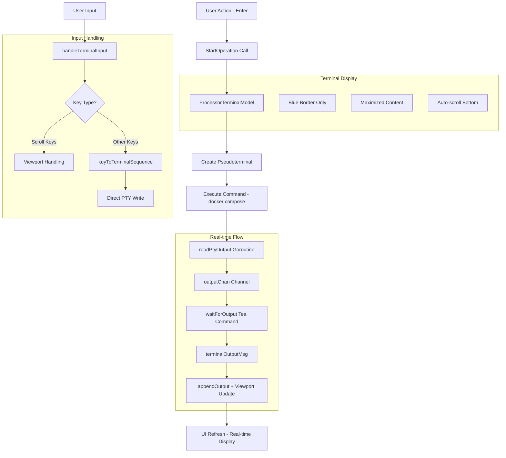

# Processor-Wizard Integration Guide

> Technical documentation for embedded terminal integration in PentAGI installer wizard using Bubble Tea and pseudoterminals.

## Architecture Decision: Pseudoterminal vs Built-in Bubble Tea

After extensive research of `tea.ExecProcess` and alternative approaches, **pseudoterminal solution was chosen** for the following reasons:

**Why Not `tea.ExecProcess`:**
- ❌ Fullscreen takeover - cannot be embedded in viewport regions
- ❌ Blocking execution - pauses entire Bubble Tea program
- ❌ No real-time output streaming to specific UI components
- ❌ Cannot handle interactive Docker commands within constrained areas

**Built-in Approach Limitations:**
- Limited to `os/exec` with pipes (no true terminal semantics)
- Manual ANSI escape sequence handling required
- Reduced interactivity (no Ctrl+C, terminal properties)
- Complex input/output coordination

**Pseudoterminal Advantages:**
- ✅ Embedded in specific viewport regions
- ✅ Real-time command output with ANSI colors/formatting
- ✅ Full interactivity (stdin/stdout/stderr, Ctrl+C)
- ✅ Professional terminal experience within TUI
- ✅ Docker compatibility (`docker exec -it`, progress bars)

## Core Architecture

### Key Components

**`ProcessorTerminalModel`** interface (defined in [`processor.go`](../cmd/installer/processor/processor.go)):
```go
type ProcessorTerminalModel interface {
    tea.Model
    StartOperation(operation string, stack ProductStack) tea.Cmd
    SendInput(input string) tea.Cmd
    IsOperationRunning() bool
    GetCurrentOperation() (string, ProductStack)
    SetSize(width, height int)  // Dynamic resizing support
}
```

**Implementation** in [`terminal_model.go`](../cmd/installer/processor/terminal_model.go):
- Uses `github.com/creack/pty` for pseudoterminal creation
- Real-time output streaming via buffered channel (`outputChan chan string`)
- Direct key-to-terminal-sequence mapping for native terminal behavior
- Maximized viewport space - no headers, input lines, or inner borders
- Clean blue border with full content area utilization

### Integration Pattern

**Wizard Screen Integration** (see [`apply_changes.go`](../cmd/installer/wizard/models/apply_changes.go)):
```go
type ApplyChangesFormModel struct {
    processor     processor.Processor
    terminalModel processor.ProcessorTerminalModel
    useEmbeddedTerminal bool  // toggle between terminal/fallback modes
}

// Create terminal model
m.terminalModel = m.processor.CreateTerminalModel(width, height)

// Start operation
return m.terminalModel.StartOperation("ApplyChanges", processor.ProductStackAll)
```

## Message Flow Architecture

The integration uses a **buffered channel-based approach** for real-time terminal output streaming:



## Apply Changes integrity pre-check (Wizard)

Before invoking `processor.ApplyChanges()`, the Apply Changes screen performs an embedded files integrity scan:

- Enter: start async scan using `GetStackFilesStatus(files, ProductStackAll, workingDir)`
- If outdated/missing files found: prompt user to update (Y) or proceed without updates (N)
- Ctrl+C: cancel the integrity stage and return to initial instruction screen

Hotkeys on this screen:
- Initial: Enter
- During scan: Ctrl+C
- When prompt is shown: Y/N, Ctrl+C

Depending on choice, `processor.ApplyChanges()` is called with/without `WithForce()`. This keeps user in control of overwriting modified files while still allowing a smooth path when no updates are required.

Note: the integrity prompt lists only modified files; missing files are considered normal on a fresh installation and are not shown to the user.

**Key Improvements:**
- **50ms polling** via `waitForOutput()` for responsive UI updates
- **Buffered channel** (100 messages) prevents blocking
- **Direct key mapping** - no intermediate input buffers
- **Viewport delegation** for scrolling (PageUp/PageDown, mouse wheel)

## Implementation Guide

### 1. Screen Model Setup

Add terminal integration to any wizard screen following this pattern:

```go
type YourFormModel struct {
    *BaseScreen
    processor     processor.Processor
    terminalModel processor.ProcessorTerminalModel
    useEmbeddedTerminal bool
}

func (m *YourFormModel) BuildForm() tea.Cmd {
    contentWidth, contentHeight := m.getViewportFormSize()

    if m.useEmbeddedTerminal {
        // Create maximized terminal model - only 2px margin for blue border
        m.terminalModel = m.processor.CreateTerminalModel(contentWidth-2, contentHeight-2)
    } else {
        // Fallback to viewport for message-based output
        m.outputViewport = viewport.New(contentWidth-4, contentHeight-6)
    }
    return nil
}
```

### 2. Update Method Integration

Handle terminal model updates with proper type assertion and input delegation:

```go
func (m *YourFormModel) Update(msg tea.Msg) (tea.Model, tea.Cmd) {
    var cmds []tea.Cmd

    // Update terminal model first (handles real-time output)
    if m.useEmbeddedTerminal && m.terminalModel != nil {
        updatedModel, terminalCmd := m.terminalModel.Update(msg)
        if terminalModel, ok := updatedModel.(processor.ProcessorTerminalModel); ok {
            m.terminalModel = terminalModel
        }
        if terminalCmd != nil {
            cmds = append(cmds, terminalCmd)
        }
    }

    switch msg := msg.(type) {
    case tea.WindowSizeMsg:
        // Update terminal size dynamically
        if m.useEmbeddedTerminal && m.terminalModel != nil {
            contentWidth, contentHeight := m.getViewportFormSize()
            m.terminalModel.SetSize(contentWidth-2, contentHeight-2)
        }

    case tea.KeyMsg:
        // Terminal takes priority when operation is running
        if m.useEmbeddedTerminal && m.terminalModel != nil && m.terminalModel.IsOperationRunning() {
            return m, tea.Batch(cmds...)  // Terminal already processed input
        }
        // Your screen-specific hotkeys here...
    }

    return m, tea.Batch(cmds...)
}
```

### 3. Operation Triggers

Start processor operations through terminal model:

```go
// In your action handler
func (m *YourFormModel) startProcess() tea.Cmd {
    if m.useEmbeddedTerminal {
        return m.terminalModel.StartOperation("install", processor.ProductStackPentagi)
    }
    // Fallback to message-based approach
    return processor.CreateStackOperationCommand(m.processor, "install", processor.ProductStackPentagi)
}
```

### 4. Display Integration

Render terminal within your screen layout - simplified approach:

```go
func (m *YourFormModel) renderMainPanel() string {
    if m.useEmbeddedTerminal && m.terminalModel != nil {
        // Terminal model returns complete styled content with blue border
        return m.terminalModel.View()
    }

    // Fallback: render status + output viewport for message-based mode
    var sections []string
    sections = append(sections, m.renderStatusHeader())
    sections = append(sections, m.outputViewport.View())
    return strings.Join(sections, "\n")
}
```

**Terminal View Structure:**
- **No header/footer** - maximized content space
- **Blue border only** - clean visual boundaries
- **Auto-scrolling viewport** - always shows latest output
- **Responsive sizing** - adapts to window changes via `SetSize()`

## Features & Capabilities

### Interactive Terminal
- **Real-time output**: 50ms polling via buffered channel (100 messages)
- **Native input handling**: Direct key-to-terminal-sequence conversion
- **ANSI support**: Colors, formatting, progress bars rendered correctly
- **Smart scrolling**: PageUp/PageDown and mouse wheel for viewport, all other keys to PTY

### Docker Integration
- **Interactive commands**: `docker exec -it container bash`
- **Progress visualization**: Docker pull progress bars with colors
- **Color output**: Docker's colored status messages preserved
- **Signal handling**: Ctrl+C, Ctrl+D, Ctrl+Z properly handled

### UI Features
- **Maximized space**: No headers, input lines, or inner borders
- **Blue border styling**: Clean visual boundaries with `lipgloss.Color("62")`
- **Dynamic resizing**: `SetSize()` method for window changes
- **Toggle mode**: Ctrl+T switches between embedded terminal and message logs
- **Auto-scroll**: Always shows latest output, bottom-aligned

## Command Configuration

Processor operations support flexible configuration via [`processor.go:56-61`](../cmd/installer/processor/processor.go):

```go
// Available options
processor.WithForce()                   // Skip validation checks
processor.WithTea(messageChan)          // Message-based integration
processor.WithTerminalModel(terminal)   // Embedded terminal integration
```

Choose integration method based on screen requirements:
- **Embedded terminal**: Interactive operations, real-time output, full PTY support
- **Message-based**: Simple operations, basic progress tracking (see [`tea_integration.go`](../cmd/installer/processor/tea_integration.go))

**Alternative Integration:** For simpler use cases or Windows compatibility, [`tea_integration.go`](../cmd/installer/processor/tea_integration.go) provides message-based command execution via `CreateProcessorTeaCommand()` with streaming output through `ProcessorOutputMsg` events.

## Limitations & Considerations

### Performance
- **Memory usage**: Output buffer auto-managed, channel limited to 100 messages
- **Goroutine management**: Automatic cleanup via `defer close(outputChan)`
- **Resource overhead**: Minimal - one goroutine per operation, 1ms throttling
- **Update frequency**: 50ms polling prevents UI blocking

### Platform Compatibility
- **Unix/Linux/macOS**: Full pseudoterminal support via `github.com/creack/pty v1.1.21`
- **Windows**: Limited support (ConPty), fallback to `tea_integration.go` recommended

### UI Constraints
- **Minimum size**: `width-2, height-2` for border space
- **Input delegation**: Terminal captures all input except scroll keys when running
- **Layout integration**: Single terminal per screen, full area utilization

## Testing & Debugging

### Terminal Model Testing
Terminal model can be tested independently of wizard integration (see [`processor_test.go`](../cmd/installer/processor/processor_test.go) for mock patterns).

### Debug Features
- **Ctrl+T toggle**: Switch to message-based mode for debugging
- **Output logging**: All terminal output available for inspection
- **Error reporting**: Terminal errors bubble up to UI state

## Future Enhancements

### Potential Improvements
- **Session recording**: Capture terminal sessions for replay/debugging
- **Multiple terminals**: Support for concurrent operations with tabs
- **Terminal themes**: Customizable color schemes via lipgloss
- **Buffer persistence**: Save terminal output between screen switches
- **Copy/paste**: Terminal text selection and clipboard integration

### Integration Opportunities
- **Service management**: Real-time `docker ps` monitoring in terminal
- **Log streaming**: Live log viewing with `docker logs -f`
- **Interactive debugging**: Terminal-based troubleshooting tools
- **Configuration editing**: Embedded editors for compose files

### Architecture Extensions
- **Message broadcasting**: Share terminal output across multiple UI components
- **Operation queuing**: Sequential command execution with progress tracking
- **Error recovery**: Automatic retry mechanisms with user confirmation

This clean, channel-based architecture provides a maintainable foundation for embedding professional terminal functionality within Bubble Tea applications while maximizing screen real estate and user experience.
