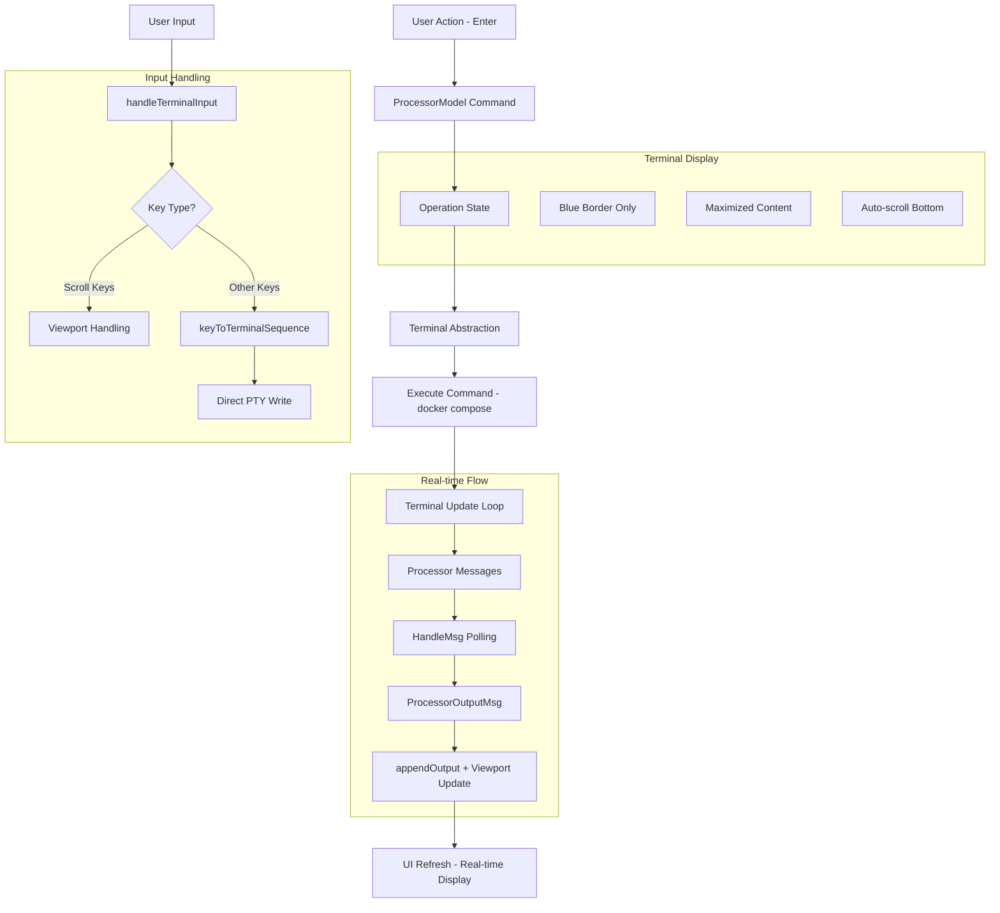

# Processor-Wizard Integration Guide

> Technical documentation for embedded terminal integration in PentAGI installer wizard using Bubble Tea and pseudoterminals.

## Architecture Decision: Pseudoterminal vs Built-in Bubble Tea

After extensive research of `tea.ExecProcess` and alternative approaches, **pseudoterminal solution was chosen** for the following reasons:

**Why Not `tea.ExecProcess`:**
- ❌ Fullscreen takeover - cannot be embedded in viewport regions
- ❌ Blocking execution - pauses entire Bubble Tea program
- ❌ No real-time output streaming to specific UI components
- ❌ Cannot handle interactive Docker commands within constrained areas

**Built-in Approach Limitations:**
- Limited to `os/exec` with pipes (no true terminal semantics)
- Manual ANSI escape sequence handling required
- Reduced interactivity (no Ctrl+C, terminal properties)
- Complex input/output coordination

**Pseudoterminal Advantages:**
- ✅ Embedded in specific viewport regions
- ✅ Real-time command output with ANSI colors/formatting
- ✅ Full interactivity (stdin/stdout/stderr, Ctrl+C)
- ✅ Professional terminal experience within TUI
- ✅ Docker compatibility (`docker exec -it`, progress bars)

## Core Architecture

### Key Components

**`Processor`** interface (defined in [`processor.go`](../../cmd/installer/processor/processor.go)):
```go
type Processor interface {
    ApplyChanges(ctx context.Context, opts ...OperationOption) error
    CheckFiles(ctx context.Context, stack ProductStack, opts ...OperationOption) (FilesCheckResult, error)
    FactoryReset(ctx context.Context, opts ...OperationOption) error
    Install(ctx context.Context, opts ...OperationOption) error
    Update(ctx context.Context, stack ProductStack, opts ...OperationOption) error
    Download(ctx context.Context, stack ProductStack, opts ...OperationOption) error
    Remove(ctx context.Context, stack ProductStack, opts ...OperationOption) error
    Purge(ctx context.Context, stack ProductStack, opts ...OperationOption) error
    Start(ctx context.Context, stack ProductStack, opts ...OperationOption) error
    Stop(ctx context.Context, stack ProductStack, opts ...OperationOption) error
    Restart(ctx context.Context, stack ProductStack, opts ...OperationOption) error
    ResetPassword(ctx context.Context, stack ProductStack, opts ...OperationOption) error

    // InstallerPackage describes the installer build on offer without downloading it.
    InstallerPackage(ctx context.Context) (*InstallerPackage, error)
}
```

**Bubble Tea integration** in [`model.go`](../../cmd/installer/processor/model.go), [`state.go`](../../cmd/installer/processor/state.go), and [`logic.go`](../../cmd/installer/processor/logic.go):
- Wraps processor operations as `tea.Cmd` values through `ProcessorModel`
- Streams operation updates through `ProcessorStartedMsg`, `ProcessorOutputMsg`, `ProcessorFilesCheckMsg`, and `ProcessorCompletionMsg`
- Pumps that stream with `ProcessorWaitMsg` — the screen's reply to each message is what asks for the next one (see [The message chain](#the-message-chain))
- Executes commands through the shared `terminal.Terminal` abstraction when available
- Falls back to non-ANSI compose output on small terminals and Windows by setting `COMPOSE_ANSI=never`

`ProcessorModel.InstallerPackage(ctx)` is the one exception to the pattern: it returns `(*InstallerPackage, error)` rather than a `tea.Cmd`. It is a single short request with a single answer, not an operation that streams into a terminal panel, and the one screen that needs it wraps it in a command of its own.

### Integration Pattern

**Wizard Screen Integration** (see [`apply_changes.go`](../../cmd/installer/wizard/models/apply_changes.go)):
```go
type ApplyChangesFormModel struct {
    processor processor.ProcessorModel
    running   bool
    terminal  terminal.Terminal
}

// Create terminal model for the screen
m.terminal = terminal.NewTerminal(width, height, terminal.WithAutoScroll(), terminal.WithAutoPoll())

// Start operation through the processor model
return m.processor.ApplyChanges(context.Background(), processor.WithTerminal(m.terminal))
```

## Message Flow Architecture

The integration is **message-driven in both directions**: the operation appends messages to its own state and the screen asks for the next one, while the terminal panel is fed directly by the running command and signals the UI when its content changes (see [The message chain](#the-message-chain)):



## Apply Changes integrity pre-check (Wizard)

Before invoking `processor.ApplyChanges()`, the Apply Changes screen performs an embedded files integrity scan:

- Enter: start async scan using `GetStackFilesStatus(files, ProductStackAll, workingDir)`
- If outdated/missing files found: prompt user to update (Y) or proceed without updates (N)
- Ctrl+C: cancel the integrity stage and return to initial instruction screen

Hotkeys on this screen:
- Initial: Enter
- During scan: Ctrl+C
- When prompt is shown: Y/N, Ctrl+C

Depending on choice, `processor.ApplyChanges()` is called with/without `WithForce()`. This keeps user in control of overwriting modified files while still allowing a smooth path when no updates are required.

Note: the integrity prompt lists only modified files; missing files are considered normal on a fresh installation and are not shown to the user.

**Key Improvements:**
- **Message replay, not polling** — the operation appends to `operationState.msgs` and `HandleMsg` hands back the next entry; it falls back to a 100 ms wait only when there is nothing new
- **No message cap and no shared channel** — `msgs` is a slice that grows with the operation, so nothing about a slow screen can block the operation
- **Direct key mapping** - no intermediate input buffers
- **Viewport delegation** for scrolling (PageUp/PageDown, mouse wheel)

## Maintenance entries and the screens behind them

The maintenance list ([`maintenance.go`](../../cmd/installer/wizard/models/maintenance.go)) carries no behaviour of its own: `LoadItems` appends a `ListItem` holding a `ScreenID`, and `HandleSelection` turns the selected one into a `NavigationMsg{Target: item.ID}`. Changing what an entry does is therefore changing which screen its `ScreenID` names. Two entries no longer name the generic operation form.

**Update PentAGI** points at `UpdateOverviewScreen` (`"update_overview"`), not at `UpdatePentagiScreen` (`"processor_operation_form§compose§update"`). [`update_overview.go`](../../cmd/installer/wizard/models/update_overview.go) renders what the update would change — the version move per stack, the per-component plan, and the release notes crossed on the way — and on `enter` emits `NavigationMsg{Target: UpdatePentagiScreen}`. The overview is inserted **between** the entry and the form; the form, its availability check and its `y/n` confirmation are untouched, so the sequence is entry → overview → form, not a replacement.

The overview screen holds no `ProcessorModel` and starts no operation — `NewUpdateOverviewModel` takes only the controller, styles and window. Everything it shows already sits in the last check result read through `controller.GetChecker()`, so it makes no network call and cannot fail. What separates "nothing to update" from "we never found out" is `CheckResult.UpdateFailure`, not the emptiness of `StackUpdates`: the screen is reachable from a menu entry drawn off an earlier check, and printing "up to date" after a check that never completed would be a claim in exactly the wrong direction.

`enter` here means *continue*, not *page down* as it does on the EULA screen. EULA spends `enter` on paging because consent there is given by separate `y`/`n` keys; the overview asks for no consent, so its one unambiguous key belongs to the one action it offers, and scrolling is left to the arrows, `pgup`/`pgdown` and `home`/`end`.

**Update Installer** points at `InstallerUpdateScreen` (`"installer_update"`), a screen of its own in [`installer_update.go`](../../cmd/installer/wizard/models/installer_update.go). The `ScreenID` it replaced was `"processor_operation_form§installer§update"` — a generic operation form — and the `ProductStackInstaller` branches went out with it: `getOperationInfo`, `isActionAvailable` and `renderEffectsText` in [`processor_operation_form.go`](../../cmd/installer/wizard/models/processor_operation_form.go) no longer mention that stack, and the help and effects strings those branches used — `ProcessorHelpUpdateInstaller`, `EffectsUpdateInstaller` — are gone from the locale. The two the menu entry itself is drawn from stayed: `MaintenanceUpdateInstaller` and `MaintenanceUpdateInstallerDesc` are what the new screen returns from `GetFormName`, `GetFormTitle` and `GetFormDescription`, deliberately, so the entry reads the way it always did. This is a replacement rather than a rename: the form's help promised to replace the running binary and exit, which no version of the installer has ever done, and a confirmation guarding an operation that does not exist is worse than none. The screen names the running version, the offered version, the platform, the download size and the full target path first, then offers one action.

`processor.ProductStackInstaller` itself still exists and is still what the screen passes to `processor.Update` — only the wizard's generic branch for it is gone.

**Confirmation is not shared between the two screens.** The generic form keeps `requiresConfirmation` for the stack operations that have it — update of `all`/`compose`, factory reset, purge — and on `enter` it clears the terminal, prints the confirmation and waits for `y`/`n`. The installer screen asks nothing about the download itself; its only question is whether to write over a file already sitting at the target path (`InstallerPackage.Downloaded`), because downloading over nothing needs no permission. `n` there is not a dead end: the file the user chose to keep is the build they came for, so the screen prints the same move command a finished download would have printed.

**Adding a screen takes four registrations, and the second one has no symptom when it is missing.** A `ScreenID` constant in [`types.go`](../../cmd/installer/wizard/models/types.go); a branch in `models.RestoreModel` in the same file; registration in `registry.initScreens` ([`registry.go`](../../cmd/installer/wizard/registry/registry.go)); and the locale strings, plus a hotkey caption in `app.initHotkeysLocale` if the screen uses a combination the map does not already have.

What a missing `RestoreModel` branch costs is worth stating precisely, because the obvious answer is wrong. `app.forwardMsgToCurrentModel` calls `app.currentModel.Update(msg)` and reassigns `app.currentModel` only when `RestoreModel` returns non-nil — but every screen here has a pointer receiver and returns itself, so the mutation has already happened in place and the returned `tea.Cmd` is propagated either way. Nothing freezes today; the skipped step is a reassignment of a pointer the app already holds. The branch is load-bearing for the case the type allows but nobody has written yet: a screen whose `Update` returns a *different* model, which would then be dropped with no error anywhere. `TestTypes_RestoreModel_RestoresTheUpdateScreens` (`models/types_test.go`) asserts the two update screens' presence in `RestoreModel` for that reason — the contract is "every screen is listed" rather than "list the ones that need it", because the day a screen starts returning something else is not the day anybody remembers this rule.

## The message chain

A screen does not poll the processor; it answers it. Understanding this is the difference between a screen that finishes an operation and one that appears to hang halfway through.

`wrapCommand` in [`model.go`](../../cmd/installer/processor/model.go) starts the operation on a goroutine under the processor mutex and then waits before returning a `tea.Cmd` producing a `ProcessorWaitMsg` — until the operation returns, until the context is cancelled, or 500 ms, whichever comes first. That wait happens inside the caller, so the screen's `Update` or key handler can be held for up to half a second before the first frame is drawn. Meanwhile the operation appends messages to `operationState.msgs` ([`state.go`](../../cmd/installer/processor/state.go)): `ProcessorStartedMsg`, one `ProcessorOutputMsg` per output update, `ProcessorFilesCheckMsg` where files are scanned, and a final `ProcessorCompletionMsg`. Each message carries the state it came from and its own index.

`ProcessorModel.HandleMsg` is what advances it: given a message, it replays the next entry of `state.msgs` if one exists, and otherwise waits 100 ms and emits another `ProcessorWaitMsg` for the same index. So the rule for a screen is mechanical — **return `m.processor.HandleMsg(msg)` for every processor message received**, including the ones it has nothing to do with:

```go
case processor.ProcessorStartedMsg:
    return m, m.processor.HandleMsg(msg)

case processor.ProcessorOutputMsg:
    // ignore (handled by terminal)
    return m, m.processor.HandleMsg(msg)

case processor.ProcessorWaitMsg:
    return m, m.processor.HandleMsg(msg)

case processor.ProcessorCompletionMsg:
    m.handleCompletion(msg)
    return m, m.processor.HandleMsg(msg)
```

Swallow any one of these types and the chain stops there: no further output arrives and the completion never does, so the screen sits on its "in progress" line forever with the operation actually finished behind it.

Two ends are deliberate. `HandleMsg` returns `nil` for `ProcessorCompletionMsg` — it is the last message, and asking for another would only spin. It also returns `nil` for a `ProcessorWaitMsg` carrying an error, which is how a cancelled context stops the polling rather than leaving a command re-arming itself every 100 ms.

`ProcessorOutputMsg` is forwarded but its content is ignored by screens that pass `WithTerminal(m.terminal)`: the operation writes into that same terminal directly, so the panel is already current, and the message exists here only to keep the chain moving. What a screen actually reacts to is `ProcessorCompletionMsg` — that is where it clears its `running` flag and appends whatever it has left to say. In [`installer_update.go`](../../cmd/installer/wizard/models/installer_update.go) that is `handleCompletion`: on `msg.Error != nil` it appends the failure line and stops, and otherwise it appends the move instructions — where the build is, and the exact command that puts it in place, replaced by a plain "move it over the installer you launched" when `os.Executable` gave no path to build a command from. Windows gets one line more, because it will not replace a program that is running. What the screen does not repeat is the verification: the operation has already reported that the checksum and signature matched, and saying it twice would read as a second event.

Only the current screen sees these messages. `app.Update` broadcasts `tea.WindowSizeMsg` to every registered screen through `registry.HandleMsg`, but everything else goes to `forwardMsgToCurrentModel` — which is why each screen that runs operations spells out the processor cases itself rather than inheriting them.

## Implementation Guide

### 1. Screen Model Setup

Add terminal integration to any wizard screen following this pattern:

```go
type YourFormModel struct {
    *BaseScreen
    processor processor.ProcessorModel
    terminal  terminal.Terminal
}

func (m *YourFormModel) BuildForm() tea.Cmd {
    contentWidth, contentHeight := m.getViewportFormSize()

    if m.terminal == nil {
        m.terminal = terminal.NewTerminal(
            contentWidth-2,
            contentHeight-1,
            terminal.WithAutoScroll(),
            terminal.WithAutoPoll(),
            terminal.WithCurrentEnv(),
        )
    }

    return m.terminal.Init()
}
```

### 2. Update Method Integration

Route each message to exactly one owner. Terminal updates are restored through `terminal.RestoreModel`, processor messages are answered with `HandleMsg`, and anything unrecognised falls through to the terminal so scrolling keeps working:

```go
func (m *YourFormModel) Update(msg tea.Msg) (tea.Model, tea.Cmd) {
    handleTerminal := func(msg tea.Msg) (tea.Model, tea.Cmd) {
        if m.terminal == nil {
            return m, nil
        }

        updatedModel, cmd := m.terminal.Update(msg)
        if terminalModel := terminal.RestoreModel(updatedModel); terminalModel != nil {
            m.terminal = terminalModel
        }

        return m, cmd
    }

    switch msg := msg.(type) {
    case tea.WindowSizeMsg:
        contentWidth, contentHeight := m.getViewportFormSize()
        if m.terminal != nil {
            if !m.isVerticalLayout() {
                contentWidth -= 2
            }
            m.terminal.SetSize(contentWidth-2, contentHeight-1)
        }
        m.updateViewports()

        return m, nil

    case terminal.TerminalUpdateMsg:
        return handleTerminal(msg)

    // every processor message is answered, or the chain stops here
    case processor.ProcessorCompletionMsg:
        m.handleCompletion(msg)
        return m, m.processor.HandleMsg(msg)

    case processor.ProcessorStartedMsg:
        return m, m.processor.HandleMsg(msg)

    case processor.ProcessorOutputMsg:
        // ignore (handled by terminal)
        return m, m.processor.HandleMsg(msg)

    case processor.ProcessorWaitMsg:
        return m, m.processor.HandleMsg(msg)

    case tea.KeyMsg:
        // terminal takes priority while a command is running
        if m.terminal != nil && m.terminal.IsRunning() {
            return handleTerminal(msg)
        }
        // your screen-specific hotkeys here...

        // pass other keys to terminal for scrolling etc.
        return handleTerminal(msg)

    default:
        return handleTerminal(msg)
    }
}
```

See [The message chain](#the-message-chain) for why the three processor cases that appear to do nothing still have to be there.

### 3. Operation Triggers

Start processor operations through terminal model:

```go
// In your action handler
func (m *YourFormModel) startProcess() tea.Cmd {
    m.running = true

    return m.processor.Install(
        context.Background(),
        processor.WithTerminal(m.terminal),
    )
}
```

Operations taking a `ProductStack` take it as the second argument — the installer screen, for instance, runs `m.processor.Update(ctx, processor.ProductStackInstaller, processor.WithTerminal(m.terminal))`. The `running` flag is the screen's own; it is set here and cleared on `ProcessorCompletionMsg`, and it is what keeps `enter` from starting a second operation while the first is still going.

### 4. Display Integration

Render terminal within your screen layout - simplified approach:

```go
func (m *YourFormModel) renderMainPanel() string {
    if m.terminal != nil {
        // Terminal model returns complete styled content with blue border
        return m.terminal.View()
    }

    return m.GetStyles().Error.Render(locale.ApplyChangesTerminalIsNotInitialized)
}
```

**Terminal View Structure:**
- **No header/footer** - maximized content space
- **Blue border only** - clean visual boundaries
- **Auto-scrolling viewport** - always shows latest output
- **Responsive sizing** - adapts to window changes via `SetSize()`

## Features & Capabilities

### Interactive Terminal
- **Real-time output**: the running command's stdout/stderr are read by scanner goroutines straight into the terminal's buffer, and a single-waiter notifier wakes the UI with a `TerminalUpdateMsg` when the content changes — no polling interval to tune
- **Native input handling**: Direct key-to-terminal-sequence conversion
- **ANSI support**: Colors, formatting, progress bars rendered correctly
- **Smart scrolling**: PageUp/PageDown and mouse wheel for viewport, all other keys to PTY

### Docker Integration
- **Interactive commands**: `docker exec -it container bash`
- **Progress visualization**: Docker pull progress bars with colors
- **Color output**: Docker's colored status messages preserved
- **Signal handling**: Ctrl+C, Ctrl+D, Ctrl+Z properly handled

### UI Features
- **Maximized space**: No headers, input lines, or inner borders
- **Blue border styling**: Clean visual boundaries with `lipgloss.Color("62")`
- **Dynamic resizing**: `SetSize()` method for window changes
- **Toggle mode**: Ctrl+T switches between embedded terminal and message logs
- **Auto-scroll**: Always shows latest output, bottom-aligned

## Command Configuration

Processor operations support flexible configuration via [`processor.go`](../../cmd/installer/processor/processor.go):

```go
// Available options
processor.WithForce()                   // Skip validation checks
processor.WithTerminal(terminal)        // Terminal-backed integration
processor.WithPasswordValue(password)   // Reset password operation input
```

Choose integration method based on screen requirements:
- **Embedded terminal**: Interactive operations, real-time output, full PTY support
- **Processor model**: Bubble Tea command wrappers and message polling for wizard screens (see [`model.go`](../../cmd/installer/processor/model.go))

**Alternative Integration:** For simpler use cases or Windows compatibility, the current processor model uses `ProcessorOutputMsg` events from [`state.go`](../../cmd/installer/processor/state.go) and disables Docker Compose ANSI output when needed in [`logic.go`](../../cmd/installer/processor/logic.go).

## Limitations & Considerations

### Performance
- **Memory usage**: `operationState.msgs` grows for the life of the operation and is not capped — a very chatty operation keeps every message it produced until the state is dropped
- **Goroutine management**: one goroutine per operation, started by `wrapCommand` and finished when the operation returns; the terminal's reader goroutines end with the command's pipes
- **Resource overhead**: minimal — nothing spins while an operation is idle
- **Update frequency**: `HandleMsg` returns the next message immediately when one exists, and waits 100 ms only when none has arrived yet

### Platform Compatibility
- **Unix/Linux/macOS**: Full pseudoterminal support via `github.com/creack/pty v1.1.21`
- **Windows**: Compose ANSI output is disabled in the command runner when the terminal is small or the host is Windows

### UI Constraints
- **Minimum size**: `width-2, height-2` for border space
- **Input delegation**: Terminal captures all input except scroll keys when running
- **Layout integration**: Single terminal per screen, full area utilization

## Testing & Debugging

### Processor Model Testing
Processor model behavior can be tested independently of wizard integration (see [`logic_test.go`](../../cmd/installer/processor/logic_test.go) and [`fixtures_test.go`](../../cmd/installer/processor/fixtures_test.go) for current mock patterns).

### Debug Features
- **Ctrl+T toggle**: Switch to message-based mode for debugging
- **Output logging**: All terminal output available for inspection
- **Error reporting**: Terminal errors bubble up to UI state

## Future Enhancements

### Potential Improvements
- **Session recording**: Capture terminal sessions for replay/debugging
- **Multiple terminals**: Support for concurrent operations with tabs
- **Terminal themes**: Customizable color schemes via lipgloss
- **Buffer persistence**: Save terminal output between screen switches
- **Copy/paste**: Terminal text selection and clipboard integration

### Integration Opportunities
- **Service management**: Real-time `docker ps` monitoring in terminal
- **Log streaming**: Live log viewing with `docker logs -f`
- **Interactive debugging**: Terminal-based troubleshooting tools
- **Configuration editing**: Embedded editors for compose files

### Architecture Extensions
- **Message broadcasting**: Share terminal output across multiple UI components
- **Operation queuing**: Sequential command execution with progress tracking
- **Error recovery**: Automatic retry mechanisms with user confirmation

This clean, message-driven architecture provides a maintainable foundation for embedding professional terminal functionality within Bubble Tea applications while maximizing screen real estate and user experience.
