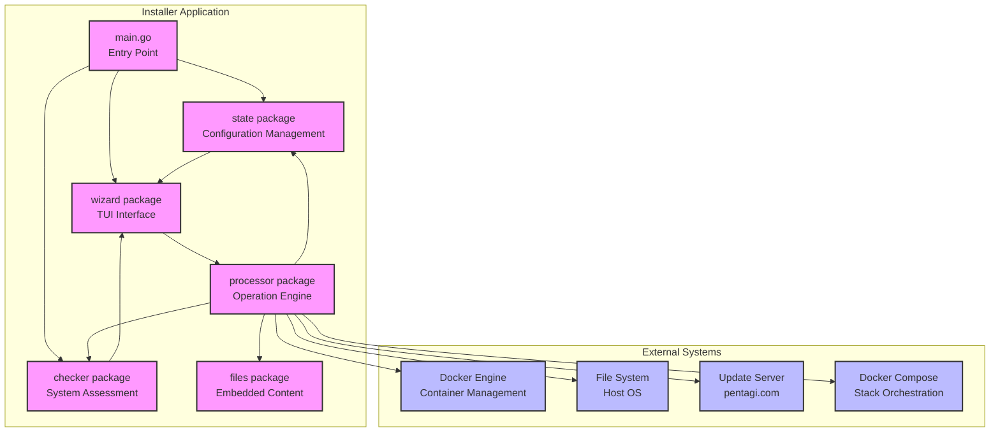
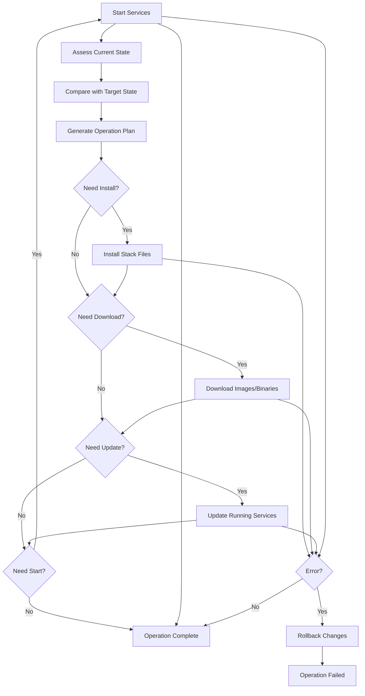

# Processor Package Architecture

## Overview

The `processor` package serves as the core orchestrator for PentAGI installer operations, managing system interactions, Docker environments, and file system operations across different product stacks. It acts as the operational engine that executes user configuration changes determined through the TUI wizard interface.

## Installer Integration Architecture



## Terms and Definitions

- **ProductStack**: Logical grouping of services that can be managed as a unit (pentagi, langfuse, observability, worker, installer, all)
- **Deployment Modes**: embedded (full local stack), external (existing service), disabled (no functionality)
- **State**: Persistent configuration storage including .env variables and wizard navigation stack
- **Checker**: System environment assessment providing current installation status and capabilities
- **TUI Wizard**: Terminal User Interface providing guided configuration flow
- **Embedded Content**: Docker compose files and configurations bundled within installer binary via go:embed
- **Worker Images**: Container images for AI agent tasks (default: debian:latest, pentest: vxcontrol/kali-linux)
- **ApplyChanges**: Deterministic state machine that transitions system from current to target configuration
- **Stack "all"**: Context-dependent operation affecting applicable stacks (excludes worker/installer for lifecycle operations)
- **Terminal Model**: Embedded pseudoterminal (`github.com/creack/pty`) providing real-time interactive command execution within TUI
- **Message Integration**: Channel-based processor integration via `ProcessorMessage` events for simple operations

## Architecture

### Main Components

- **processor.go**: Processor interface, options (`WithForce`, `WithTerminal`), and synchronous operation entry points
- **model.go**: Bubble Tea `ProcessorModel` with command wrappers and `HandleMsg` polling
- **compose.go**: Docker Compose operations and YAML file management, including strict purge `purgeImagesStack`
- **docker.go**: Docker API/CLI interactions for images, containers, networks, and volumes (worker + main)
- **fs.go**: File system operations and embedded content extraction with excluded files policy
- **logic.go**: Business logic (ApplyChanges state machine, lifecycle operations, factory reset)
- **update.go**: Update/download/remove scaffolding (installer flows currently stubbed)
- **state.go**: Operation state, messages, and terminal integration helpers

### ProductStack Types

```go
type ProductStack string

const (
    StackPentAGI        ProductStack = "pentagi"        // Main stack (docker-compose.yml)
    StackLangfuse       ProductStack = "langfuse"       // LLM observability (docker-compose-langfuse.yml)
    StackObservability  ProductStack = "observability" // System monitoring (docker-compose-observability.yml)
    StackWorker         ProductStack = "worker"         // Docker images for AI agent tasks
    StackInstaller      ProductStack = "installer"     // Installer binary itself
    StackAll            ProductStack = "all"            // Context-dependent multi-stack operation
)
```

## Detailed Operation Scenarios

### Lifecycle Management
- **Start(stack)**:
  - pentagi/langfuse/observability: `docker compose ... up -d` (honors embedded mode for non-destructive ops)
  - all: sequential start in order observability → langfuse → pentagi
  - worker/installer: not applicable

- **Stop(stack)**:
  - pentagi/langfuse/observability: `docker compose ... stop`
  - all: sequential stop in reverse order (pentagi → langfuse → observability)
  - worker/installer: not applicable

- **Restart(stack)**:
  - implemented as stop + small delay + start to avoid dependency race
  - worker/installer: not applicable

### Installation & Content Management
- **Download(stack)**:
  - pentagi/langfuse/observability: `docker compose pull`
  - worker: `docker pull ${DOCKER_DEFAULT_IMAGE_FOR_PENTEST}` (default 6GB+)
  - installer: stubbed (not implemented fully yet)
  - all: download all applicable stacks

- **Install(stack)**:
  - pentagi: extract compose file and example provider config
  - langfuse: extract compose file (embedded mode only)
  - observability: extract compose file and directory tree (embedded mode only)
  - worker: download images
  - installer: not applicable
  - all: install all configured stacks

- **Update(stack)**:
  - pentagi/langfuse/observability: download → `docker compose up -d`
  - worker: download only (no forced restart)
  - installer: stubbed (checksum/replace helpers exist, flow returns not implemented)
  - all: sequence with dependency ordering

### Removal Operations
- **Remove(stack)**:
  - pentagi/langfuse/observability: `docker compose down` (keep volumes/images)
  - worker: remove images via Docker API and related containers
  - installer: remove flow stubbed
  - all: remove all stacks

- **Purge(stack)**:
  - pentagi/langfuse/observability: `down --rmi all -v` for strict purge; standard purge `down -v` is also available
  - worker: remove all containers, images, and volumes in worker environment
  - installer: complete removal flow stubbed
  - all: purge all stacks and remove custom networks

### State Management
- **ApplyChanges()**:
  - pre-phase (wizard): integrity scan, user selects overwrite (force) or keep (no force)
  - phase 1: observability (ensure/verify files → update stack or remove if external/disabled)
  - phase 2: langfuse (same logic; local start requires `LangfuseConnected`)
  - phase 3: pentagi (always embedded; ensure/verify → update)
  - refresh checker state after each phase

- **ResetChanges()**:
  - Call `state.State.Reset()` to discard pending configuration changes
  - Preserve committed state from previous successful operations
  - Reset wizard navigation stack to last stable point

## Implementation Strategy

### High-Level Method Organization
Each specialized file should contain business-logic level methods that directly support processor interface operations, not low-level utilities.

### Stack-Specific Operations
- **compose.go**:
  - `installPentAGI()`, `installLangfuse()`, `installObservability()` - extract compose files with environment patching
  - `startStack(stack)`, `stopStack(stack)`, `restartStack(stack)` - orchestrate docker compose commands
  - `updateStack(stack)` - rolling updates with health checks
- **docker.go**:
  - `pullWorkerImage()` - download pentest image (DOCKER_DEFAULT_IMAGE_FOR_PENTEST: vxcontrol/kali-linux)
  - `pullDefaultImage()` - download general image (DOCKER_DEFAULT_IMAGE: debian:latest)
  - `removeWorkerContainers()` - cleanup running worker containers (ports 28000-32000 range)
  - `purgeWorkerImages()` - complete image removal including fallback images
- **fs.go**:
  - `ensureStackIntegrity(stack, force)` - create missing files, force update existing ones
  - `verifyStackIntegrity(stack, force)` - validate existing files, update if force=true
  - `cleanupStackFiles(stack)` - remove extracted files and directories
  - File integrity validation with YAML syntax checking
  - Embedded directory tree handling for observability stack
- **update.go**:
  - `checkUpdates()` - communicate with pentagi.com update server
  - `downloadInstaller()` - atomic binary replacement with backup
  - `updateStackImages(stack)` - orchestrate image updates with rollback
- **remove.go**:
  - `removeStack(stack)` - soft removal preserving data
  - `purgeStack(stack)` - complete cleanup including volumes and images

### Critical Implementation Details
- **Two-Track Command Execution**:
  - Worker stack: Docker API SDK (uses DOCKER_HOST, PENTAGI_DOCKER_CERT_PATH, DOCKER_TLS_VERIFY from config)
  - Compose stacks: Console commands with live output streaming to TUI
- **TUI Integration Modes**:
  - **Embedded Terminal**: Real-time pseudoterminal integration (`ProcessorTerminalModel`) via `github.com/creack/pty`
  - **Message Channel**: Simple progress tracking via `ProcessorMessage` events through channels
  - **Toggle Support**: Ctrl+T switches between modes for debugging/compatibility
- **Deployment Mode Handling**:
  - Langfuse: embedded (full stack), external (existing server), disabled (no analytics); local start guarded by `LangfuseConnected`
  - Observability: embedded (full stack), external (OTEL collector), disabled (no monitoring)
- **Environment Variable Handling**: Compose files use --env-file parameter for environment variables, only special cases require file patching
- **Progress Tracking**: Worker downloads (vxcontrol/kali-linux 6GB+ → 13GB disk) with real-time progress via terminal
- **Docker Configuration**: Support NET_ADMIN capability for network scanning, Docker socket access for container management
- **Dependency Ordering**: PentAGI must start before Langfuse/Observability for network creation
- **State Persistence**: All operations update checker.CheckResult and state.State for consistency
- **Atomic Operations**: Install/Update operations must be reversible on failure

### Integration Patterns
- **Wizard → Processor**: Called via `wizard.controllers.StateController` on user action
- **State Coordination**: Processor updates both `state.State` (configuration) and internal state tracking
- **File System Layout**: Working directory contains .env + extracted compose files + .state/ subdirectory
- **Container Naming**: Follows patterns in checker constants (PentagiContainerName, etc.)

### Key Environment Variables
- **LLM providers**: OPEN_AI_KEY, ANTHROPIC_API_KEY, GEMINI_API_KEY, BEDROCK_*, OLLAMA_SERVER_URL
- **Provider configs**: PENTAGI_LLM_SERVER_CONFIG_PATH (host path), PENTAGI_OLLAMA_SERVER_CONFIG_PATH (host path)
- **Monitoring**: LANGFUSE_BASE_URL, LANGFUSE_PROJECT_ID, OTEL_HOST
- **Docker config**: DOCKER_HOST, PENTAGI_DOCKER_CERT_PATH (host path), DOCKER_TLS_VERIFY, DOCKER_CERT_PATH (container path, managed)
- **Deployment modes**: envs determine embedded vs external vs disabled
- **Worker images**: DOCKER_DEFAULT_IMAGE (debian:latest), DOCKER_DEFAULT_IMAGE_FOR_PENTEST (vxcontrol/kali-linux)
- **Path migration**: DoMigrateSettings() migrates old DOCKER_CERT_PATH/LLM_SERVER_CONFIG_PATH/OLLAMA_SERVER_CONFIG_PATH to PENTAGI_* variants on startup

### Error Handling Strategy
- **Validation errors**: validate stack applicability before operation
- **System errors**: Docker API failures, file permissions, network issues
- **State conflicts**: partial installations, conflicting configs, version mismatches
- **Rollback logic**: atomic replace helpers for installer binary; compose operations are fail-fast without rollback

## Integration Points

### Dependencies
- **checker package**: System state assessment via `checker.CheckResult`
- **state package**: Configuration management via `state.State`
- **files package**: Embedded content access via `files.Files`
- **loader package**: .env file operations

### External Systems
- Docker Compose CLI for stack orchestration
- Docker API for container/image management
- HTTP client for installer updates from pentagi.com
- File system for content extraction and cleanup

## ApplyChanges State Machine

Deterministic operation sequence based on current vs target configuration:



### Decision Matrix
- **Fresh Install**: Install → Download → Start
- **Update Available**: Download → Update
- **Configuration Change**: Install → Update → Restart
- **Multi-Stack Setup**: Sequential operations with dependency handling

## User Scenarios & Integration

### Primary Use Cases
1. **First-time Installation**: User runs installer, configures via TUI, calls ApplyChanges to deploy complete stack
2. **Configuration Updates**: User modifies .env settings via TUI, ApplyChanges determines minimal required operations
3. **Stack Management**: User enables/disables Langfuse or Observability, system installs/removes appropriate components
4. **System Updates**: Periodic update checks trigger Download/Update operations for newer versions
5. **Troubleshooting**: Remove/Install cycles for component reset, Purge for complete cleanup

### Wizard Integration Flow
1. `main.go` initializes state, checker, launches wizard
2. `wizard.App` provides TUI for configuration changes
3. `wizard.controllers.StateController` manages state modifications
4. User triggers "Apply Changes" → wizard runs integrity scan (Enter), prompts user for update decision (Y/N), then executes `processor.ApplyChanges()` with/without force
5. Operations execute with real-time feedback to TUI; Ctrl+C cancels integrity stage only
6. `state.Commit()` persists successful changes, `state.Reset()` on failure

### Processor Usage in Wizard

**Controller Integration**: StateController creates processor instance and delegates operations
```go
// wizard/controllers/state_controller.go
type StateController struct {
    state     *state.State
    checker   *checker.CheckResult
    processor processor.Processor
}

func (c *StateController) ApplyUserChanges() error {
    return c.processor.ApplyChanges(context.Background(),
        processor.WithForce(), // User explicitly requested changes
    )
}
```

**Screen-Level Operations**: Modern approach with embedded terminal model
```go
// wizard/models/apply_changes.go (current implementation)
type ApplyChangesFormModel struct {
    processor           processor.Processor
    terminalModel       processor.ProcessorTerminalModel
    useEmbeddedTerminal bool
}

func (m *ApplyChangesFormModel) startApplyProcess() tea.Cmd {
    if m.useEmbeddedTerminal && m.terminalModel != nil {
        return m.terminalModel.StartOperation("ApplyChanges", processor.ProductStackAll)
    }

    // Fallback for message-based integration
    messageChan := make(chan processor.ProcessorMessage, 100)
    return processor.CreateApplyChangesCommand(m.processor,
        processor.WithForce(),
        processor.WithTea(messageChan),
    )
}

// Terminal model integration in Update method
func (m *ApplyChangesFormModel) Update(msg tea.Msg) (tea.Model, tea.Cmd) {
    if m.useEmbeddedTerminal && m.terminalModel != nil {
        updatedModel, terminalCmd := m.terminalModel.Update(msg)
        if terminalModel, ok := updatedModel.(processor.ProcessorTerminalModel); ok {
            m.terminalModel = terminalModel
        }
        return m, terminalCmd
    }
    // Handle other cases...
}
```

**Real-Time Integration**: Terminal model provides native real-time feedback
```go
// No manual polling required - terminal model handles real-time updates automatically
func (m *ApplyChangesFormModel) renderTerminalPanel() string {
    if m.useEmbeddedTerminal && m.terminalModel != nil {
        return m.terminalModel.View() // Complete terminal interface
    }
    return m.renderFallbackPanel() // Message-based fallback
}

// Dynamic resizing support
case tea.WindowSizeMsg:
    if m.useEmbeddedTerminal && m.terminalModel != nil {
        contentWidth, contentHeight := m.getViewportFormSize()
        m.terminalModel.SetSize(contentWidth-2, contentHeight-2)
    }
```

## Implementation Requirements

### CommandOption Design

```go
type commandConfig struct {
    // Execution control
    Force        bool                     // Skip validation checks and attempt maximum operations

    // TUI Integration - two integration modes available
    Tea          chan ProcessorMessage    // Message-based integration via channel
    TerminalModel ProcessorTerminalModel  // Embedded terminal model integration
}

// Simplified option pattern (only essential options)
type CommandOption func(*commandConfig)

func WithForce() CommandOption {
    return func(c *commandConfig) { c.Force = true }
}

func WithTea(messageChan chan ProcessorMessage) CommandOption {
    return func(c *commandConfig) { c.Tea = messageChan }
}

func WithTerminalModel(terminal ProcessorTerminalModel) CommandOption {
    return func(c *commandConfig) { c.TerminalModel = terminal }
}
```

### Update Server Protocol
- Uses existing `checker.CheckUpdatesRequest`/`CheckUpdatesResponse` structures
- Binary download with SHA256 verification
- Atomic replacement via temporary file + rename
- Post-update exit with restart instruction message

### Critical Safety Measures
- **Pre-flight Checks**: Validate system resources before major operations
- **Backup Strategy**: Create backups before destructive operations (Purge)
- **Network Isolation**: Respect proxy settings from environment configuration
- **Permission Handling**: Graceful handling of Docker socket access requirements

### Current Architecture

**Core Components**:
- **processor.go**: Interface implementation and delegation
- **model.go**: ProcessorModel for tea.Cmd wrapping
- **logic.go**: Business logic (ApplyChanges, lifecycle operations)
- **state.go**: Operation state management
- **compose.go, docker.go, fs.go, update.go**: Specialized operations

**Testing Infrastructure**:
- **mock_test.go**: Comprehensive mocks with call tracking
- **logic_test.go**: Business logic tests
- **fs_test.go**: File system operation tests
- **Mock CheckHandler**: Flexible system state simulation

**Integration Points**:
- **Wizard**: Uses ProcessorModel with terminal integration
- **Checker**: Uses CheckHandler interface for state assessment
- **State**: Configuration management and persistence
