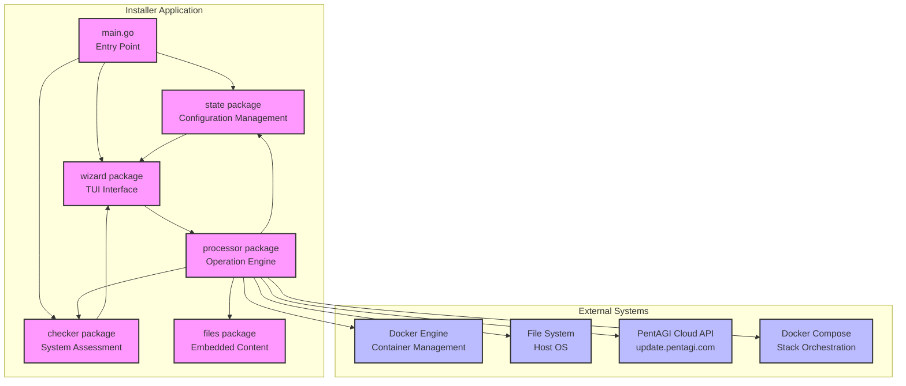
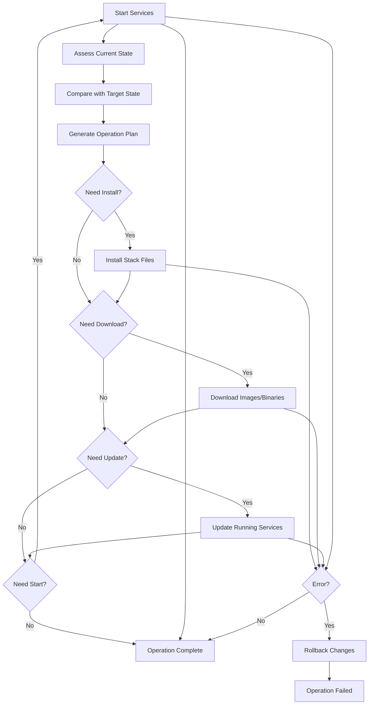

# Processor Package Architecture

## Overview

The `processor` package serves as the core orchestrator for PentAGI installer operations, managing system interactions, Docker environments, and file system operations across different product stacks. It acts as the operational engine that executes user configuration changes determined through the TUI wizard interface.

## Installer Integration Architecture


```mermaid
graph TB
    subgraph "Installer Application"
        Main[main.go<br/>Entry Point]
        State[state package<br/>Configuration Management]
        Checker[checker package<br/>System Assessment]
        Files[files package<br/>Embedded Content]
        Wizard[wizard package<br/>TUI Interface]
        Processor[processor package<br/>Operation Engine]
    end

    subgraph "External Systems"
        Docker[Docker Engine<br/>Container Management]
        FS[File System<br/>Host OS]
        UpdateServer[PentAGI Cloud API<br/>update.pentagi.com]
        Compose[Docker Compose<br/>Stack Orchestration]
    end

    Main --> State
    Main --> Checker
    Main --> Wizard
    State --> Wizard
    Checker --> Wizard
    Wizard --> Processor
    Processor --> State
    Processor --> Checker
    Processor --> Files
    Processor --> Docker
    Processor --> FS
    Processor --> UpdateServer
    Processor --> Compose

    classDef core fill:#f9f,stroke:#333,stroke-width:2px
    classDef external fill:#bbf,stroke:#333,stroke-width:2px

    class Main,State,Checker,Files,Wizard,Processor core
    class Docker,FS,UpdateServer,Compose external
```

## Terms and Definitions

- **ProductStack**: Logical grouping of services that can be managed as a unit (pentagi, graphiti, langfuse, observability, compose, worker, installer, all)
- **Deployment Modes**: embedded (full local stack), external (existing service), disabled (no functionality)
- **State**: Persistent configuration storage including .env variables and wizard navigation stack
- **Checker**: System environment assessment providing current installation status and capabilities
- **TUI Wizard**: Terminal User Interface providing guided configuration flow
- **Embedded Content**: Docker compose files and configurations bundled within installer binary via go:embed
- **Worker Images**: Container images for AI agent tasks (default: debian:latest, pentest: vxcontrol/kali-linux)
- **ApplyChanges**: Deterministic state machine that transitions system from current to target configuration
- **Stack "all"**: Context-dependent operation affecting applicable stacks (excludes worker/installer for lifecycle operations)
- **Terminal Model**: Embedded pseudoterminal (`github.com/creack/pty`) providing real-time interactive command execution within TUI
- **Message Integration**: Channel-based processor integration via `ProcessorMessage` events for simple operations

## Architecture

### Main Components

- **processor.go**: Processor interface, options (`WithForce`, `WithTerminal`), and synchronous operation entry points
- **model.go**: Bubble Tea `ProcessorModel` with command wrappers and `HandleMsg` polling
- **compose.go**: Docker Compose operations and YAML file management, including strict purge `purgeImagesStack`
- **docker.go**: Docker API/CLI interactions for images, containers, networks, and volumes (worker + main)
- **fs.go**: File system operations and embedded content extraction with excluded files policy
- **logic.go**: Business logic (ApplyChanges state machine, lifecycle operations, factory reset)
- **update.go**: Cloud-facing operations — update check, installer package description, installer download with progress reporting
- **pull_reference.go**: Writes the image references the cloud chose into `.env` before a compose pull
- **jaeger_plugin.go**: Downloads the Jaeger storage plugin (a file, not an image) and puts it in place
- **verify.go**: Post-update comparison of what is installed against what was offered
- **reference_drift.go**: Reports compose image variables pointing at a repository this build does not ship
- **state.go**: Operation state, messages, and terminal integration helpers

### ProductStack Types

```go
type ProductStack string

const (
    ProductStackPentagi       ProductStack = "pentagi"       // Main stack (docker-compose.yml)
    ProductStackGraphiti      ProductStack = "graphiti"      // Knowledge graph (docker-compose-graphiti.yml)
    ProductStackLangfuse      ProductStack = "langfuse"      // LLM observability (docker-compose-langfuse.yml)
    ProductStackObservability ProductStack = "observability" // System monitoring (docker-compose-observability.yml)
    ProductStackCompose       ProductStack = "compose"       // The four compose stacks together
    ProductStackWorker        ProductStack = "worker"        // Docker images for AI agent tasks
    ProductStackInstaller     ProductStack = "installer"     // Installer binary itself
    ProductStackAll           ProductStack = "all"           // Context-dependent multi-stack operation
)
```

## Detailed Operation Scenarios

### Lifecycle Management
- **Start(stack)**:
  - pentagi/langfuse/observability: `docker compose ... up -d` (honors embedded mode for non-destructive ops)
  - all: sequential start in order observability → langfuse → pentagi
  - worker/installer: not applicable

- **Stop(stack)**:
  - pentagi/langfuse/observability: `docker compose ... stop`
  - all: sequential stop in reverse order (pentagi → langfuse → observability)
  - worker/installer: not applicable

- **Restart(stack)**:
  - implemented as stop + small delay + start to avoid dependency race
  - worker/installer: not applicable

### Installation & Content Management
- **Download(stack)**:
  - pentagi: `docker compose pull`; graphiti/langfuse/observability: the same, but only in embedded mode (external/disabled stacks are skipped)
  - worker: `docker pull ${DOCKER_DEFAULT_IMAGE_FOR_PENTEST}` (default 6GB+), then refresh worker and update facts
  - installer: download and verify the offered installer build (no-op when already current, error when the update server is unreachable) — see *Installer self-update* below
  - compose: the four compose stacks in order
  - all: compose stacks, then worker, then installer

- **Install(stack)**:
  - pentagi: extract compose file and example provider config
  - langfuse: extract compose file (embedded mode only)
  - observability: extract compose file and directory tree (embedded mode only)
  - graphiti: extract compose file plus the `graphiti/` and `neo4j/` directory trees (embedded mode only)
  - worker: download images
  - installer: not applicable
  - all: install all configured stacks (only the ones not yet installed)

- **Update(stack)**:
  - pentagi/graphiti/langfuse/observability: no-op when the checker already says the stack is up to date; otherwise (observability only) update the Jaeger storage plugin → `docker compose pull` → `docker compose up -d` → restart the `jaeger` service if that plugin was actually replaced → re-gather that stack's facts. Writing the image references is not a separate first step: the pull and the `up -d` each write them into `.env` themselves (see *Image references are written before the pull*)
  - worker: pull worker images only (no forced restart)
  - installer: same download-and-verify as `Download`; the running binary is never replaced
  - compose: the four compose stacks in order observability → langfuse → graphiti → pentagi
  - all: the compose stacks in that order, then worker, then installer
  - every update ends with a fresh update check followed by a verification report (see *Post-update verification*)

#### Image references are written before the pull

Every `image:` in the shipped compose files is `${<COMPONENT>_IMAGE:-<default>}`, so the variable — not the file — decides what `docker compose pull` fetches. `applyPullReferences(stack)` reads `PullReference` from the components of that stack in the last check answer and writes them into `.env` via `state.WriteVars`, logging every `NAME=reference` it wrote.

`WriteVars` and **not** `SetVars`. Everything else in the state package stages: `SetVar`/`SetVars` record an intention that reaches `.env` only when the user applies their changes. The pull that follows is `docker compose --env-file <.env>`, so a staged variable is one compose has never heard of — `${PENTAGI_IMAGE:-vxcontrol/pentagi:latest}` falls back to the default, the pull fetches something the server never offered, and the update reports success. `WriteVars` re-reads the file from disk, sets these values on it and saves, so the user's pending edits are neither applied nor lost, and the installation is not left dirty by a value the installer wrote for itself.

- The variable name is derived from the component name (upper case, `-` → `_`, suffix `_IMAGE`) rather than kept in a table, so a new component needs no second registration; a mismatch degrades to "the compose default was used", which `docker compose config` shows.
- It runs **before** the pull. Writing afterwards would pull the old reference and then record the new intention — an update that reports success and changes nothing.
- The installer does not choose a tag. `pull_reference` is ready to use as it arrives and is not always `repository:tag` — it may name a more specific, immutable tag than the one the compose file carries, and a client that rebuilt `repository:tag` locally would silently pull something it was never offered.
- Components the answer did not resolve carry no reference and are skipped. Writing an empty value would work (`${VAR:-default}` treats empty as absent) but would erase a reference an earlier answer pinned.
- A write failure is returned rather than logged and swallowed, for the same reason.
- Skipping is safe by construction: an installation that never got an answer falls back to the reference the compose file shipped with and behaves exactly as before.
- Every operation that fetches writes them, because the write lives in `updateStack` and `downloadStack` rather than at the call sites. There are more call sites than is comfortable — `Update` (which calls both), `Download`, `Install` and the four `ApplyChanges` phases — and the one that forgot would not be a compile error: `${COMPONENT_IMAGE:-default}` would quietly resolve to the shipped default and the operation would report success having fetched something the server never offered. The tear-down operations deliberately do not write: `down` needs no reference, and writing one while removing a stack would be a side effect nobody asked for.
- `ReferenceDrift()` is the separate query for the opposite problem: variables pointing at a different *repository* than this build ships. A different tag of the same repository is the mechanism working, not drift, so it is not reported; realignment is a deliberate user action, never a side effect of an update.

#### Jaeger storage plugin (observability only)

The plugin is a **file** mounted into the Jaeger container, which loads it over gRPC — no amount of image pulling updates it. Both architectures (`observability/jaeger/bin/jaeger-clickhouse-linux-amd64` and `-arm64`) are kept in step, because which one runs is decided inside the container by the architecture of the Docker VM and the entrypoint picks the file by `uname -m` at start.

- Fetched **before** the images. A plugin that cannot be downloaded aborts the stack update with nothing else disturbed; doing it afterwards would leave images pulled and the stack restarted around a plugin that never arrived.
- `updateJaegerPlugin` reports **whether it replaced anything**, and when it did, the update restarts the `jaeger` service after `up -d`. The `up -d` is not enough on its own: compose recreates a container only when its *spec* changes, and a different file inside a bind mount is not a spec change. The plugin is exec'd by the entrypoint at container start, so when the plugin was replaced but the Jaeger image was not, the container keeps running the plugin it loaded when it came up — the update looks applied while nothing about it is. The restart is skipped when nothing was replaced, so an observability update that only moves images does not bounce Jaeger for no reason.
- Only components the checker marked outdated are fetched. Membership in the answer is not the test — it also lists artefacts that are already current — so "download everything listed" would mean ~28MB per architecture on every observability update. Components whose OS is not linux are skipped as well: the file name says linux, and content for another platform would land under a linux name.
- Written to `<target>.new` **in the target's own directory** and renamed into place. The file being replaced is the one a running Jaeger loads, so an interrupted in-place write would leave a truncated plugin and the container would come back up with an opaque gRPC error. The staging file is a sibling because `os.Rename` is atomic only within one filesystem, and because writing an executable to the system temp directory and moving it is the pattern antivirus and EDR products score heavily.
- Created with mode `0755` **at creation**, not afterwards: `os.Rename` does not carry the destination's mode, the result keeps the staging file's, and a plugin created `0644` ends up non-executable — with Jaeger failing on a gRPC plugin error rather than a permission one.
- Leftover `.new` files are removed at the start of every run, whether or not anything is to be fetched: an interrupted download leaves ~28MB that nothing else would ever clean up, because integrity verification only walks files the installer ships. Removal is by exact name and never by glob — the directory is mounted into a container and an operator may keep their own files there.
- Both plugin paths are in `filesToExcludeFromVerification` with the "create if missing, never overwrite" policy. Without that the update would undo itself: the downloaded plugin differs from the embedded copy, so integrity verification calls it modified and under force — which is the path a stack update takes — copies the shipped version back over it.

#### Post-update verification

Every successful update answers one question in two steps: did the artefacts that are now installed become the ones that were offered?

- The targets are captured **before** the update runs, because the update replaces the answer; comparing against the new answer would compare the result with itself and always agree.
- **Step 1 — local re-check.** The components observed after the update are compared with the captured targets, and three outcomes are stated in different words: *matches the published build*, *no published digest to compare against* (the answer carried no digest, or nothing is installed — not a failure), and *expected X, got Y*.
- **Step 2 — a fresh check against the cloud.** It runs in the same deferred call, and its answer is what repaints the maintenance menu: only the server knows whether something newer appeared in the meantime.
- The comparison runs **after** the fresh check, because the fresh check settles the one legitimate disagreement. A moving tag can move between the answer and the pull, so what is installed may match no target and still be right. If the server no longer offers an update for the stack, the difference is reported as *newer than the offered build*; if the offer stands, it is a mismatch. A re-check that itself failed is no authority, so a difference stays a mismatch.
- Verification never fails the operation. The update either worked or reported an error; this is a report about the result, and turning a registry that moved ahead into a failed update would be worse than saying nothing.
- The installer stack is excluded from verification deliberately: its operation downloads a build without applying it, so comparing against the running binary would report the intended outcome as a mismatch.

#### Installer self-update

`Download(installer)` and `Update(installer)` are two menu entries over the same operation, and that operation ends at "downloaded and verified".

- The build is described first (`packages/info`), then streamed to `installer_<version>` (`.exe` on Windows) in the directory holding `.env`, with length, sha256 and Ed25519 signature checked as the bytes arrive. Progress is printed every 10% — one line per read would bury the surrounding output.
- **The running binary is never replaced.** A process cannot reliably replace the file it is executing: Linux refuses the write (`ETXTBSY`), Windows holds it locked, and getting it wrong leaves the user with no installer at all. Instead the screen prints the exact command — `mv "<downloaded>" "<running installer>"`, or `move /Y` on Windows, both paths quoted so an installation under a path with a space does not become two arguments. If `os.Executable` says nothing, no command is printed at all: a command with a guessed destination is worse than none.
- The version is part of the file name so a download cannot overwrite the installer in use, and an inode-based guard refuses to write to a file that *is* the running binary (Linux would answer `ETXTBSY`, macOS would silently truncate it).
- The file is written under its final name in the installation directory rather than through the system temp directory, for the same antivirus/EDR reason as the Jaeger plugin.
- An unfinished download is deleted — verification only completes on the last byte, so a file named like a release but unverified must not be left next to the installation — and the held package description is dropped with it, so a build republished under the same version does not make every retry fail identically.
- `InstallerPackage(ctx)` describes the offer without downloading: version, os/arch, size, the exact path the download will use, whether a file is already there, and the running binary's path. The screen needs the size *before* asking for consent; the description is remembered and reused by the download, so one press of the action does not pay for the same request twice (every call carries a proof-of-work challenge and counts against the account's daily allowance). The only thing the screen asks the user to confirm is overwriting a file that is already there.
- `removeInstaller` is the one operation still unimplemented: it returns an error.

### Removal Operations
- **Remove(stack)**:
  - pentagi/langfuse/observability: `docker compose down` (keep volumes/images)
  - worker: remove images via Docker API and related containers
  - installer: remove flow stubbed
  - all: remove all stacks

- **Purge(stack)**:
  - pentagi/langfuse/observability: `down --rmi all -v` for strict purge; standard purge `down -v` is also available
  - worker: remove all containers, images, and volumes in worker environment
  - installer: complete removal flow stubbed
  - all: purge all stacks and remove custom networks

### State Management
- **ApplyChanges()**:
  - pre-phase (wizard): integrity scan, user selects overwrite (force) or keep (no force)
  - phase 1: observability (ensure/verify files → update stack or remove if external/disabled)
  - phase 2: langfuse (same logic; local start requires `LangfuseConnected`)
  - phase 3: graphiti (same logic; local start requires `GraphitiConnected`)
  - phase 4: pentagi (always embedded; ensure/verify → update)
  - refresh checker state after each phase
  - `Install` reuses the same four phases, each guarded by "not installed yet"

- **ResetChanges()**:
  - Call `state.State.Reset()` to discard pending configuration changes
  - Preserve committed state from previous successful operations
  - Reset wizard navigation stack to last stable point

## Implementation Strategy

### High-Level Method Organization
Each specialized file should contain business-logic level methods that directly support processor interface operations, not low-level utilities.

### Stack-Specific Operations
- **compose.go**:
  - `startStack(stack)`, `stopStack(stack)`, `restartStack(stack)` - orchestrate docker compose commands
  - `updateStack(stack)` / `downloadStack(stack)` - the only two operations that fetch, and the two that write the chosen image references first
  - `removeStack(stack)` / `purgeStack(stack)` / `purgeImagesStack(stack)` - `down`, `down -v`, `down --rmi all -v`
- **docker.go**:
  - `pullWorkerImage()` - download pentest image (DOCKER_DEFAULT_IMAGE_FOR_PENTEST: vxcontrol/kali-linux)
  - `pullDefaultImage()` - download general image (DOCKER_DEFAULT_IMAGE: debian:latest)
  - `removeWorkerContainers()` - cleanup running worker containers (ports 28000-32000 range)
  - `purgeWorkerImages()` - complete image removal including fallback images
- **fs.go**:
  - `ensureStackIntegrity(stack, force)` - create missing files, force update existing ones
  - `verifyStackIntegrity(stack, force)` - validate existing files, update if force=true
  - `cleanupStackFiles(stack)` - remove extracted files and directories
  - File integrity validation with YAML syntax checking
  - Embedded directory tree handling for observability stack
- **update.go**:
  - `checkUpdates()` - refresh what the PentAGI Cloud API says about this installation; the answer lands on the shared `checker.CheckResult` instead of being returned, so there is only one copy of it
  - `installerPackage()` - describe the offered build (version, platform, size, target path) without downloading it
  - `downloadInstaller()` / `updateInstaller()` - the same operation under two names: fetch `installer_<version>` and verify it; the running binary is left alone
  - `updateJaegerPlugin()` - bring the Jaeger storage plugin files up to the offered version (in `jaeger_plugin.go`)
- **pull_reference.go**:
  - `applyPullReferences(stack)` - write the chosen image references into `.env` before a pull
- **verify.go**:
  - `captureStackTargets(result, stack)` / `verifyStackUpdate(stack, targets, state)` - the two halves of the post-update comparison
- **logic.go**:
  - `remove(stack)` / `purge(stack)` - the removal orchestration; the compose helpers above do the work

### Critical Implementation Details
- **Two-Track Command Execution**:
  - Worker stack: Docker API SDK (uses DOCKER_HOST, PENTAGI_DOCKER_CERT_PATH, DOCKER_TLS_VERIFY from config)
  - Compose stacks: Console commands with live output streaming to TUI
- **TUI Integration Modes**:
  - **Embedded Terminal**: Real-time pseudoterminal integration (`ProcessorTerminalModel`) via `github.com/creack/pty`
  - **Message Channel**: Simple progress tracking via `ProcessorMessage` events through channels
  - **Toggle Support**: Ctrl+T switches between modes for debugging/compatibility
- **Deployment Mode Handling**:
  - Langfuse: embedded (full stack), external (existing server), disabled (no analytics); local start guarded by `LangfuseConnected`
  - Observability: embedded (full stack), external (OTEL collector), disabled (no monitoring)
- **Environment Variable Handling**: Compose files use --env-file parameter for environment variables, only special cases require file patching. Image references are part of this: every `image:` is `${<COMPONENT>_IMAGE:-<default>}`, and every operation that fetches writes those variables from the cloud answer into `.env` before pulling — bypassing the staging area, since compose reads the file
- **Progress Tracking**: Worker downloads (vxcontrol/kali-linux 6GB+ → 13GB disk) with real-time progress via terminal; file downloads (installer build, Jaeger plugin) report every 10% against the size the package description gave
- **Docker Configuration**: Support NET_ADMIN capability for network scanning, Docker socket access for container management
- **Dependency Ordering**: PentAGI must start before Langfuse/Observability for network creation
- **State Persistence**: All operations update checker.CheckResult and state.State for consistency
- **Atomicity**: Only file downloads are atomic (staged sibling + rename for the Jaeger plugin, delete-on-failure for the installer build). Compose operations are not reversible — a failed update leaves whatever compose managed to do

### Integration Patterns
- **Wizard → Processor**: Called via `wizard.controllers.StateController` on user action
- **State Coordination**: Processor updates both `state.State` (configuration) and internal state tracking
- **File System Layout**: Working directory contains .env + extracted compose files + .state/ subdirectory
- **Container Naming**: Follows patterns in checker constants (PentagiContainerName, etc.)

### Key Environment Variables
- **LLM providers**: OPEN_AI_KEY, ANTHROPIC_API_KEY, GEMINI_API_KEY, BEDROCK_*, DEEPSEEK_*, GLM_*, KIMI_*, QWEN_*, OLLAMA_SERVER_URL
- **Provider configs**: PENTAGI_LLM_SERVER_CONFIG_PATH (host path), PENTAGI_OLLAMA_SERVER_CONFIG_PATH (host path), PENTAGI_BEDROCK_CONFIG_PATH (host path)
- **Monitoring**: LANGFUSE_BASE_URL, LANGFUSE_PROJECT_ID, OTEL_HOST
- **Docker config**: DOCKER_HOST, PENTAGI_DOCKER_CERT_PATH (host path), DOCKER_TLS_VERIFY, DOCKER_CERT_PATH (container path, managed)
- **Deployment modes**: envs determine embedded vs external vs disabled
- **Worker images**: DOCKER_DEFAULT_IMAGE (debian:latest), DOCKER_DEFAULT_IMAGE_FOR_PENTEST (vxcontrol/kali-linux)
- **Path migration**: DoMigrateSettings() migrates old DOCKER_CERT_PATH/LLM_SERVER_CONFIG_PATH/OLLAMA_SERVER_CONFIG_PATH/BEDROCK_CONFIG_PATH to PENTAGI_* variants on startup

### Error Handling Strategy
- **Validation errors**: validate stack applicability before operation
- **System errors**: Docker API failures, file permissions, network issues
- **State conflicts**: partial installations, conflicting configs, version mismatches
- **Rollback logic**: none for compose operations — they are fail-fast. Only file downloads are protected: the Jaeger plugin is staged next to its target and renamed only after a clean write, and an unverified installer download is deleted rather than left behind

## Integration Points

### Dependencies
- **checker package**: System state assessment via `checker.CheckResult`
- **state package**: Configuration management via `state.State`
- **files package**: Embedded content access via `files.Files`
- **loader package**: .env file operations

### External Systems
- Docker Compose CLI for stack orchestration
- Docker API for container/image management
- HTTP client (`cloud` package) for update checks and file downloads from the PentAGI Cloud API
- File system for content extraction and cleanup

## ApplyChanges State Machine

Deterministic operation sequence based on current vs target configuration:


```mermaid
graph TD
    Start([ApplyChanges Called]) --> Assess[Assess Current State]
    Assess --> Compare[Compare with Target State]
    Compare --> Plan[Generate Operation Plan]

    Plan --> NeedInstall{Need Install?}
    NeedInstall -->|Yes| Install[Install Stack Files]
    NeedInstall -->|No| NeedDownload{Need Download?}
    Install --> NeedDownload

    NeedDownload -->|Yes| Download[Download Images/Binaries]
    NeedDownload -->|No| NeedUpdate{Need Update?}
    Download --> NeedUpdate

    NeedUpdate -->|Yes| Update[Update Running Services]
    NeedUpdate -->|No| NeedStart{Need Start?}
    Update --> NeedStart

    NeedStart -->|Yes| Start[Start Services]
    NeedStart -->|No| Success[Operation Complete]
    Start --> Success

    Install --> Rollback{Error?}
    Download --> Rollback
    Update --> Rollback
    Start --> Rollback
    Rollback -->|Yes| Cleanup[Rollback Changes]
    Rollback -->|No| Success
    Cleanup --> Failure[Operation Failed]
```

### Decision Matrix
- **Fresh Install**: Install → Download → Start
- **Update Available**: Download → Update
- **Configuration Change**: Install → Update → Restart
- **Multi-Stack Setup**: Sequential operations with dependency handling

## User Scenarios & Integration

### Primary Use Cases
1. **First-time Installation**: User runs installer, configures via TUI, calls ApplyChanges to deploy complete stack
2. **Configuration Updates**: User modifies .env settings via TUI, ApplyChanges determines minimal required operations
3. **Stack Management**: User enables/disables Langfuse or Observability, system installs/removes appropriate components
4. **System Updates**: Periodic update checks trigger Download/Update operations for newer versions
5. **Troubleshooting**: Remove/Install cycles for component reset, Purge for complete cleanup

### Wizard Integration Flow
1. `main.go` initializes state, checker, launches wizard
2. `wizard.App` provides TUI for configuration changes
3. `wizard.controllers.StateController` manages state modifications
4. User triggers "Apply Changes" → wizard runs integrity scan (Enter), prompts user for update decision (Y/N), then executes `processor.ApplyChanges()` with/without force
5. Operations execute with real-time feedback to TUI; Ctrl+C cancels integrity stage only
6. `state.Commit()` persists successful changes, `state.Reset()` on failure

### Processor Usage in Wizard

**Controller Integration**: StateController creates processor instance and delegates operations
```go
// wizard/controllers/state_controller.go
type StateController struct {
    state     *state.State
    checker   *checker.CheckResult
    processor processor.Processor
}

func (c *StateController) ApplyUserChanges() error {
    return c.processor.ApplyChanges(context.Background(),
        processor.WithForce(), // User explicitly requested changes
    )
}
```

**Screen-Level Operations**: Modern approach with embedded terminal model
```go
// wizard/models/apply_changes.go (current implementation)
type ApplyChangesFormModel struct {
    processor           processor.Processor
    terminalModel       processor.ProcessorTerminalModel
    useEmbeddedTerminal bool
}

func (m *ApplyChangesFormModel) startApplyProcess() tea.Cmd {
    if m.useEmbeddedTerminal && m.terminalModel != nil {
        return m.terminalModel.StartOperation("ApplyChanges", processor.ProductStackAll)
    }

    // Fallback for message-based integration
    messageChan := make(chan processor.ProcessorMessage, 100)
    return processor.CreateApplyChangesCommand(m.processor,
        processor.WithForce(),
        processor.WithTea(messageChan),
    )
}

// Terminal model integration in Update method
func (m *ApplyChangesFormModel) Update(msg tea.Msg) (tea.Model, tea.Cmd) {
    if m.useEmbeddedTerminal && m.terminalModel != nil {
        updatedModel, terminalCmd := m.terminalModel.Update(msg)
        if terminalModel, ok := updatedModel.(processor.ProcessorTerminalModel); ok {
            m.terminalModel = terminalModel
        }
        return m, terminalCmd
    }
    // Handle other cases...
}
```

**Real-Time Integration**: Terminal model provides native real-time feedback
```go
// No manual polling required - terminal model handles real-time updates automatically
func (m *ApplyChangesFormModel) renderTerminalPanel() string {
    if m.useEmbeddedTerminal && m.terminalModel != nil {
        return m.terminalModel.View() // Complete terminal interface
    }
    return m.renderFallbackPanel() // Message-based fallback
}

// Dynamic resizing support
case tea.WindowSizeMsg:
    if m.useEmbeddedTerminal && m.terminalModel != nil {
        contentWidth, contentHeight := m.getViewportFormSize()
        m.terminalModel.SetSize(contentWidth-2, contentHeight-2)
    }
```

## Implementation Requirements

### CommandOption Design

```go
type commandConfig struct {
    // Execution control
    Force        bool                     // Skip validation checks and attempt maximum operations

    // TUI Integration - two integration modes available
    Tea          chan ProcessorMessage    // Message-based integration via channel
    TerminalModel ProcessorTerminalModel  // Embedded terminal model integration
}

// Simplified option pattern (only essential options)
type CommandOption func(*commandConfig)

func WithForce() CommandOption {
    return func(c *commandConfig) { c.Force = true }
}

func WithTea(messageChan chan ProcessorMessage) CommandOption {
    return func(c *commandConfig) { c.Tea = messageChan }
}

func WithTerminalModel(terminal ProcessorTerminalModel) CommandOption {
    return func(c *commandConfig) { c.TerminalModel = terminal }
}
```

### Update Server Protocol
- Every call goes through the `cloud` package to the PentAGI Cloud API at `UPDATE_SERVER_HOST` (default `update.pentagi.com`), always honoring `PROXY_URL` — the installer's own proxy setting, which the process environment may not carry. `SUPPORT_SERVER_HOST` (default `support.pentagi.com`) is written by the same settings form and belongs to the Support API; no call here targets it yet
- `/api/v1/proxy/updates/check` reports the installed components and answers per stack: whether an update exists, the version transition, and per component the action, the pull reference and the target digest
- `/api/v1/proxy/packages/info` then `/api/v1/proxy/packages/download` fetch a file (installer build, Jaeger storage plugin). The description carries the size, sha256 and signature the stream is checked against; that size is also the only length the client ever learns, since the encrypted body carries no `Content-Length`, so download progress is computed from it
- No atomic self-replacement and no post-update exit: the downloaded installer is left on disk with the command to move it into place

### Critical Safety Measures
- **Pre-flight Checks**: Validate system resources before major operations
- **Backup Strategy**: Create backups before destructive operations (Purge)
- **Network Isolation**: Respect proxy settings from environment configuration
- **Permission Handling**: Graceful handling of Docker socket access requirements

### Current Architecture

**Core Components**:
- **processor.go**: Interface implementation and delegation
- **model.go**: ProcessorModel for tea.Cmd wrapping
- **logic.go**: Business logic (ApplyChanges, lifecycle operations)
- **state.go**: Operation state management
- **compose.go, docker.go, fs.go, update.go**: Specialized operations
- **pull_reference.go, jaeger_plugin.go, verify.go, reference_drift.go**: The update path — image references, plugin file, post-update comparison, drift reporting

**Testing Infrastructure**:
- **fixtures_test.go**: Comprehensive mocks with call tracking
- **logic_test.go**: Business logic tests
- **fs_test.go**: File system operation tests
- **update_test.go, pull_reference_test.go, jaeger_plugin_test.go, verify_test.go**: Download progress and package description reuse, image reference selection, plugin staging and cleanup, the four verification outcomes
- **Mock CheckHandler**: Flexible system state simulation

**Integration Points**:
- **Wizard**: Uses ProcessorModel with terminal integration
- **Checker**: Uses CheckHandler interface for state assessment
- **State**: Configuration management and persistence
