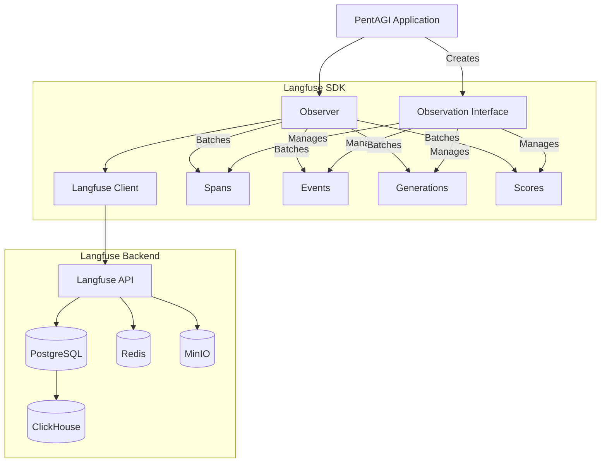
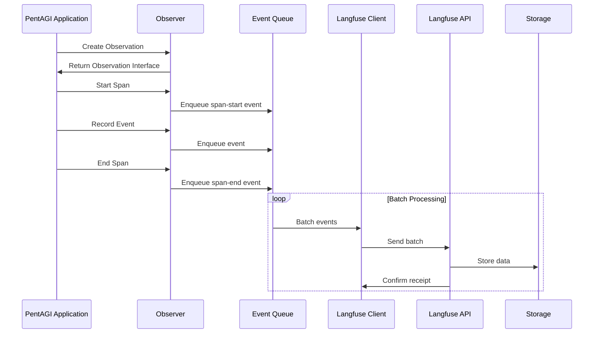

# Langfuse Integration for PentAGI

This document provides a comprehensive guide to the Langfuse integration in PentAGI, covering architecture, setup, usage patterns, and best practices for developers.

## Table of Contents

- [Langfuse Integration for PentAGI](#langfuse-integration-for-pentagi)
  - [Table of Contents](#table-of-contents)
  - [Introduction](#introduction)
  - [Architecture](#architecture)
    - [Component Overview](#component-overview)
    - [Data Flow](#data-flow)
    - [Key Interfaces](#key-interfaces)
      - [Observer Interface](#observer-interface)
      - [Observation Interface](#observation-interface)
      - [Span, Event, and Generation Interfaces](#span-event-and-generation-interfaces)
  - [Setup and Configuration](#setup-and-configuration)
    - [Infrastructure Requirements](#infrastructure-requirements)
    - [Configuration Options](#configuration-options)
    - [Initialization](#initialization)
  - [Usage Guide](#usage-guide)
    - [Creating Observations](#creating-observations)
    - [Recording Spans](#recording-spans)
    - [Tracking Events](#tracking-events)
    - [Logging Generations](#logging-generations)
    - [Adding Scores](#adding-scores)
    - [Recording Agent Observations](#recording-agent-observations)
    - [Recording Tool Observations](#recording-tool-observations)
    - [Recording Chain Observations](#recording-chain-observations)
    - [Recording Retriever Observations](#recording-retriever-observations)
    - [Recording Evaluator Observations](#recording-evaluator-observations)
    - [Recording Embedding Observations](#recording-embedding-observations)
    - [Recording Guardrail Observations](#recording-guardrail-observations)
    - [Context Propagation](#context-propagation)
  - [Integration Examples](#integration-examples)
    - [Flow Controller Integration](#flow-controller-integration)
    - [Agent Execution Tracking](#agent-execution-tracking)
    - [LLM Call Monitoring](#llm-call-monitoring)
  - [Advanced Topics](#advanced-topics)
    - [Batching and Performance](#batching-and-performance)
    - [Error Handling](#error-handling)
    - [Custom Metadata](#custom-metadata)

## Introduction

Langfuse is an open-source observability platform specifically designed for LLM-powered applications. The PentAGI integration with Langfuse provides:

- **Comprehensive tracing** for AI agent flows and tasks
- **Detailed telemetry** for LLM interactions and tool calls
- **Performance metrics** for system components
- **Evaluation** capabilities for agent outputs and behaviors

This integration enables developers to:

1. Debug complex multi-step agent flows
2. Track token usage and costs across different models
3. Monitor system performance in production
4. Gather data for ongoing improvement of agents and models

## Architecture

### Component Overview

The Langfuse integration in PentAGI is built around a layered architecture that provides both high-level abstractions for simple use cases and fine-grained control for complex scenarios.



### Data Flow

The data flow through the Langfuse system follows a consistent pattern:



### Key Interfaces

The Langfuse integration is built around several key interfaces:

#### Observer Interface

The `Observer` interface is the primary entry point for Langfuse integration:

```go
type Observer interface {
    // Creates a new observation and returns updated context
    NewObservation(
        ctx context.Context,
        opts ...ObservationContextOption,
    ) (context.Context, Observation)

    // Gracefully shuts down the observer
    Shutdown(ctx context.Context) error

    // Forces immediate flush of queued events
    ForceFlush(ctx context.Context) error
}
```

#### Observation Interface

The `Observation` interface provides methods to record different types of data:

```go
type Observation interface {
    // Returns the observation ID
    ID() string

    // Returns the trace ID
    TraceID() string

    // Records a log message
    Log(ctx context.Context, message string)

    // Records a score for evaluation
    Score(opts ...ScoreOption)

    // Creates a new event observation
    Event(opts ...EventStartOption) Event

    // Creates a new span observation
    Span(opts ...SpanStartOption) Span

    // Creates a new generation observation
    Generation(opts ...GenerationStartOption) Generation
}
```

#### Span, Event, and Generation Interfaces

These interfaces represent different observation types:

```go
type Span interface {
    // Ends the span with optional data
    End(opts ...SpanOption)

    // Creates a child observation context
    Observation(ctx context.Context) (context.Context, Observation)

    // Returns observation metadata
    ObservationInfo() ObservationInfo
}

type Event interface {
    // Ends the event with optional data
    End(opts ...EventEndOption)

    // Other methods similar to Span
    // ...
}

type Generation interface {
    // Ends the generation with optional data
    End(opts ...GenerationEndOption)

    // Other methods similar to Span
    // ...
}
```

## Setup and Configuration

### Infrastructure Requirements

Langfuse requires several backend services. For development and testing, you can use the included Docker Compose file:

```bash
# Start Langfuse infrastructure
docker-compose -f docker-compose-langfuse.yml up -d
```

The infrastructure includes:
- **PostgreSQL**: Primary data storage
- **ClickHouse**: Analytical data storage for queries
- **Redis**: Caching and queue management
- **MinIO**: S3-compatible storage for large objects
- **Langfuse Web**: Admin UI (accessible at http://localhost:4000)
- **Langfuse Worker**: Background processing

### Configuration Options

The Langfuse integration can be configured through environment variables:

| Variable | Description | Default |
|----------|-------------|---------|
| `LANGFUSE_BASE_URL` | Base URL for Langfuse API | |
| `LANGFUSE_PROJECT_ID` | Project ID in Langfuse | |
| `LANGFUSE_PUBLIC_KEY` | Public API key | |
| `LANGFUSE_SECRET_KEY` | Secret API key | |
| `LANGFUSE_INIT_USER_EMAIL` | Admin user email | admin@pentagi.com |
| `LANGFUSE_INIT_USER_PASSWORD` | Admin user password | P3nTagIsD0d |

For a complete list of configuration options, refer to the docker-compose-langfuse.yml file.

### Initialization

To initialize the Langfuse integration in your code:

```go
// Import the necessary packages
import (
    "pentagi/pkg/observability/langfuse"
    "pentagi/pkg/config"
)

// Create a Langfuse client
client, err := langfuse.NewClient(
    langfuse.WithBaseURL(cfg.LangfuseBaseURL),
    langfuse.WithPublicKey(cfg.LangfusePublicKey),
    langfuse.WithSecretKey(cfg.LangfuseSecretKey),
    langfuse.WithProjectID(cfg.LangfuseProjectID),
)
if err != nil {
    return nil, fmt.Errorf("failed to create langfuse client: %w", err)
}

// Create an observer with the client
observer := langfuse.NewObserver(client,
    langfuse.WithProject("pentagi"),
    langfuse.WithSendInterval(10 * time.Second),
    langfuse.WithQueueSize(100),
)

// Use a no-op observer when Langfuse is not configured
if errors.Is(err, ErrNotConfigured) {
    observer = langfuse.NewNoopObserver()
}
```

## Usage Guide

### Creating Observations

Observations are the fundamental tracking unit in Langfuse. Create a new observation for each logical operation or flow:

```go
// Create a new observation from context
ctx, observation := observer.NewObservation(ctx,
    langfuse.WithObservationTraceContext(
        langfuse.WithTraceName("flow-execution"),
        langfuse.WithTraceUserId(user.Email),
        langfuse.WithTraceSessionId(fmt.Sprintf("flow-%d", flowID)),
    ),
)
```

### Recording Spans

Spans track time duration and are used for operations with a distinct start and end:

```go
// Create a span for an operation
span := observation.Span(
    langfuse.WithSpanName("database-query"),
    langfuse.WithStartSpanInput(query),
)

// Execute the operation
result, err := executeQuery(query)

// End the span with result
if err != nil {
    span.End(
        langfuse.WithSpanStatus(err.Error()),
        langfuse.WithSpanLevel(langfuse.ObservationLevelError),
    )
} else {
    span.End(
        langfuse.WithSpanOutput(result),
        langfuse.WithSpanStatus("success"),
    )
}
```

### Tracking Events

Events represent point-in-time occurrences:

```go
// Record an event
observation.Event(
    langfuse.WithEventName("user-interaction"),
    langfuse.WithEventMetadata(langfuse.Metadata{
        "action": "button-click",
        "element": "submit-button",
    }),
)
```

### Logging Generations

Generations track LLM interactions with additional metadata:

```go
// Start a generation
generation := observation.Generation(
    langfuse.WithGenerationName("task-planning"),
    langfuse.WithGenerationModel("gpt-4"),
    langfuse.WithGenerationInput(prompt),
    langfuse.WithGenerationModelParameters(&langfuse.ModelParameters{
        Temperature: 0.7,
        MaxTokens: 1000,
    }),
)

// Get the response from the LLM
response, err := llmClient.Generate(prompt)

// End the generation with the result
generation.End(
    langfuse.WithGenerationOutput(response),
    langfuse.WithEndGenerationUsage(&langfuse.GenerationUsage{
        Input: promptTokens,
        Output: responseTokens,
        Unit: langfuse.GenerationUsageUnitTokens,
    }),
)
```

### Adding Scores

Scores provide evaluations for agent outputs:

```go
// Add a score to an observation
observation.Score(
    langfuse.WithScoreName("response-quality"),
    langfuse.WithScoreFloatValue(0.95),
    langfuse.WithScoreComment("High quality and relevant response"),
)
```

### Recording Agent Observations

Agents represent autonomous reasoning processes in agentic systems:

```go
// Create an agent observation
agent := observation.Agent(
    langfuse.WithAgentName("security-analyst"),
    langfuse.WithAgentInput(analysisRequest),
    langfuse.WithAgentMetadata(langfuse.Metadata{
        "agent_role": "security_researcher",
        "capabilities": []string{"vulnerability_analysis", "exploit_detection"},
    }),
)

// Perform agent work
result := performAnalysis(ctx)

// End the agent observation
agent.End(
    langfuse.WithAgentOutput(result),
    langfuse.WithAgentStatus("completed"),
)
```

### Recording Tool Observations

Tools track the execution of specific tools or functions:

```go
// Create a tool observation
tool := observation.Tool(
    langfuse.WithToolName("web-search"),
    langfuse.WithToolInput(searchQuery),
    langfuse.WithToolMetadata(langfuse.Metadata{
        "tool_type": "search",
        "provider": "duckduckgo",
    }),
)

// Execute the tool
results, err := executeSearch(ctx, searchQuery)

// End the tool observation
if err != nil {
    tool.End(
        langfuse.WithToolStatus(err.Error()),
        langfuse.WithToolLevel(langfuse.ObservationLevelError),
    )
} else {
    tool.End(
        langfuse.WithToolOutput(results),
        langfuse.WithToolStatus("success"),
    )
}
```

### Recording Chain Observations

Chains track multi-step reasoning processes:

```go
// Create a chain observation
chain := observation.Chain(
    langfuse.WithChainName("multi-step-reasoning"),
    langfuse.WithChainInput(messages),
    langfuse.WithChainMetadata(langfuse.Metadata{
        "chain_type": "sequential",
        "steps": 3,
    }),
)

// Execute the chain
finalResult := executeReasoningChain(ctx, messages)

// End the chain observation
chain.End(
    langfuse.WithChainOutput(finalResult),
    langfuse.WithChainStatus("completed"),
)
```

### Recording Retriever Observations

Retrievers track information retrieval operations, such as vector database searches:

```go
// Create a retriever observation
retriever := observation.Retriever(
    langfuse.WithRetrieverName("vector-similarity-search"),
    langfuse.WithRetrieverInput(map[string]any{
        "query": searchQuery,
        "threshold": 0.75,
        "max_results": 5,
    }),
    langfuse.WithRetrieverMetadata(langfuse.Metadata{
        "retriever_type": "vector_similarity",
        "embedding_model": "text-embedding-ada-002",
    }),
)

// Perform retrieval
docs, err := vectorStore.SimilaritySearch(ctx, searchQuery)

// End the retriever observation
retriever.End(
    langfuse.WithRetrieverOutput(docs),
    langfuse.WithRetrieverStatus("success"),
)
```

### Recording Evaluator Observations

Evaluators track quality assessment and validation operations:

```go
// Create an evaluator observation
evaluator := observation.Evaluator(
    langfuse.WithEvaluatorName("response-quality-evaluator"),
    langfuse.WithEvaluatorInput(map[string]any{
        "response": agentResponse,
        "criteria": []string{"accuracy", "completeness", "safety"},
    }),
    langfuse.WithEvaluatorMetadata(langfuse.Metadata{
        "evaluator_type": "llm_based",
        "model": "gpt-4",
    }),
)

// Perform evaluation
scores := evaluateResponse(ctx, agentResponse)

// End the evaluator observation
evaluator.End(
    langfuse.WithEvaluatorOutput(scores),
    langfuse.WithEvaluatorStatus("completed"),
)
```

### Recording Embedding Observations

Embeddings track vector embedding generation operations:

```go
// Create an embedding observation
embedding := observation.Embedding(
    langfuse.WithEmbeddingName("text-embedding-generation"),
    langfuse.WithEmbeddingInput(map[string]any{
        "text": textToEmbed,
        "model": "text-embedding-ada-002",
    }),
    langfuse.WithEmbeddingMetadata(langfuse.Metadata{
        "embedding_model": "text-embedding-ada-002",
        "dimensions": 1536,
    }),
)

// Generate embedding
vector, err := embeddingProvider.Embed(ctx, textToEmbed)

// End the embedding observation
embedding.End(
    langfuse.WithEmbeddingOutput(map[string]any{
        "vector": vector,
        "dimensions": len(vector),
    }),
    langfuse.WithEmbeddingStatus("success"),
)
```

### Recording Guardrail Observations

Guardrails track safety and policy enforcement checks:

```go
// Create a guardrail observation
guardrail := observation.Guardrail(
    langfuse.WithGuardrailName("content-safety-check"),
    langfuse.WithGuardrailInput(map[string]any{
        "text": userInput,
        "checks": []string{"content_policy", "pii_detection"},
    }),
    langfuse.WithGuardrailMetadata(langfuse.Metadata{
        "guardrail_type": "safety",
        "strictness": "high",
    }),
)

// Perform safety checks
passed, violations := performSafetyChecks(ctx, userInput)

// End the guardrail observation
guardrail.End(
    langfuse.WithGuardrailOutput(map[string]any{
        "passed": passed,
        "violations": violations,
    }),
    langfuse.WithGuardrailStatus(fmt.Sprintf("passed=%t", passed)),
)
```

### Context Propagation

Langfuse leverages Go's context package for observation propagation:

```go
// Create a parent observation
ctx, parentObs := observer.NewObservation(ctx)

// Create a span
span := parentObs.Span(langfuse.WithSpanName("parent-operation"))

// Create a child context with the span's observation
childCtx, childObs := span.Observation(ctx)

// Use the child context for further operations
result := performOperation(childCtx)

// Child observations will be linked to the parent
childObs.Log(childCtx, "Operation completed")
```

## Data Conversion

The Langfuse integration automatically converts LangChainGo data structures to OpenAI-compatible format for optimal display in the Langfuse UI.

### Automatic Conversion

All Input and Output data passed to observation types is automatically converted:

```go
// LangChainGo message format
messages := []*llms.MessageContent{
    {
        Role: llms.ChatMessageTypeHuman,
        Parts: []llms.ContentPart{
            llms.TextContent{Text: "Analyze this vulnerability"},
        },
    },
}

// Automatically converted to OpenAI format
generation := observation.Generation(
    langfuse.WithGenerationInput(messages),  // Converted automatically
)
```

### OpenAI Format Benefits

The converter transforms messages to OpenAI-compatible format providing:

1. **Standard Structure** - Compatible with OpenAI API message format
2. **Rich UI Rendering** - Tool calls, images, and complex responses display correctly
3. **Playground Support** - Messages work with Langfuse playground feature
4. **Table Rendering** - Complex tool responses shown as expandable tables

### Message Conversion

#### Role Mapping

| LangChainGo Role | OpenAI Role |
|------------------|-------------|
| `ChatMessageTypeHuman` | `"user"` |
| `ChatMessageTypeAI` | `"assistant"` |
| `ChatMessageTypeSystem` | `"system"` |
| `ChatMessageTypeTool` | `"tool"` |

#### Simple Text Message

**Input:**
```go
&llms.MessageContent{
    Role: llms.ChatMessageTypeHuman,
    Parts: []llms.ContentPart{
        llms.TextContent{Text: "Hello"},
    },
}
```

**Output (JSON):**
```json
{
  "role": "user",
  "content": "Hello"
}
```

#### Message with Tool Calls

**Input:**
```go
&llms.MessageContent{
    Role: llms.ChatMessageTypeAI,
    Parts: []llms.ContentPart{
        llms.TextContent{Text: "I'll search for that"},
        llms.ToolCall{
            ID: "call_001",
            FunctionCall: &llms.FunctionCall{
                Name: "search_database",
                Arguments: `{"query":"test"}`,
            },
        },
    },
}
```

**Output (JSON):**
```json
{
  "role": "assistant",
  "content": "I'll search for that",
  "tool_calls": [
    {
      "id": "call_001",
      "type": "function",
      "function": {
        "name": "search_database",
        "arguments": "{\"query\":\"test\"}"
      }
    }
  ]
}
```

#### Tool Response - Simple vs Rich

**Simple Content (1-2 keys):**
```go
llms.ToolCallResponse{
    ToolCallID: "call_001",
    Content: `{"status": "success"}`,
}
```

Rendered as plain string in UI.

**Rich Content (3+ keys or nested):**
```go
llms.ToolCallResponse{
    ToolCallID: "call_001",
    Content: `{
        "results": [...],
        "count": 10,
        "page": 1,
        "total_pages": 5
    }`,
}
```

Rendered as **expandable table** in Langfuse UI with toggle button.

#### Reasoning/Thinking Content

Messages with reasoning are converted to include thinking blocks:

**Input:**
```go
llms.TextContent{
    Text: "The answer is 42",
    Reasoning: &reasoning.ContentReasoning{
        Content: "Step-by-step analysis...",
    },
}
```

**Output (JSON):**
```json
{
  "role": "assistant",
  "content": "The answer is 42",
  "thinking": [
    {
      "type": "thinking",
      "content": "Step-by-step analysis..."
    }
  ]
}
```

#### Multimodal Messages

Images and binary content are properly converted:

**Input:**
```go
&llms.MessageContent{
    Role: llms.ChatMessageTypeHuman,
    Parts: []llms.ContentPart{
        llms.TextContent{Text: "What's in this image?"},
        llms.ImageURLContent{
            URL: "https://example.com/image.jpg",
            Detail: "high",
        },
    },
}
```

**Output (JSON):**
```json
{
  "role": "user",
  "content": [
    {"type": "text", "text": "What's in this image?"},
    {
      "type": "image_url",
      "image_url": {
        "url": "https://example.com/image.jpg",
        "detail": "high"
      }
    }
  ]
}
```

### Tool Call Linking

The converter automatically adds function names to tool responses for better UI clarity:

```go
// Message chain with tool call
messages := []*llms.MessageContent{
    {
        Role: llms.ChatMessageTypeAI,
        Parts: []llms.ContentPart{
            llms.ToolCall{
                ID: "call_001",
                FunctionCall: &llms.FunctionCall{
                    Name: "search_database",
                },
            },
        },
    },
    {
        Role: llms.ChatMessageTypeTool,
        Parts: []llms.ContentPart{
            llms.ToolCallResponse{
                ToolCallID: "call_001",
                Content: `{"results": [...]}`,
            },
        },
    },
}
```

The tool response automatically gets the `"name": "search_database"` field added, showing the function name as the title in Langfuse UI instead of just "Tool".

### ContentChoice Conversion

Output from LLM providers is also converted:

```go
output := &llms.ContentChoice{
    Content: "Based on analysis...",
    ToolCalls: []llms.ToolCall{...},
    Reasoning: &reasoning.ContentReasoning{...},
}

generation.End(
    langfuse.WithGenerationOutput(output),  // Converted to OpenAI format
)
```

Converted to assistant message with content, tool_calls, and thinking fields as appropriate.

## Integration Examples

### Flow Controller Integration

The main integration point in PentAGI is the Flow Controller, which handles the lifecycle of AI agent flows:

```go
// In flow controller initialization
ctx, observation := obs.Observer.NewObservation(ctx,
    langfuse.WithObservationTraceContext(
        langfuse.WithTraceName(fmt.Sprintf("%d flow worker", flow.ID)),
        langfuse.WithTraceUserId(user.Mail),
        langfuse.WithTraceTags([]string{"controller"}),
        langfuse.WithTraceSessionId(fmt.Sprintf("flow-%d", flow.ID)),
        langfuse.WithTraceMetadata(langfuse.Metadata{
            "flow_id": flow.ID,
            "user_id": user.ID,
            // ...additional metadata
        }),
    ),
)

// Create a span for a specific operation
flowSpan := observation.Span(langfuse.WithSpanName("prepare flow worker"))

// Propagate the context with the span
ctx, _ = flowSpan.Observation(ctx)

// End the span when the operation completes
flowSpan.End(langfuse.WithSpanStatus("flow worker started"))
```

### Agent Execution Tracking

Track individual agent executions and tool calls:

```go
// Create a span for agent execution
agentSpan := observation.Span(
    langfuse.WithSpanName("agent-execution"),
    langfuse.WithStartSpanInput(input),
)

// Track the generation
generation := agentSpan.Observation(ctx).Generation(
    langfuse.WithGenerationName("agent-thinking"),
    langfuse.WithGenerationModel(modelName),
)

// End the generation with the result
generation.End(
    langfuse.WithGenerationOutput(output),
    langfuse.WithEndGenerationUsage(&langfuse.GenerationUsage{
        Input: promptTokens,
        Output: responseTokens,
        Unit: langfuse.GenerationUsageUnitTokens,
    }),
)

// End the span
agentSpan.End(
    langfuse.WithSpanStatus("success"),
    langfuse.WithSpanOutput(result),
)
```

### LLM Call Monitoring

Track and monitor all LLM interactions:

```go
// Create a generation for an LLM call
generation := observation.Generation(
    langfuse.WithGenerationName("content-generation"),
    langfuse.WithGenerationModel(llmModel),
    langfuse.WithGenerationInput(prompt),
    langfuse.WithGenerationModelParameters(
        langfuse.GetLangchainModelParameters(options),
    ),
)

// Make the LLM call
response, err := llm.Generate(ctx, prompt, options...)

// End the generation with result
if err != nil {
    generation.End(
        langfuse.WithGenerationStatus(err.Error()),
        langfuse.WithGenerationLevel(langfuse.ObservationLevelError),
    )
} else {
    generation.End(
        langfuse.WithGenerationOutput(response),
        langfuse.WithEndGenerationUsage(&langfuse.GenerationUsage{
            Input: calculateInputTokens(prompt),
            Output: calculateOutputTokens(response),
            Unit: langfuse.GenerationUsageUnitTokens,
        }),
    )
}
```

## Advanced Topics

### Batching and Performance

The Langfuse integration uses batching to optimize performance:

```go
// Configure batch size and interval
observer := langfuse.NewObserver(client,
    langfuse.WithQueueSize(200),      // Events per batch
    langfuse.WithSendInterval(15*time.Second), // Send interval
)
```

Events are queued and sent in batches to minimize overhead. The `ForceFlush` method can be used to immediately send queued events:

```go
// Force sending of all queued events
if err := observer.ForceFlush(ctx); err != nil {
    log.Printf("Failed to flush events: %v", err)
}
```

### Error Handling

Langfuse operations are designed to be non-blocking and fail gracefully:

```go
// Create a span with try/catch pattern
span := observation.Span(langfuse.WithSpanName("risky-operation"))
defer func() {
    if r := recover(); r != nil {
        span.End(
            langfuse.WithSpanStatus(fmt.Sprintf("panic: %v", r)),
            langfuse.WithSpanLevel(langfuse.ObservationLevelError),
        )
        panic(r) // Re-panic
    }
}()

// Perform operation
result, err := performRiskyOperation()

// Handle error
if err != nil {
    span.End(
        langfuse.WithSpanStatus(err.Error()),
        langfuse.WithSpanLevel(langfuse.ObservationLevelError),
    )
    return err
}

// Success case
span.End(
    langfuse.WithSpanOutput(result),
    langfuse.WithSpanStatus("success"),
)
```

### Custom Metadata

Langfuse supports custom metadata for all observation types:

```go
// Add custom metadata to a span
span := observation.Span(
    langfuse.WithSpanName("process-file"),
    langfuse.WithStartSpanMetadata(langfuse.Metadata{
        "file_size": fileSize,
        "file_type": fileType,
        "encryption": encryptionType,
        "user_id": userID,
        // Any JSON-serializable data
    }),
)
```

This metadata is searchable and filterable in the Langfuse UI, making it easier to find and analyze specific observations.

### Data Converter Implementation

The converter is implemented in `pkg/observability/langfuse/converter.go` and provides two main functions:

```go
// Convert input data (message chains) to OpenAI format
func convertInput(input any, tools []llms.Tool) any

// Convert output data (responses, choices) to OpenAI format
func convertOutput(output any) any
```

**Type Support:**

The converter handles various data types:
- `[]*llms.MessageContent` and `[]llms.MessageContent` - Message chains
- `*llms.MessageContent` and `llms.MessageContent` - Single messages
- `*llms.ContentChoice` and `llms.ContentChoice` - LLM responses
- `[]*llms.ContentChoice` and `[]llms.ContentChoice` - Multiple choices
- Other types - Pass-through without conversion

**Conversion Features:**

1. **Role Mapping**: `human` → `user`, `ai` → `assistant`
2. **Tool Call Formatting**: Converts to OpenAI function calling format
3. **Tool Response Parsing**: Smart detection of rich vs simple content
4. **Function Name Linking**: Automatically adds function names to tool responses
5. **Reasoning Extraction**: Separates thinking content into dedicated blocks
6. **Multimodal Support**: Handles images, binary data, and text together
7. **Error Resilience**: Gracefully handles invalid JSON and edge cases

**Performance Considerations:**

- Conversion happens once at observation creation/end
- JSON parsing is cached where possible
- No additional network overhead
- Minimal memory allocation through careful type handling

**Testing:**

The converter includes comprehensive test coverage in `converter_test.go`:
- Input conversion scenarios (simple, multimodal, with tools)
- Output conversion scenarios (text, tool calls, reasoning)
- Edge cases (empty chains, invalid JSON, unknown types)
- Real-world conversation flows
- Performance benchmarks
