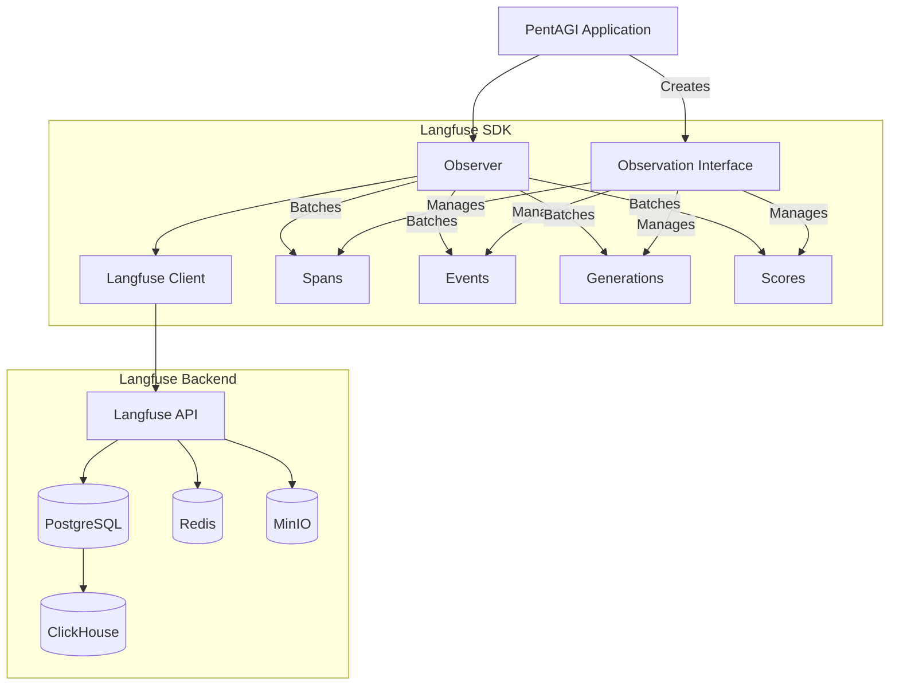
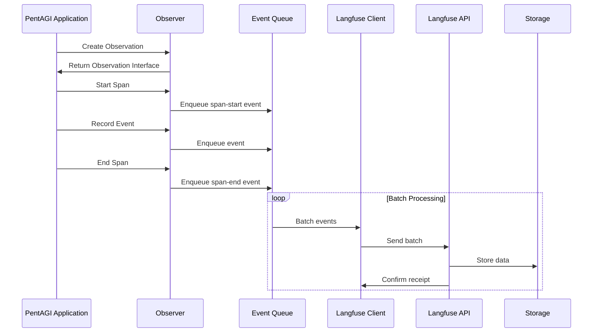

# Langfuse Integration for PentAGI

This document provides a comprehensive guide to the Langfuse integration in PentAGI, covering architecture, setup, usage patterns, and best practices for developers.

## Table of Contents

- [Langfuse Integration for PentAGI](#langfuse-integration-for-pentagi)
  - [Table of Contents](#table-of-contents)
  - [Introduction](#introduction)
  - [Architecture](#architecture)
    - [Component Overview](#component-overview)
    - [Data Flow](#data-flow)
    - [Key Interfaces](#key-interfaces)
      - [Observer Interface](#observer-interface)
      - [Observation Interface](#observation-interface)
      - [Span, Event, and Generation Interfaces](#span-event-and-generation-interfaces)
  - [Setup and Configuration](#setup-and-configuration)
    - [Infrastructure Requirements](#infrastructure-requirements)
    - [Configuration Options](#configuration-options)
    - [Initialization](#initialization)
  - [Usage Guide](#usage-guide)
    - [Creating Observations](#creating-observations)
    - [Recording Spans](#recording-spans)
    - [Tracking Events](#tracking-events)
    - [Logging Generations](#logging-generations)
    - [Adding Scores](#adding-scores)
    - [Context Propagation](#context-propagation)
  - [Integration Examples](#integration-examples)
    - [Flow Controller Integration](#flow-controller-integration)
    - [Agent Execution Tracking](#agent-execution-tracking)
    - [LLM Call Monitoring](#llm-call-monitoring)
  - [Advanced Topics](#advanced-topics)
    - [Batching and Performance](#batching-and-performance)
    - [Error Handling](#error-handling)
    - [Custom Metadata](#custom-metadata)

## Introduction

Langfuse is an open-source observability platform specifically designed for LLM-powered applications. The PentAGI integration with Langfuse provides:

- **Comprehensive tracing** for AI agent flows and tasks
- **Detailed telemetry** for LLM interactions and tool calls
- **Performance metrics** for system components
- **Evaluation** capabilities for agent outputs and behaviors

This integration enables developers to:

1. Debug complex multi-step agent flows
2. Track token usage and costs across different models
3. Monitor system performance in production
4. Gather data for ongoing improvement of agents and models

## Architecture

### Component Overview

The Langfuse integration in PentAGI is built around a layered architecture that provides both high-level abstractions for simple use cases and fine-grained control for complex scenarios.



### Data Flow

The data flow through the Langfuse system follows a consistent pattern:



### Key Interfaces

The Langfuse integration is built around several key interfaces:

#### Observer Interface

The `Observer` interface is the primary entry point for Langfuse integration:

```go
type Observer interface {
    // Creates a new observation and returns updated context
    NewObservation(
        ctx context.Context,
        opts ...ObservationContextOption,
    ) (context.Context, Observation)

    // Gracefully shuts down the observer
    Shutdown(ctx context.Context) error

    // Forces immediate flush of queued events
    ForceFlush(ctx context.Context) error
}
```

#### Observation Interface

The `Observation` interface provides methods to record different types of data:

```go
type Observation interface {
    // Returns the observation ID
    ID() string

    // Returns the trace ID
    TraceID() string

    // Records a log message
    Log(ctx context.Context, message string)

    // Records a score for evaluation
    Score(opts ...ScoreOption)

    // Creates a new event observation
    Event(opts ...EventStartOption) Event

    // Creates a new span observation
    Span(opts ...SpanStartOption) Span

    // Creates a new generation observation
    Generation(opts ...GenerationStartOption) Generation
}
```

#### Span, Event, and Generation Interfaces

These interfaces represent different observation types:

```go
type Span interface {
    // Ends the span with optional data
    End(opts ...SpanEndOption)

    // Creates a child observation context
    Observation(ctx context.Context) (context.Context, Observation)

    // Returns observation metadata
    ObservationInfo() ObservationInfo
}

type Event interface {
    // Ends the event with optional data
    End(opts ...EventEndOption)

    // Other methods similar to Span
    // ...
}

type Generation interface {
    // Ends the generation with optional data
    End(opts ...GenerationEndOption)

    // Other methods similar to Span
    // ...
}
```

## Setup and Configuration

### Infrastructure Requirements

Langfuse requires several backend services. For development and testing, you can use the included Docker Compose file:

```bash
# Start Langfuse infrastructure
docker-compose -f docker-compose-langfuse.yml up -d
```

The infrastructure includes:
- **PostgreSQL**: Primary data storage
- **ClickHouse**: Analytical data storage for queries
- **Redis**: Caching and queue management
- **MinIO**: S3-compatible storage for large objects
- **Langfuse Web**: Admin UI (accessible at http://localhost:4000)
- **Langfuse Worker**: Background processing

### Configuration Options

The Langfuse integration can be configured through environment variables:

| Variable | Description | Default |
|----------|-------------|---------|
| `LANGFUSE_BASE_URL` | Base URL for Langfuse API | |
| `LANGFUSE_PROJECT_ID` | Project ID in Langfuse | |
| `LANGFUSE_PUBLIC_KEY` | Public API key | |
| `LANGFUSE_SECRET_KEY` | Secret API key | |
| `LANGFUSE_INIT_USER_EMAIL` | Admin user email | admin@pentagi.com |
| `LANGFUSE_INIT_USER_PASSWORD` | Admin user password | P3nTagIsD0d |

For a complete list of configuration options, refer to the docker-compose-langfuse.yml file.

### Initialization

To initialize the Langfuse integration in your code:

```go
// Import the necessary packages
import (
    "pentagi/pkg/observability/langfuse"
    "pentagi/pkg/config"
)

// Create a Langfuse client
client, err := langfuse.NewClient(
    langfuse.WithBaseURL(cfg.LangfuseBaseURL),
    langfuse.WithPublicKey(cfg.LangfusePublicKey),
    langfuse.WithSecretKey(cfg.LangfuseSecretKey),
    langfuse.WithProjectID(cfg.LangfuseProjectID),
)
if err != nil {
    return nil, fmt.Errorf("failed to create langfuse client: %w", err)
}

// Create an observer with the client
observer := langfuse.NewObserver(client,
    langfuse.WithProject("pentagi"),
    langfuse.WithSendInterval(10 * time.Second),
    langfuse.WithQueueSize(100),
)

// Use a no-op observer when Langfuse is not configured
if errors.Is(err, ErrNotConfigured) {
    observer = langfuse.NewNoopObserver()
}
```

## Usage Guide

### Creating Observations

Observations are the fundamental tracking unit in Langfuse. Create a new observation for each logical operation or flow:

```go
// Create a new observation from context
ctx, observation := observer.NewObservation(ctx,
    langfuse.WithObservationTraceContext(
        langfuse.WithTraceName("flow-execution"),
        langfuse.WithTraceUserId(user.Email),
        langfuse.WithTraceSessionId(fmt.Sprintf("flow-%d", flowID)),
    ),
)
```

### Recording Spans

Spans track time duration and are used for operations with a distinct start and end:

```go
// Create a span for an operation
span := observation.Span(
    langfuse.WithStartSpanName("database-query"),
    langfuse.WithStartSpanInput(query),
)

// Execute the operation
result, err := executeQuery(query)

// End the span with result
if err != nil {
    span.End(
        langfuse.WithEndSpanStatus(err.Error()),
        langfuse.WithEndSpanLevel(langfuse.ObservationLevelError),
    )
} else {
    span.End(
        langfuse.WithEndSpanOutput(result),
        langfuse.WithEndSpanStatus("success"),
    )
}
```

### Tracking Events

Events represent point-in-time occurrences:

```go
// Record an event
observation.Event(
    langfuse.WithStartEventName("user-interaction"),
    langfuse.WithStartEventMetadata(langfuse.Metadata{
        "action": "button-click",
        "element": "submit-button",
    }),
)
```

### Logging Generations

Generations track LLM interactions with additional metadata:

```go
// Start a generation
generation := observation.Generation(
    langfuse.WithStartGenerationName("task-planning"),
    langfuse.WithStartGenerationModel("gpt-4"),
    langfuse.WithStartGenerationInput(prompt),
    langfuse.WithStartGenerationModelParameters(&langfuse.ModelParameters{
        Temperature: 0.7,
        MaxTokens: 1000,
    }),
)

// Get the response from the LLM
response, err := llmClient.Generate(prompt)

// End the generation with the result
generation.End(
    langfuse.WithEndGenerationOutput(response),
    langfuse.WithEndGenerationUsage(&langfuse.GenerationUsage{
        Input: promptTokens,
        Output: responseTokens,
        Unit: langfuse.GenerationUsageUnitTokens,
    }),
)
```

### Adding Scores

Scores provide evaluations for agent outputs:

```go
// Add a score to an observation
observation.Score(
    langfuse.WithScoreName("response-quality"),
    langfuse.WithScoreFloatValue(0.95),
    langfuse.WithScoreComment("High quality and relevant response"),
)
```

### Context Propagation

Langfuse leverages Go's context package for observation propagation:

```go
// Create a parent observation
ctx, parentObs := observer.NewObservation(ctx)

// Create a span
span := parentObs.Span(langfuse.WithStartSpanName("parent-operation"))

// Create a child context with the span's observation
childCtx, childObs := span.Observation(ctx)

// Use the child context for further operations
result := performOperation(childCtx)

// Child observations will be linked to the parent
childObs.Log(childCtx, "Operation completed")
```

## Integration Examples

### Flow Controller Integration

The main integration point in PentAGI is the Flow Controller, which handles the lifecycle of AI agent flows:

```go
// In flow controller initialization
ctx, observation := obs.Observer.NewObservation(ctx,
    langfuse.WithObservationTraceContext(
        langfuse.WithTraceName(fmt.Sprintf("%d flow worker", flow.ID)),
        langfuse.WithTraceUserId(user.Mail),
        langfuse.WithTraceTags([]string{"controller"}),
        langfuse.WithTraceSessionId(fmt.Sprintf("flow-%d", flow.ID)),
        langfuse.WithTraceMetadata(langfuse.Metadata{
            "flow_id": flow.ID,
            "user_id": user.ID,
            // ...additional metadata
        }),
    ),
)

// Create a span for a specific operation
flowSpan := observation.Span(langfuse.WithStartSpanName("prepare flow worker"))

// Propagate the context with the span
ctx, _ = flowSpan.Observation(ctx)

// End the span when the operation completes
flowSpan.End(langfuse.WithEndSpanStatus("flow worker started"))
```

### Agent Execution Tracking

Track individual agent executions and tool calls:

```go
// Create a span for agent execution
agentSpan := observation.Span(
    langfuse.WithStartSpanName("agent-execution"),
    langfuse.WithStartSpanInput(input),
)

// Track the generation
generation := agentSpan.Observation(ctx).Generation(
    langfuse.WithStartGenerationName("agent-thinking"),
    langfuse.WithStartGenerationModel(modelName),
)

// End the generation with the result
generation.End(
    langfuse.WithEndGenerationOutput(output),
    langfuse.WithEndGenerationUsage(&langfuse.GenerationUsage{
        Input: promptTokens,
        Output: responseTokens,
        Unit: langfuse.GenerationUsageUnitTokens,
    }),
)

// End the span
agentSpan.End(
    langfuse.WithEndSpanStatus("success"),
    langfuse.WithEndSpanOutput(result),
)
```

### LLM Call Monitoring

Track and monitor all LLM interactions:

```go
// Create a generation for an LLM call
generation := observation.Generation(
    langfuse.WithStartGenerationName("content-generation"),
    langfuse.WithStartGenerationModel(llmModel),
    langfuse.WithStartGenerationInput(prompt),
    langfuse.WithStartGenerationModelParameters(
        langfuse.GetLangchainModelParameters(options),
    ),
)

// Make the LLM call
response, err := llm.Generate(ctx, prompt, options...)

// End the generation with result
if err != nil {
    generation.End(
        langfuse.WithEndGenerationStatus(err.Error()),
        langfuse.WithEndGenerationLevel(langfuse.ObservationLevelError),
    )
} else {
    generation.End(
        langfuse.WithEndGenerationOutput(response),
        langfuse.WithEndGenerationUsage(&langfuse.GenerationUsage{
            Input: calculateInputTokens(prompt),
            Output: calculateOutputTokens(response),
            Unit: langfuse.GenerationUsageUnitTokens,
        }),
    )
}
```

## Advanced Topics

### Batching and Performance

The Langfuse integration uses batching to optimize performance:

```go
// Configure batch size and interval
observer := langfuse.NewObserver(client,
    langfuse.WithQueueSize(200),      // Events per batch
    langfuse.WithSendInterval(15*time.Second), // Send interval
)
```

Events are queued and sent in batches to minimize overhead. The `ForceFlush` method can be used to immediately send queued events:

```go
// Force sending of all queued events
if err := observer.ForceFlush(ctx); err != nil {
    log.Printf("Failed to flush events: %v", err)
}
```

### Error Handling

Langfuse operations are designed to be non-blocking and fail gracefully:

```go
// Create a span with try/catch pattern
span := observation.Span(langfuse.WithStartSpanName("risky-operation"))
defer func() {
    if r := recover(); r != nil {
        span.End(
            langfuse.WithEndSpanStatus(fmt.Sprintf("panic: %v", r)),
            langfuse.WithEndSpanLevel(langfuse.ObservationLevelError),
        )
        panic(r) // Re-panic
    }
}()

// Perform operation
result, err := performRiskyOperation()

// Handle error
if err != nil {
    span.End(
        langfuse.WithEndSpanStatus(err.Error()),
        langfuse.WithEndSpanLevel(langfuse.ObservationLevelError),
    )
    return err
}

// Success case
span.End(
    langfuse.WithEndSpanOutput(result),
    langfuse.WithEndSpanStatus("success"),
)
```

### Custom Metadata

Langfuse supports custom metadata for all observation types:

```go
// Add custom metadata to a span
span := observation.Span(
    langfuse.WithStartSpanName("process-file"),
    langfuse.WithStartSpanMetadata(langfuse.Metadata{
        "file_size": fileSize,
        "file_type": fileType,
        "encryption": encryptionType,
        "user_id": userID,
        // Any JSON-serializable data
    }),
)
```

This metadata is searchable and filterable in the Langfuse UI, making it easier to find and analyze specific observations.
