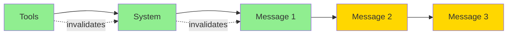

# LLM Provider Integration Guide

This document describes critical requirements for client code when working with LLM providers through this library. Focus is on **why** certain patterns are required, not just **what** they do.

## General Requirements

### Message Chain Construction

**Rule**: Always preserve reasoning data in multi-turn conversations.

**Why**: Models with extended thinking (Claude 3.7+, GPT-o1+, etc.) require reasoning signatures to validate message chain integrity. Missing signatures cause API errors.

**How**:
```go
// After receiving response with reasoning
if choice.Reasoning != nil {
    messages = append(messages, llms.MessageContent{
        Role: llms.ChatMessageTypeAI,
        Parts: []llms.ContentPart{
            llms.TextPartWithReasoning(choice.Content, choice.Reasoning),
            // then add tool calls if any
        },
    })
}
```

**Critical**: Use `TextPartWithReasoning()` even if `Content` is empty. The reasoning block and signature must be preserved for API validation.

---

### Tool Call ID Format Compatibility

**Rule**: Each provider uses a specific format for tool call IDs that must be validated when switching providers.

**Why**: Different providers have different validation rules for tool call IDs. For example:
- **OpenAI/Gemini**: Accept alphanumeric IDs like `call_abc123def456ghi789jkl0`
- **Anthropic**: Require base62 IDs matching pattern `^[a-zA-Z0-9_-]+$` like `toolu_A1b2C3d4E5f6G7h8I9j0K1l2`

**Problem**: When restoring a message chain that was created with one provider (e.g., Gemini) and using it with another provider (e.g., Anthropic), the API will reject tool call IDs that don't match its expected format.

**Solution**: Use `ChainAST.NormalizeToolCallIDs()` to convert incompatible tool call IDs:

```go
// Restore chain from database (may contain IDs from different provider)
var chain []llms.MessageContent
json.Unmarshal(msgChain.Chain, &chain)

// Create AST
ast, err := cast.NewChainAST(chain, true)
if err != nil {
    return err
}

// Normalize to current provider's format
err = ast.NormalizeToolCallIDs(currentProviderTemplate)
if err != nil {
    return err
}

// Use normalized chain
normalizedChain := ast.Messages()
```

**How it works**:
1. Validates each tool call ID against the new template using `ValidatePattern`
2. Generates new IDs only for those that don't match
3. Preserves IDs that already match to avoid unnecessary changes
4. Updates both tool calls and their corresponding responses

**Common Templates**:

| Provider | Template | Example |
|----------|----------|---------|
| OpenAI | `call_{r:24:x}` | `call_abc123def456ghi789jkl0` |
| Gemini | `call_{r:24:x}` | `call_xyz789abc012def345ghi6` |
| Anthropic | `toolu_{r:24:b}` | `toolu_A1b2C3d4E5f6G7h8I9j0K1l2` |

**When to use**: This is automatically handled in `restoreChain()` function, but you may need it manually when:
- Implementing custom provider logic
- Migrating between providers
- Testing with different providers

---

### Reasoning Content Cleanup

**Rule**: Clear reasoning content when switching between providers.

**Why**: Reasoning content contains provider-specific data that causes API errors with different providers:
- **Cryptographic signatures**: Anthropic's extended thinking uses signatures that other providers reject
- **Reasoning metadata**: Provider-specific formatting and validation
- **Redacted content**: Encrypted reasoning blocks

**Problem**: When restoring a chain created with Anthropic (with reasoning signatures) and sending to Gemini, the API will reject the request.

**Solution**: Use `ChainAST.ClearReasoning()` to remove all reasoning data:

```go
// After restoring chain and normalizing IDs
ast, err := cast.NewChainAST(chain, true)
if err != nil {
    return err
}

// Normalize IDs first
err = ast.NormalizeToolCallIDs(newTemplate)
if err != nil {
    return err
}

// Then clear reasoning signatures
err = ast.ClearReasoning()
if err != nil {
    return err
}

// Chain is now safe for the new provider
cleanedChain := ast.Messages()
```

**What gets cleared**:
- `TextContent.Reasoning` - Extended thinking signatures and content
- `ToolCall.Reasoning` - Per-tool reasoning data

**What stays preserved**:
- All text content
- Tool call IDs (after normalization)
- Function names and arguments  
- Tool responses

**Automatic handling**: Both `NormalizeToolCallIDs()` and `ClearReasoning()` are called automatically in `restoreChain()` to ensure full compatibility when switching providers.

---

## Anthropic Provider

### 1. Extended Thinking Mode

#### 1.1 Roundtrip Signature Preservation

**Why**: Anthropic API validates reasoning integrity using cryptographic signatures. Missing signature → `400 Bad Request`.

**When**: ALL responses from thinking-enabled models (Claude 3.7+, Sonnet 4+, Haiku 4.5+).

```go
// ✓ CORRECT
messages = append(messages, llms.MessageContent{
    Role: llms.ChatMessageTypeAI,
    Parts: []llms.ContentPart{
        llms.TextPartWithReasoning(choice.Content, choice.Reasoning),
    },
})

// ✗ WRONG - Signature lost, API will reject next request
messages = append(messages, llms.MessageContent{
    Role: llms.ChatMessageTypeAI,
    Parts: []llms.ContentPart{
        llms.TextPart(choice.Content), // Missing reasoning!
    },
})
```

**Components in `choice.Reasoning`**:
- `Content`: Human-readable thinking text
- `Signature`: Binary cryptographic signature (REQUIRED for roundtrip)
- `RedactedContent`: Encrypted reasoning (if present, MUST be preserved)

#### 1.2 Temperature Requirement

**Rule**: Set `Temperature = 1.0` for extended thinking.

**Why**: Anthropic's thinking mode requires temperature=1.0 to function correctly. Lower values degrade reasoning quality or cause API errors.

```go
llm.GenerateContent(ctx, messages,
    llms.WithReasoning(llms.ReasoningMedium, 2048),
    llms.WithTemperature(1.0), // REQUIRED
)
```

#### 1.3 Interleaved Thinking with Tools

**Auto-enable**: Library automatically adds `interleaved-thinking-2025-05-14` beta header when both `Tools` and `Reasoning` are present.

**Why**: Without this header, API cannot interleave thinking blocks between tool calls → degraded reasoning quality or errors.

**Manual override** (if needed):
```go
anthropic.WithInterleavedThinking() // Explicit beta header
```

#### 1.4 Reasoning Location

**Important**: Anthropic places reasoning in `choice.Reasoning`, NOT in individual `ToolCall.Reasoning`.

```go
// ✓ CORRECT
resp, _ := llm.GenerateContent(ctx, messages, ...)
reasoning := resp.Choices[0].Reasoning // Here!

// ✗ WRONG - Anthropic doesn't use this
for _, tc := range resp.Choices[0].ToolCalls {
    _ = tc.Reasoning // Always nil for Anthropic
}
```

**Why**: Anthropic's API design treats reasoning as conversation-level, not tool-level. One thinking block may inform multiple tool calls.

---

### 2. Prompt Caching

#### 2.1 Enable Caching

**Required**: Add `WithPromptCaching()` to enable beta header.

```go
llm.GenerateContent(ctx, messages,
    anthropic.WithPromptCaching(), // REQUIRED
    anthropic.WithCacheStrategy(anthropic.CacheStrategy{
        CacheTools:    true,
        CacheSystem:   true,
        CacheMessages: true,
    }),
)
```

**Why**: Without beta header, cache control directives are silently ignored → no cost savings.

#### 2.2 Minimum Token Threshold

**Rule**: Cached content must exceed minimum tokens:
- Claude Sonnet 4: 1024 tokens
- Claude Haiku 4.5: 4096 tokens

**Why**: API rejects cache control for content below threshold → `400 Bad Request`.

**How to ensure**:
```go
// Generate large enough content
systemPrompt := strings.Repeat("You are a helpful assistant. ", 200) // > 1024 tokens
tools := generateLargeTools() // > 1024 tokens when serialized
```

#### 2.3 Cache Hierarchy

**Critical**: Anthropic cache is hierarchical: `tools → system → messages`

**Why**: Cache works as cumulative prefix, not independent chunks. Changing `tools` invalidates `system` and `messages` cache below it.



**Economics**:
- First turn: Write entire prefix (125% cost)
- Turn 2+: Read prefix (10% cost) + Write new messages (125% cost)

**Example**:
```go
// Turn 1: Cache creation = 1500 tokens (tools + system + msg1)
// Turn 2: Cache read = 1500, Cache write = 50 (only msg2)
// Turn 3: Cache read = 1550, Cache write = 40 (only msg3)
```

#### 2.4 Incremental Caching Pattern

**Rule**: Cache grows incrementally, NOT cumulatively re-written.

**Why**: API intelligently writes only delta between turns → massive cost savings in long conversations.

```go
// Turn 1
r1, _ := llm.GenerateContent(ctx, messages1, opts...)
// CacheCreation: 1500 tokens (tools + system + user1)
// CacheRead: 0

// Turn 2: Add AI response + new user message
messages2 := append(messages1,
    llms.MessageContent{Role: llms.ChatMessageTypeAI, Parts: ...}, // AI1
    llms.MessageContent{Role: llms.ChatMessageTypeHuman, Parts: ...}, // User2
)
r2, _ := llm.GenerateContent(ctx, messages2, opts...)
// CacheCreation: 50 tokens (AI1 + User2 ONLY)
// CacheRead: 1500 tokens (tools + system + user1)
```

**Common mistake**: Expecting `CacheCreation` to grow cumulatively (it doesn't!).

#### 2.5 Cache Invalidation

**Triggers** (order matters):
1. Tools modification → Invalidates everything
2. System prompt change → Invalidates messages
3. Message history change → Invalidates only that message onward

**Detection**: Library includes `detectThinkingModeChange()` to warn about mode switches mid-conversation (invalidates cache).

```go
// ✓ SAFE - Consistent thinking mode
Turn 1: WithReasoning() → creates cache with thinking
Turn 2: WithReasoning() → reads cache

// ✗ DANGEROUS - Mode change invalidates cache
Turn 1: no WithReasoning() → creates cache WITHOUT thinking
Turn 2: WithReasoning() → API may reject due to missing signature
```

---

### 3. Multi-turn with Tools + Thinking

#### 3.1 Message Structure

**Rule**: AI message must contain `TextPartWithReasoning` FIRST, then tool calls.

```go
// ✓ CORRECT order
aiParts := []llms.ContentPart{
    llms.TextPartWithReasoning(choice.Content, choice.Reasoning), // 1st
    toolCall1, // 2nd
    toolCall2, // 3rd
}
messages = append(messages, llms.MessageContent{
    Role:  llms.ChatMessageTypeAI,
    Parts: aiParts,
})
```

**Why**: API expects reasoning block before tool use blocks. Incorrect order → malformed request.

#### 3.2 Workflow Example

```go
// Turn 1: User request
messages := []llms.MessageContent{
    {Role: llms.ChatMessageTypeSystem, Parts: []llms.ContentPart{...}},
    {Role: llms.ChatMessageTypeHuman, Parts: []llms.ContentPart{llms.TextPart("Analyze data")}},
}

resp1, _ := llm.GenerateContent(ctx, messages,
    llms.WithTools(tools),
    llms.WithReasoning(llms.ReasoningMedium, 2048),
    anthropic.WithPromptCaching(),
    llms.WithTemperature(1.0),
)

// Turn 2: Add AI response with reasoning + tool calls
choice1 := resp1.Choices[0]
aiParts := []llms.ContentPart{
    llms.TextPartWithReasoning(choice1.Content, choice1.Reasoning), // Must include!
}
for _, tc := range choice1.ToolCalls {
    aiParts = append(aiParts, tc)
}
messages = append(messages, llms.MessageContent{
    Role:  llms.ChatMessageTypeAI,
    Parts: aiParts,
})

// Turn 3: Add tool results
for _, tc := range choice1.ToolCalls {
    messages = append(messages, llms.MessageContent{
        Role: llms.ChatMessageTypeTool,
        Parts: []llms.ContentPart{
            llms.ToolCallResponse{
                ToolCallID: tc.ID,
                Name:       tc.FunctionCall.Name,
                Content:    toolResult,
            },
        },
    })
}

// Continue conversation...
resp2, _ := llm.GenerateContent(ctx, messages, ...)
```

---

### 4. Common Pitfalls

#### 4.1 Signature Loss

```go
// ✗ WRONG - Signature discarded
messages = append(messages, llms.MessageContent{
    Role: llms.ChatMessageTypeAI,
    Parts: []llms.ContentPart{
        llms.TextPart(choice.Content), // Lost reasoning!
    },
})
```

**Error**: `400 Bad Request: "missing required thinking signature"`

#### 4.2 Temperature Mismatch

```go
// ✗ WRONG - Temperature too low
llms.WithReasoning(llms.ReasoningHigh, 4096),
llms.WithTemperature(0.5), // Should be 1.0!
```

**Result**: Degraded reasoning quality or API rejection.

#### 4.3 Missing Beta Header

```go
// ✗ WRONG - Cache silently ignored
llms.GenerateContent(ctx, messages,
    anthropic.WithCacheStrategy(...), // No effect without:
    // anthropic.WithPromptCaching(), // Missing!
)
```

**Result**: Full token cost, no caching savings.

#### 4.4 Cache Threshold Not Met

```go
// ✗ WRONG - System too short for caching
systemPrompt := "You are helpful." // < 1024 tokens
```

**Error**: `400 Bad Request: "cached content below minimum threshold"`

---

### 5. Performance Tips

#### 5.1 Client-Level Cache Strategy

Set default strategy at client construction:

```go
llm, _ := anthropic.New(
    anthropic.WithDefaultCacheStrategy(anthropic.CacheStrategy{
        CacheTools:    true,
        CacheSystem:   true,
        CacheMessages: true,
        TTL:           "5m", // or "1h"
    }),
)
```

**Why**: Avoids repeating strategy in every `GenerateContent()` call.

#### 5.2 Cache Metrics

Monitor cache efficiency:

```go
resp, _ := llm.GenerateContent(ctx, messages, ...)
genInfo := resp.Choices[0].GenerationInfo

cacheRead := genInfo["CacheReadInputTokens"].(int)
cacheCreation := genInfo["CacheCreationInputTokens"].(int)

// Calculate savings:
// cacheRead costs 10% of standard tokens
// cacheCreation costs 125% of standard tokens
```

---

## Google Gemini Provider

### Thought Signatures in Tool Calls

**Critical Requirement**: Gemini requires `thought_signature` to be present in all tool calls when using models with thinking capabilities.

**Why**: Gemini validates that each tool call has an associated thinking signature. Missing signatures cause API error:
```
Function call is missing a thought_signature in functionCall parts.
This is required for tools to work correctly, and missing thought_signature
may lead to degraded model performance.
```

**Where reasoning is stored**: Gemini places reasoning in `ToolCall.Reasoning`, not in a separate TextContent like Anthropic.

```go
// Gemini pattern: reasoning in ToolCall
resp, _ := llm.GenerateContent(ctx, messages, ...)
for _, choice := range resp.Choices {
    for _, toolCall := range choice.ToolCalls {
        // Gemini stores reasoning HERE
        if toolCall.Reasoning != nil {
            // Contains thinking content and signature
            signature := toolCall.Reasoning.Signature
        }
    }
}
```

**Critical for chain management**:
1. **Never summarize the last body pair** - This preserves thought_signature for the most recent tool call
2. **Never clear reasoning** when continuing with Gemini - Only clear when switching to a different provider
3. **Preserve complete AI message** including all reasoning when building message chains

**Example of preserved structure**:

```json
{
  "role": "ai",
  "parts": [
    {
      "reasoning": {
        "Content": "Thinking about the problem...",
        "Signature": "base64_encoded_signature"
      },
      "text": "",
      "type": "text"
    },
    {
      "type": "tool_call",
      "tool_call": {
        "function": {...},
        "id": "fcall_xxx",
        "reasoning": {
          "Content": "Per-tool thinking...",
          "Signature": "another_signature"
        }
      }
    }
  ]
}
```

**Automatic protection**: The summarization algorithm automatically skips the last body pair to preserve these signatures.

---

## Google Gemini Provider (Additional Details)

### 1. Extended Thinking Mode

#### 1.1 Reasoning Location (CRITICAL DIFFERENCE from Anthropic)

**Rule**: Gemini places reasoning in **DIFFERENT locations** depending on response type.

**For text-only responses**:
```go
// ✓ CORRECT - Reasoning in ContentChoice
resp, _ := llm.GenerateContent(ctx, messages, ...)
reasoning := resp.Choices[0].Reasoning // Text response
```

**For tool call responses**:
```go
// ✓ CORRECT - Reasoning in FIRST ToolCall
resp, _ := llm.GenerateContent(ctx, messages, ...)
firstToolCall := resp.Choices[0].ToolCalls[0]
reasoning := firstToolCall.Reasoning // Tool call response!

// ContentChoice.Reasoning is nil when tool calls present
assert.Nil(resp.Choices[0].Reasoning)
```

**Why**: Gemini's API design attaches reasoning to the first tool call, not to the overall response. This differs fundamentally from Anthropic.

#### 1.2 Signature Preservation Requirements

**For function calls**: MANDATORY (400 error without signature)

```go
// ✓ CORRECT - Preserve tool call with signature
messages = append(messages, llms.MessageContent{
    Role: llms.ChatMessageTypeAI,
    Parts: []llms.ContentPart{
        firstToolCall, // Includes signature via extractThoughtSignature
    },
})
```

**For text responses**: RECOMMENDED (enables implicit caching, see §2.2)

```go
// ✓ CORRECT - Preserve text with signature
messages = append(messages, llms.MessageContent{
    Role: llms.ChatMessageTypeAI,
    Parts: []llms.ContentPart{
        llms.TextPartWithReasoning(choice.Content, choice.Reasoning),
    },
})
```

#### 1.3 Signature Placement in Parallel vs Sequential Calls

**Parallel tool calls**: Signature ONLY in first tool call

```go
resp, _ := llm.GenerateContent(ctx, messages, llms.WithTools(tools), ...)

// ✓ First tool call has signature
assert.NotNil(resp.Choices[0].ToolCalls[0].Reasoning)
assert.NotEmpty(resp.Choices[0].ToolCalls[0].Reasoning.Signature)

// ✓ Subsequent parallel calls do NOT have signature
for i := 1; i < len(resp.Choices[0].ToolCalls); i++ {
    assert.Nil(resp.Choices[0].ToolCalls[i].Reasoning)
}
```

**Sequential tool calls**: DIFFERENT signature for each call

```go
// Turn 1: First tool call
resp1, _ := llm.GenerateContent(ctx, messages1, ...)
sig1 := resp1.Choices[0].ToolCalls[0].Reasoning.Signature

// Turn 2: Second tool call (after providing first tool result)
resp2, _ := llm.GenerateContent(ctx, messages2, ...)
sig2 := resp2.Choices[0].ToolCalls[0].Reasoning.Signature

// Signatures are DIFFERENT in sequential calls
assert.NotEqual(sig1, sig2)
```

**Why**: Each sequential step has unique context, requiring new signature. Parallel calls share context, requiring only one signature.

#### 1.4 Temperature Flexibility

**No special requirements**: Unlike Anthropic, Gemini works with any temperature value.

```go
// ✓ Works fine
llm.GenerateContent(ctx, messages,
    llms.WithReasoning(llms.ReasoningMedium, 1024),
    llms.WithTemperature(0.5), // Any value is OK
)
```

---

### 2. Prompt Caching

Gemini supports TWO distinct caching mechanisms with different characteristics.

#### 2.1 Explicit Caching (Manual, Pre-created)

**How**: Create cached content separately via `CachingHelper`

```go
helper, _ := googleai.NewCachingHelper(ctx, googleai.WithAPIKey(apiKey))

// Create cache (minimum 32,768 tokens required)
cached, _ := helper.CreateCachedContent(ctx, "gemini-2.0-flash",
    []llms.MessageContent{
        {Role: llms.ChatMessageTypeSystem, Parts: []llms.ContentPart{
            llms.TextPart(largeSystemPrompt), // Must be ~24,000 words
        }},
    },
    1*time.Hour, // TTL
    "my-cache-name",
)

// Use cache in requests
resp, _ := llm.GenerateContent(ctx, messages,
    googleai.WithCachedContent(cached.Name),
)
```

**Characteristics**:
- **Minimum**: 32,768 tokens (~24,000 words)
- **Storage cost**: Hourly charge based on TTL
- **Savings**: 75% discount on cached tokens
- **Control**: Full control over what gets cached
- **Best for**: Large, reusable context (knowledge bases, documentation)

#### 2.2 Implicit Caching (Automatic, Ephemeral)

**How**: Automatically enabled, no configuration needed

```go
// Request 1: Establishes cache
resp1, _ := llm.GenerateContent(ctx, messages,
    llms.WithModel("gemini-2.5-flash"),
)

// Wait 15-30 seconds for cache to establish

// Request 2: Hits cache automatically
resp2, _ := llm.GenerateContent(ctx, messages,
    llms.WithModel("gemini-2.5-flash"),
)
```

**Characteristics**:
- **Minimum**: 1024 tokens (gemini-2.5-flash), 4096 tokens (gemini-3-flash-preview)
- **Storage cost**: FREE (ephemeral, managed by Google)
- **Delay**: 15-30 seconds between requests to establish cache
- **No guarantee**: Best-effort, not guaranteed to cache

**Cache triggers**:
1. **Identical requests**: Byte-for-byte HTTP body match → always caches
2. **Conversation continuation**: Requires signature preservation (see below)

#### 2.3 Implicit Caching for Conversation Continuation

**CRITICAL**: For multi-turn conversations, signature preservation is REQUIRED for implicit caching.

**Models**: Use `gemini-3-flash-preview` with reasoning enabled

```go
// Turn 1: Initial request
messages := []llms.MessageContent{
    {Role: llms.ChatMessageTypeSystem, Parts: []llms.ContentPart{
        llms.TextPart(largeContext), // > 4096 tokens for gemini-3
    }},
    {Role: llms.ChatMessageTypeHuman, Parts: []llms.ContentPart{
        llms.TextPart("Question 1"),
    }},
}

resp1, _ := llm.GenerateContent(ctx, messages,
    llms.WithModel("gemini-3-flash-preview"),
    llms.WithReasoning(llms.ReasoningMedium, 512), // REQUIRED
)

// Turn 2: MUST preserve signature
messages = append(messages,
    llms.MessageContent{
        Role: llms.ChatMessageTypeAI,
        Parts: []llms.ContentPart{
            llms.TextPartWithReasoning(choice1.Content, choice1.Reasoning), // CRITICAL!
        },
    },
    llms.MessageContent{
        Role: llms.ChatMessageTypeHuman,
        Parts: []llms.ContentPart{llms.TextPart("Question 2")},
    },
)

resp2, _ := llm.GenerateContent(ctx, messages,
    llms.WithModel("gemini-3-flash-preview"),
    llms.WithReasoning(llms.ReasoningMedium, 512),
)

// Check cache hit
cachedTokens := resp2.Choices[0].GenerationInfo["PromptCachedTokens"].(int)
assert.Greater(cachedTokens, 0) // Cache hit! (~89% of tokens cached)
```

**Why signature is required**: Gemini uses signature to identify conversation prefix for caching. Without signature, each turn is treated as new request → no prefix caching.

**Result**: With proper signature preservation:
- Turn 1: 0 cached tokens
- Turn 2: ~89% cached tokens (prefix: system + user1)
- Turn 3: ~92% cached tokens (prefix: system + user1 + AI1 + user2)

---

### 3. Function Call ID Management

**Auto-generation**: Gemini automatically generates IDs if not provided.

```go
// Library generates ID in format: fcall_{16_hex_chars}
// IDs are cleaned (prefix removed) when sending to API
```

**Why**: Gemini API doesn't always provide IDs, but client code needs them for tracking. Library ensures consistency.

---

### 4. Signature Deduplication (Automatic)

**Problem**: Using universal pattern (Anthropic-compatible) on Gemini may create duplicate signatures.

```go
// Universal pattern (works for Anthropic)
aiParts := []llms.ContentPart{
    llms.TextPartWithReasoning(choice.Content, choice.Reasoning), // signature here
    toolCall, // signature here too (for Gemini)
}
```

**Solution**: Library automatically deduplicates.

**Rules**:
1. If `TextContent.Text == ""` AND any `ToolCall` has signature → skip empty TextContent
2. If `TextContent.Text != ""` → keep both (text content is meaningful)
3. If no ToolCalls present → keep TextContent even if empty (preserve signature)

```go
// Example 1: Empty text + tool call with signature
Parts: [TextPart("", reasoning), ToolCall(reasoning)]
// → API receives: [ToolCall with signature] ✓

// Example 2: Non-empty text + tool call with signature
Parts: [TextPart("I'll search", reasoning), ToolCall(reasoning)]
// → API receives: [Text with signature, ToolCall with signature] ✓
// (Both kept - text content is meaningful)

// Example 3: Empty text, no tool calls
Parts: [TextPart("", reasoning)]
// → API receives: [Text with signature] ✓
// (Kept - no tool call to carry signature)
```

**Why**: Prevents API errors from duplicate signatures while preserving meaningful content.

---

### 5. Common Pitfalls

#### 5.1 Wrong Reasoning Location

```go
// ✗ WRONG - Looking for reasoning in wrong place
resp, _ := llm.GenerateContent(ctx, messages, llms.WithTools(tools), ...)
reasoning := resp.Choices[0].Reasoning // nil for tool calls!

// ✓ CORRECT
reasoning := resp.Choices[0].ToolCalls[0].Reasoning // Here!
```

#### 5.2 Missing Signature in Tool Calls

```go
// ✗ WRONG - Signature lost in roundtrip
messages = append(messages, llms.MessageContent{
    Role: llms.ChatMessageTypeAI,
    Parts: []llms.ContentPart{
        llms.ToolCall{...}, // No signature!
    },
})
```

**Error**: `400 Bad Request: "thought signature required for function calling"`

#### 5.3 Implicit Caching Without Signature

```go
// ✗ WRONG - Conversation continuation without signature
messages = append(messages,
    llms.MessageContent{
        Role: llms.ChatMessageTypeAI,
        Parts: []llms.ContentPart{
            llms.TextPart(choice.Content), // Missing reasoning!
        },
    },
)
```

**Result**: No implicit cache hit → full token cost for entire conversation.

#### 5.4 Explicit Cache Too Small

```go
// ✗ WRONG - Below 32,768 token minimum
systemPrompt := strings.Repeat("You are helpful. ", 100) // Only ~200 tokens
```

**Error**: `400 Bad Request: "cached content below minimum size"`

---

### 6. Performance Tips

#### 6.1 Choose Right Caching Strategy

**Use Explicit Caching when**:
- Content is static and reused across many sessions
- You need guaranteed caching (not best-effort)
- Content exceeds 32,768 tokens easily

**Use Implicit Caching when**:
- Multi-turn conversations with gemini-3-flash-preview
- Content is 4096+ tokens but < 32,768 tokens
- You want zero storage costs

#### 6.2 Monitor Cache Efficiency

```go
resp, _ := llm.GenerateContent(ctx, messages, ...)
genInfo := resp.Choices[0].GenerationInfo

cachedTokens := genInfo["PromptCachedTokens"].(int)
totalTokens := genInfo["TotalTokens"].(int)

cacheHitRate := float64(cachedTokens) / float64(totalTokens) * 100
log.Printf("Cache hit rate: %.1f%%", cacheHitRate)
```

---

### 7. Thought Signature Preservation in Chain Summarization

**Critical Issue**: When using chain summarization with Gemini models that have thinking capabilities, the last body pair must NEVER be summarized.

**Why**: Summarization removes the `thought_signature` from tool calls, causing the error:
```
Function call is missing a thought_signature in functionCall parts.
This is required for tools to work correctly.
```

**Automatic Protection**: The summarization algorithm (`chain_summary.go`) automatically:
1. **Skips the last body pair** in `summarizeOversizedBodyPairs()` 
2. **Always preserves the most recent interaction** in `determineLastSectionPairs()`
3. **Maintains reasoning signatures** for continued conversation

**Example scenario where this matters**:

```go
// Scenario: Last tool call returns large response (50KB+)
// Chain before summarization:
messages = [
    {Role: "human", Parts: ["Find SQL injection"]},
    {Role: "ai", Parts: [
        {Text: "", Reasoning: {Content: "...", Signature: "..."}},  // Gemini thinking
        {ToolCall: {Name: "pentester", Reasoning: {...}}},          // With thought_signature
    ]},
    {Role: "tool", Parts: [{Response: "...50KB of results..."}]},  // Large response
]

// After summarization: Last body pair is PRESERVED with all signatures intact
// This allows the conversation to continue without API errors
```

**What gets preserved**:
- Complete AI message with all reasoning parts
- Tool call with `thought_signature`
- Large tool response (even if 50KB+)

**What gets summarized**:
- All body pairs BEFORE the last one (if they exceed size limits)
- Older sections according to QA pair rules

**Manual override**: If you need to force summarization of all pairs (not recommended):
```go
// This will cause API errors with Gemini thinking models
// Only use if switching to a different provider
err := ast.ClearReasoning() // Removes ALL reasoning including thought_signature
```

---

## OpenAI Provider (OpenAI-Compatible)

This provider handles OpenAI cloud API and **all OpenAI-compatible backends** (OpenRouter, DeepSeek, Together, Groq, etc.).

### 1. Extended Thinking Mode

#### 1.1 No Signature Support

**CRITICAL**: OpenAI does NOT use cryptographic signatures.

```go
// ✓ CORRECT - No signature in OpenAI responses
resp, _ := llm.GenerateContent(ctx, messages,
    llms.WithReasoning(llms.ReasoningMedium, 2048),
)
assert.Nil(resp.Choices[0].Reasoning.Signature) // Always nil for OpenAI
```

**Why**: OpenAI's reasoning models (o1, o3, o4) use different validation mechanism. No signature → simpler roundtrip logic.

**Implication**: Conversation continuation works WITHOUT signature preservation (unlike Anthropic/Gemini).

```go
// ✓ Works fine for OpenAI
messages = append(messages, llms.MessageContent{
    Role: llms.ChatMessageTypeAI,
    Parts: []llms.ContentPart{
        llms.TextPart(choice.Content), // No reasoning needed!
    },
})
```

**However**: For cross-provider compatibility, still use `TextPartWithReasoning()` (harmless for OpenAI, required for others).

#### 1.2 Reasoning Content Format

**Field**: `choice.Reasoning.Content` (simple string, not object)

**Location**: Always in `choice.Reasoning`, NEVER in `ToolCall.Reasoning`

```go
// ✓ CORRECT
resp, _ := llm.GenerateContent(ctx, messages, ...)
reasoning := resp.Choices[0].Reasoning.Content // Text content here

// ✗ WRONG
reasoning := resp.Choices[0].ToolCalls[0].Reasoning // Always nil for OpenAI
```

**Why**: OpenAI treats reasoning as response-level, not tool-level (same as Anthropic, different from Gemini).

#### 1.3 Temperature Auto-Override

**Auto-set**: Library automatically sets `Temperature = 0.0` and `TopP = 0.0` for reasoning models.

```go
// Your code
llm.GenerateContent(ctx, messages,
    llms.WithModel("o3-mini"),
    llms.WithReasoning(llms.ReasoningMedium, 1000),
    llms.WithTemperature(0.7), // You set this
)

// What gets sent to API
// temperature: 0.0  ← Auto-overridden!
// top_p: 0.0        ← Auto-overridden!
```

**Why**: OpenAI reasoning models IGNORE temperature/top_p (deterministic reasoning). Library prevents confusion by enforcing zeros.

**Note**: This is OPPOSITE to Anthropic which requires `Temperature = 1.0`.

#### 1.4 Two Reasoning Formats

**Legacy format** (older models):
```go
// Request uses: reasoning_effort: "high"
```

**Modern format** (newer models, o3+):
```go
llm, _ := openai.New(
    openai.WithModernReasoningFormat(), // Enable modern format
    openai.WithUsingReasoningMaxTokens(), // Use max_tokens instead of effort
)

// Request uses: reasoning: { max_tokens: 2048 }
// or: reasoning: { effort: "medium" }
```

**Why**: OpenAI API evolved from simple `reasoning_effort` string to structured `reasoning` object. Modern format provides more control.

**Recommendation**: Use modern format for new code, legacy for compatibility.

#### 1.5 XML-Tagged Reasoning Fallback

**Auto-extraction**: Library extracts reasoning from `<think>` or `<thinking>` tags if `ReasoningContent` field is empty.

```go
// Some providers return reasoning embedded in content:
// "Here's my thought process: <think>Step 1...</think> The answer is 42"

// Library automatically extracts:
choice.Reasoning.Content = "Step 1..." // Extracted from tags
choice.Content = "Here's my thought process: The answer is 42" // Cleaned
```

**Why**: Some OpenAI-compatible providers (DeepSeek, QwQ) use XML tags instead of separate `reasoning_content` field.

---

### 2. Prompt Caching

#### 2.1 Implicit Caching Only

**CRITICAL**: OpenAI supports ONLY automatic implicit caching.

- **No explicit cache creation** (unlike Gemini's `CachingHelper`)
- **No inline cache control** (unlike Anthropic's `WithCacheStrategy`)
- **No configuration needed** (completely automatic)

```go
// ✓ CORRECT - Just use it, caching works automatically
resp, _ := llm.GenerateContent(ctx, messages,
    llms.WithModel("gpt-4.1-mini"),
)

// Cache metrics available in response
cachedTokens := resp.Choices[0].GenerationInfo["PromptCachedTokens"].(int)
cacheWriteTokens := resp.Choices[0].GenerationInfo["CacheCreationInputTokens"].(int)
```

**Why**: OpenAI manages caching internally. Client has no control over cache creation/invalidation.

#### 2.2 Cache Characteristics

- **Minimum**: 1024 tokens
- **TTL**: 5-10 minutes (managed by OpenAI)
- **Cost**: Free (no storage charges)
- **Delay**: 40+ seconds to establish cache (longer than Gemini's 15s)
- **Trigger**: Identical HTTP body OR conversation prefix match

#### 2.3 Cache Metrics

**Fields available**:
```go
genInfo := resp.Choices[0].GenerationInfo

// Standard fields
cachedTokens := genInfo["PromptCachedTokens"].(int)      // Read from cache
cacheWrite := genInfo["CacheCreationInputTokens"].(int)  // Written to cache
reasoningTokens := genInfo["ReasoningTokens"].(int)       // Reasoning tokens used

// Formula (different from Anthropic!)
// PromptTokens = total - cachedTokens
// CacheCreationInputTokens = max(cache_write_tokens, total - cached)
```

**Why different from Anthropic**: OpenAI includes cached tokens in total count, then subtracts. Anthropic reports them separately.

#### 2.4 Conversation Caching (No Signature Required)

**Key difference**: OpenAI caches conversation prefix WITHOUT signature requirement.

```go
// Turn 1
msgs := []llms.MessageContent{
    {Role: llms.ChatMessageTypeSystem, Parts: []llms.ContentPart{
        llms.TextPart(largeContext), // > 1024 tokens
    }},
    {Role: llms.ChatMessageTypeHuman, Parts: []llms.ContentPart{
        llms.TextPart("Question 1"),
    }},
}
resp1, _ := llm.GenerateContent(ctx, msgs, llms.WithModel("gpt-4.1-mini"))
// CacheWrite: > 0, CachRead: 0

// Turn 2 - Simple text part works!
msgs = append(msgs,
    llms.MessageContent{
        Role: llms.ChatMessageTypeAI,
        Parts: []llms.ContentPart{
            llms.TextPart(resp1.Choices[0].Content), // No reasoning needed!
        },
    },
    llms.MessageContent{
        Role: llms.ChatMessageTypeHuman,
        Parts: []llms.ContentPart{llms.TextPart("Question 2")},
    },
)
resp2, _ := llm.GenerateContent(ctx, msgs, llms.WithModel("gpt-4.1-mini"))
// CacheRead: > 0 (prefix cached!)
```

**Why**: OpenAI doesn't validate message integrity via signatures → simpler client code.

---

### 3. OpenAI-Compatible Backends

#### 3.1 OpenRouter Specifics

**Base URL**: `https://openrouter.ai/api/v1`

**Models**: Access to 100+ models from multiple providers through single API

```go
llm, _ := openai.New(
    openai.WithBaseURL("https://openrouter.ai/api/v1"),
    openai.WithToken(openRouterAPIKey),
)

// Use models from different providers
resp, _ := llm.GenerateContent(ctx, messages,
    llms.WithModel("anthropic/claude-sonnet-4.5"),        // Anthropic via OpenRouter
    llms.WithModel("google/gemini-2.5-flash"),            // Gemini via OpenRouter
    llms.WithModel("openai/o3-mini"),                     // OpenAI via OpenRouter
    llms.WithModel("deepseek/deepseek-r1"),               // DeepSeek via OpenRouter
)
```

**Additional metrics**:
```go
genInfo := resp.Choices[0].GenerationInfo

// OpenRouter-specific cost tracking
promptCost := genInfo["UpstreamInferencePromptCost"].(float64)
completionCost := genInfo["UpstreamInferenceCompletionsCost"].(float64)
```

**Reasoning behavior**: Depends on upstream provider
- Anthropic models via OpenRouter: May or may not return reasoning (depends on `:thinking` suffix in model name)
- Gemini models via OpenRouter: May return reasoning
- OpenAI models via OpenRouter: Typically do NOT return reasoning content

#### 3.2 DeepSeek Specifics

**Base URL**: `https://api.deepseek.com`

**Reasoning extraction**: Uses XML tag fallback

```go
llm, _ := openai.New(
    openai.WithBaseURL("https://api.deepseek.com"),
    openai.WithToken(deepseekAPIKey),
)

resp, _ := llm.GenerateContent(ctx, messages,
    llms.WithModel("deepseek-reasoner"),
)

// Reasoning extracted from <think>...</think> tags automatically
```

#### 3.3 Compatibility Requirements

**For maximum compatibility** across OpenAI-compatible backends:

1. Use modern reasoning format:
```go
llm, _ := openai.New(
    openai.WithModernReasoningFormat(),
    openai.WithUsingReasoningMaxTokens(),
)
```

2. Don't rely on reasoning content being present:
```go
// ✓ Defensive check
if choice.Reasoning != nil && choice.Reasoning.Content != "" {
    // Process reasoning
}
```

3. Check for reasoning tokens in metrics:
```go
reasoningTokens := genInfo["ReasoningTokens"].(int)
if reasoningTokens > 0 {
    // Model used reasoning, even if content not returned
}
```

---

### 4. Common Pitfalls

#### 4.1 Expecting Signatures

```go
// ✗ WRONG - OpenAI doesn't have signatures
if choice.Reasoning != nil {
    _ = choice.Reasoning.Signature // Always nil!
}
```

**Fix**: Check provider before using signatures.

#### 4.2 Assuming Reasoning Content Always Present

```go
// ✗ WRONG - Not all models/providers return reasoning content
resp, _ := llm.GenerateContent(ctx, messages,
    llms.WithModel("o3-mini"),
    llms.WithReasoning(llms.ReasoningHigh, 4096),
)
reasoning := resp.Choices[0].Reasoning.Content // May be empty!
```

**Why**: OpenAI's `/chat/completions` endpoint doesn't always return reasoning content, only `reasoning_tokens` metric.

**Fix**: Check `ReasoningTokens` metric instead:
```go
reasoningTokens := resp.Choices[0].GenerationInfo["ReasoningTokens"].(int)
if reasoningTokens > 0 {
    // Model used reasoning internally
}
```

#### 4.3 Manual Temperature for Reasoning

```go
// ✗ UNNECESSARY - Library handles this
llm.GenerateContent(ctx, messages,
    llms.WithModel("o3-mini"),
    llms.WithReasoning(llms.ReasoningMedium, 1000),
    llms.WithTemperature(0.0), // Redundant! Auto-set by library
)
```

**Why**: Library detects reasoning models and sets temperature automatically.

#### 4.4 Expecting Cache Control

```go
// ✗ WRONG - No cache control in OpenAI
llm.GenerateContent(ctx, messages,
    anthropic.WithCacheStrategy(...), // Doesn't exist for OpenAI!
)
```

**Fix**: Rely on automatic caching, monitor via metrics.

---

### 5. Performance Tips

#### 5.1 Monitor Implicit Cache

```go
resp, _ := llm.GenerateContent(ctx, messages, ...)
genInfo := resp.Choices[0].GenerationInfo

cachedTokens := genInfo["PromptCachedTokens"].(int)
totalPrompt := genInfo["PromptTokens"].(int) + cachedTokens

if cachedTokens > 0 {
    savings := float64(cachedTokens) / float64(totalPrompt) * 100
    log.Printf("Cache hit: %.1f%% of prompt cached", savings)
}
```

#### 5.2 Optimize for Cache Hits

**Strategies**:
- Keep system prompts stable across requests
- Maintain consistent message history structure
- Wait 40+ seconds between similar requests in development

**Anti-patterns**:
- Frequently changing system prompts
- Reordering message history
- Varying metadata/options

---

## Provider Conflicts & Multi-Provider Code

When building applications that switch between providers, be aware of these **CRITICAL incompatibilities**.

### 1. Signature Support Conflict ⚠️

| Provider | Signature Support | Requirement |
|----------|------------------|-------------|
| **Anthropic** | ✓ Yes (cryptographic) | MANDATORY for roundtrip |
| **Gemini** | ✓ Yes (thought signature) | MANDATORY for tool calls, RECOMMENDED for text |
| **OpenAI** | ✗ No | N/A (not supported) |

**Solution**: Universal signature preservation (safe for all)

```go
// ✓ UNIVERSAL - Works for all providers
func buildAIMessage(choice *llms.ContentChoice) llms.MessageContent {
    var parts []llms.ContentPart
    
    // Preserve reasoning if present (required for Anthropic/Gemini, harmless for OpenAI)
    if choice.Reasoning != nil {
        parts = append(parts,
            llms.TextPartWithReasoning(choice.Content, choice.Reasoning),
        )
    } else {
        parts = append(parts, llms.TextPart(choice.Content))
    }
    
    // Add tool calls
    parts = append(parts, choice.ToolCalls...)
    
    return llms.MessageContent{
        Role:  llms.ChatMessageTypeAI,
        Parts: parts,
    }
}
```

**Why**: `TextPartWithReasoning()` preserves signatures for Anthropic/Gemini while being ignored by OpenAI.

---

### 2. Reasoning Location Conflict ⚠️

| Provider | Text Response | Tool Call Response |
|----------|--------------|-------------------|
| **Anthropic** | `choice.Reasoning` | `choice.Reasoning` |
| **Gemini** | `choice.Reasoning` | `ToolCall[0].Reasoning` |
| **OpenAI** | `choice.Reasoning` | `choice.Reasoning` |

**Solution**: Provider-aware reasoning extraction

```go
func extractReasoning(resp *llms.ContentResponse, provider string) *reasoning.ContentReasoning {
    choice := resp.Choices[0]
    
    switch provider {
    case "anthropic", "openai":
        return choice.Reasoning // Always at choice level
        
    case "gemini":
        if len(choice.ToolCalls) > 0 {
            return choice.ToolCalls[0].Reasoning // First tool for tool calls
        }
        return choice.Reasoning // Choice level for text
        
    default:
        // Universal fallback: check both locations
        if choice.Reasoning != nil {
            return choice.Reasoning
        }
        if len(choice.ToolCalls) > 0 && choice.ToolCalls[0].Reasoning != nil {
            return choice.ToolCalls[0].Reasoning
        }
        return nil
    }
}
```

---

### 3. Temperature Requirements Conflict ⚠️

| Provider | Non-Reasoning Models | Reasoning Models |
|----------|---------------------|------------------|
| **Anthropic** | Any value (0.0-1.0) | MUST be 1.0 |
| **Gemini** | Any value (0.0-2.0) | Any value |
| **OpenAI** | Any value (0.0-2.0) | Auto-set to 0.0 (override ignored) |

**Solution**: Let library handle it OR provider-specific logic

```go
// Option 1: Let library auto-handle (RECOMMENDED)
llm.GenerateContent(ctx, messages,
    llms.WithReasoning(llms.ReasoningMedium, 2048),
    // Don't set temperature - library handles it per-provider
)

// Option 2: Provider-specific temperature
func buildReasoningOptions(provider string, wantedTemp float64) []llms.CallOption {
    opts := []llms.CallOption{
        llms.WithReasoning(llms.ReasoningMedium, 2048),
    }
    
    switch provider {
    case "anthropic":
        opts = append(opts, llms.WithTemperature(1.0)) // Force 1.0
    case "openai":
        // Temperature ignored (auto-set to 0.0), but set anyway for clarity
        opts = append(opts, llms.WithTemperature(0.0))
    case "gemini":
        opts = append(opts, llms.WithTemperature(wantedTemp)) // Flexible
    }
    
    return opts
}
```

**Why**: Different providers have different temperature requirements for reasoning modes.

---

### 4. Caching Strategy Conflict ⚠️

| Provider | Mechanism | Configuration | Minimum Tokens | Cost Model |
|----------|-----------|---------------|----------------|------------|
| **Anthropic** | Inline control | `WithCacheStrategy()` | 1024 (Sonnet) / 4096 (Haiku) | Read: 10%, Write: 125% |
| **Gemini** | Explicit OR Implicit | `CachingHelper` OR signatures | 32,768 (explicit) / 4096 (implicit) | 75% discount (explicit) / Free (implicit) |
| **OpenAI** | Implicit only | Automatic | 1024 | Automatic (no extra cost) |

**Solution**: Provider-specific caching setup

```go
func setupCaching(provider string, systemPrompt string) []llms.CallOption {
    var opts []llms.CallOption
    
    switch provider {
    case "anthropic":
        // Inline cache control with strategy
        opts = append(opts,
            anthropic.WithPromptCaching(),
            anthropic.WithCacheStrategy(anthropic.CacheStrategy{
                CacheTools:    true,
                CacheSystem:   true,
                CacheMessages: true,
                TTL:           "5m",
            }),
        )
        
    case "gemini":
        // Large content: use explicit caching
        if len(systemPrompt) > 24000 {
            // Requires separate CachingHelper setup
            // opts = append(opts, googleai.WithCachedContent(cachedName))
        }
        // Small content: rely on implicit caching with signature preservation
        // Just ensure llms.WithReasoning() is used with gemini-3-flash-preview
        
    case "openai":
        // Nothing to configure - fully automatic
        // Just monitor metrics to verify cache hits
    }
    
    return opts
}
```

---

### 5. Message Construction Conflict ⚠️

**Anthropic**: `TextPartWithReasoning` FIRST, then tool calls

```go
// Anthropic - specific order required
aiParts := []llms.ContentPart{
    llms.TextPartWithReasoning(choice.Content, choice.Reasoning), // 1st
    toolCall1, // 2nd
}
```

**Gemini**: Tool calls contain reasoning, may omit text part

```go
// Gemini - tool call has signature embedded
aiParts := []llms.ContentPart{
    toolCall1, // Reasoning inside first tool call
}
```

**OpenAI**: No special order, reasoning not in parts

```go
// OpenAI - simple, no reasoning in parts
aiParts := []llms.ContentPart{
    llms.TextPart(choice.Content),
    toolCall1,
}
```

**Solution**: Universal pattern (works for all)

```go
func buildUniversalAIMessage(choice *llms.ContentChoice) llms.MessageContent {
    var parts []llms.ContentPart
    
    // Add text with reasoning if present (safe for all providers)
    if choice.Content != "" || choice.Reasoning != nil {
        parts = append(parts,
            llms.TextPartWithReasoning(choice.Content, choice.Reasoning),
        )
    }
    
    // Add all tool calls
    parts = append(parts, choice.ToolCalls...)
    
    return llms.MessageContent{
        Role:  llms.ChatMessageTypeAI,
        Parts: parts,
    }
}
```

**Why this works**:
- Anthropic: Gets required `TextPartWithReasoning` + tool calls
- Gemini: Library auto-deduplicates - skips empty text if tool call has signature
- OpenAI: Ignores reasoning in parts, uses tool calls normally

**Note**: Gemini library optimization prevents duplicate signatures:
- Empty text with signature + tool call with signature → only tool call sent (signature deduplicated)
- Non-empty text with signature + tool call with signature → both sent (text content is meaningful)

---

### 6. Reasoning Content Availability

| Provider | Returns Reasoning Content | Metric Field |
|----------|--------------------------|--------------|
| **Anthropic** | ✓ Always (when enabled) | N/A (included in response) |
| **Gemini** | ✓ Always (when enabled) | `ReasoningTokens` |
| **OpenAI** | ✗ Rarely (only tokens count) | `ReasoningTokens` |

**Solution**: Defensive reasoning access

```go
func extractReasoningContent(choice *llms.ContentChoice) string {
    // Try direct access
    if choice.Reasoning != nil && choice.Reasoning.Content != "" {
        return choice.Reasoning.Content
    }
    
    // Gemini: check first tool call
    if len(choice.ToolCalls) > 0 && choice.ToolCalls[0].Reasoning != nil {
        return choice.ToolCalls[0].Reasoning.Content
    }
    
    // Check if reasoning was used (even if content not returned)
    if reasoningTokens, ok := choice.GenerationInfo["ReasoningTokens"].(int); ok && reasoningTokens > 0 {
        return "[reasoning used but content not available]"
    }
    
    return ""
}
```

**Why**: OpenAI typically doesn't return reasoning content via `/chat/completions` endpoint, only token count.

---

### 7. Quick Reference Table

| Feature | Anthropic | Gemini | OpenAI |
|---------|-----------|--------|--------|
| **Signature** | Cryptographic (required) | Thought signature (required for tools) | None |
| **Reasoning Location (text)** | `choice.Reasoning` | `choice.Reasoning` | `choice.Reasoning` |
| **Reasoning Location (tools)** | `choice.Reasoning` | `ToolCall[0].Reasoning` | `choice.Reasoning` |
| **Temperature (reasoning)** | Must be 1.0 | Any value | Auto-set to 0.0 |
| **Caching Type** | Inline (manual) | Explicit OR Implicit | Implicit only |
| **Cache Config** | `WithCacheStrategy` | `CachingHelper` OR signatures | Automatic |
| **Cache Min Tokens** | 1024-4096 | 32,768 (explicit) / 4,096 (implicit) | 1024 |
| **Cache Economics** | Read: 10%, Write: 125% | 75% discount (explicit) / Free (implicit) | Free |
| **Beta Headers** | Required for caching | Not required | Not required |
| **Reasoning Content** | ✓ Always returned | ✓ Always returned | ✗ Usually only tokens |

---

### 8. Universal Implementation Pattern

For applications supporting **all three providers**:

```go
type MultiProviderClient struct {
    provider string
    llm      llms.Model
}

func (c *MultiProviderClient) SendMessage(
    ctx context.Context,
    messages []llms.MessageContent,
    enableReasoning bool,
) (*llms.ContentResponse, error) {
    opts := c.buildOptions(enableReasoning)
    
    resp, err := c.llm.GenerateContent(ctx, messages, opts...)
    if err != nil {
        return nil, err
    }
    
    return resp, nil
}

func (c *MultiProviderClient) buildOptions(enableReasoning bool) []llms.CallOption {
    var opts []llms.CallOption
    
    if enableReasoning {
        opts = append(opts, llms.WithReasoning(llms.ReasoningMedium, 2048))
        
        // Provider-specific temperature
        switch c.provider {
        case "anthropic":
            opts = append(opts, llms.WithTemperature(1.0))
        case "openai":
            // Library auto-sets to 0.0, but be explicit
            opts = append(opts, llms.WithTemperature(0.0))
        case "gemini":
            // Flexible - use default or user preference
            opts = append(opts, llms.WithTemperature(0.7))
        }
    }
    
    // Provider-specific caching
    opts = append(opts, c.setupCaching()...)
    
    return opts
}

func (c *MultiProviderClient) setupCaching() []llms.CallOption {
    switch c.provider {
    case "anthropic":
        return []llms.CallOption{
            anthropic.WithPromptCaching(),
            anthropic.WithCacheStrategy(anthropic.CacheStrategy{
                CacheTools:    true,
                CacheSystem:   true,
                CacheMessages: true,
            }),
        }
    case "gemini":
        // Use implicit caching (automatic with signatures)
        // Or setup explicit cache via CachingHelper beforehand
        return []llms.CallOption{}
    case "openai":
        // Automatic - no configuration
        return []llms.CallOption{}
    default:
        return []llms.CallOption{}
    }
}

func (c *MultiProviderClient) ContinueConversation(
    messages []llms.MessageContent,
    lastResponse *llms.ContentResponse,
) []llms.MessageContent {
    choice := lastResponse.Choices[0]
    
    // Build AI message in provider-agnostic way
    var parts []llms.ContentPart
    
    // Extract reasoning (location differs by provider)
    var reasoning *reasoning.ContentReasoning
    switch c.provider {
    case "anthropic", "openai":
        reasoning = choice.Reasoning
    case "gemini":
        if len(choice.ToolCalls) > 0 {
            reasoning = choice.ToolCalls[0].Reasoning
        } else {
            reasoning = choice.Reasoning
        }
    }
    
    // Build parts list
    if choice.Content != "" || reasoning != nil {
        parts = append(parts,
            llms.TextPartWithReasoning(choice.Content, reasoning),
        )
    }
    parts = append(parts, choice.ToolCalls...)
    
    return append(messages, llms.MessageContent{
        Role:  llms.ChatMessageTypeAI,
        Parts: parts,
    })
}
```

---

### 9. Provider Detection

**Recommendation**: Explicitly track provider type rather than inferring from model name.

```go
type ProviderType string

const (
    ProviderAnthropic ProviderType = "anthropic"
    ProviderGemini    ProviderType = "gemini"
    ProviderOpenAI    ProviderType = "openai"
)

// ✓ EXPLICIT tracking
type Config struct {
    Provider ProviderType
    Model    string
}

// ✗ FRAGILE - Don't infer from model name
func detectProvider(modelName string) ProviderType {
    if strings.Contains(modelName, "claude") {
        return ProviderAnthropic // What about claude via OpenRouter?
    }
    // ... fragile logic
}
```

---

## Summary

### Critical Actions (All Providers)

1. **Always** use `TextPartWithReasoning()` when `choice.Reasoning != nil` (universal pattern)
2. **Always** check provider-specific reasoning location (Gemini differs for tool calls)
3. **Never** assume signature presence - OpenAI doesn't support signatures
4. **Never** hardcode temperature for reasoning - let library handle it OR use provider-specific logic

### Provider-Specific Requirements

**Anthropic**:
- ✓ Signatures: REQUIRED for roundtrip (400 error if missing)
- ✓ Temperature: MUST be 1.0 for reasoning
- ✓ Caching: `WithPromptCaching()` + `WithCacheStrategy()`
- ✓ Reasoning location: Always `choice.Reasoning`
- ✓ Min cache: 1024 tokens (Sonnet) / 4096 tokens (Haiku)

**Gemini**:
- ✓ Signatures: REQUIRED for tool calls, RECOMMENDED for text (enables implicit caching)
- ✓ Temperature: Any value works
- ✓ Caching: Explicit (`CachingHelper`) OR Implicit (automatic with signatures)
- ⚠️ Reasoning location: `choice.Reasoning` for text, `ToolCall[0].Reasoning` for tools
- ✓ Min cache: 32,768 tokens (explicit) / 4,096 tokens (implicit)

**OpenAI** (+ OpenAI-compatible):
- ✗ Signatures: NOT supported (always nil)
- ✓ Temperature: Auto-set to 0.0 for reasoning (override ignored)
- ✓ Caching: Implicit only (fully automatic)
- ✓ Reasoning location: Always `choice.Reasoning`
- ✓ Min cache: 1,024 tokens
- ⚠️ Reasoning content: Often unavailable (only `ReasoningTokens` metric present)

### Cost Optimization by Provider

| Provider | Caching Strategy | Savings | Notes |
|----------|-----------------|---------|-------|
| **Anthropic** | Inline incremental | 90% on cached reads | Write: 125%, Read: 10% |
| **Gemini Explicit** | Manual pre-created | 75% discount | Storage charges apply |
| **Gemini Implicit** | Auto with signatures | FREE | Requires gemini-3-flash-preview + reasoning |
| **OpenAI** | Automatic | FREE | No control, 40s delay for cache |

### Error Prevention Matrix

| Issue | Anthropic | Gemini | OpenAI |
|-------|-----------|--------|--------|
| Missing signature | ✗ 400 error | ✗ 400 error (tool calls) | ✓ OK (not used) |
| Wrong reasoning location | ✓ OK (always choice) | ⚠️ nil access if wrong | ✓ OK (always choice) |
| Wrong temperature | ✗ Degraded quality | ✓ OK (flexible) | ✓ OK (auto-override) |
| Cache below threshold | ✗ 400 error | ✗ 400 error | ✓ OK (no caching) |
| Mode change mid-conversation | ⚠️ Cache invalidation | ⚠️ Cache invalidation | ✓ OK (auto-handled) |

### Universal Best Practices

**For maximum compatibility across all providers**:

1. **Always preserve reasoning** (library handles deduplication):
```go
llms.TextPartWithReasoning(choice.Content, choice.Reasoning)
// Library automatically prevents duplicate signatures for Gemini
```

2. **Check reasoning in both locations**:
```go
reasoning := choice.Reasoning // Anthropic, OpenAI
if reasoning == nil && len(choice.ToolCalls) > 0 {
    reasoning = choice.ToolCalls[0].Reasoning // Gemini tool calls
}
```

3. **Don't set temperature for reasoning** (let library handle):
```go
llms.WithReasoning(llms.ReasoningMedium, 2048)
// Don't add WithTemperature - library sets correct value per-provider
```

4. **Monitor cache via standard metrics**:
```go
cachedTokens := genInfo["PromptCachedTokens"].(int)
reasoningTokens := genInfo["ReasoningTokens"].(int)
```

5. **Handle missing reasoning content gracefully**:
```go
if choice.Reasoning != nil && choice.Reasoning.Content != "" {
    // Process reasoning (Anthropic, Gemini)
} else if reasoningTokens, ok := genInfo["ReasoningTokens"].(int); ok && reasoningTokens > 0 {
    // Reasoning used but content unavailable (OpenAI)
}
```

### Library Automatic Handling

The library automatically handles these provider-specific edge cases:

| Feature | Automatic Handling |
|---------|-------------------|
| **Temperature** | Auto-set to 1.0 (Anthropic) or 0.0 (OpenAI) for reasoning |
| **Signature Deduplication** | Skips empty text parts when tool call has signature (Gemini) |
| **Reasoning Extraction** | Extracts from XML tags if needed (DeepSeek, QwQ) |
| **Beta Headers** | Auto-adds `interleaved-thinking` when tools + reasoning (Anthropic) |
| **Tool Call IDs** | Auto-generates if missing (Gemini) |

---

**Version**: Based on APIs as of 2025-01
**Providers**: 
- Anthropic: Claude 3.7, Sonnet 4, Haiku 4.5+
- Gemini: gemini-2.5-flash, gemini-3-flash-preview
- OpenAI: o1, o3, o4, gpt-4.1+, and OpenAI-compatible backends
