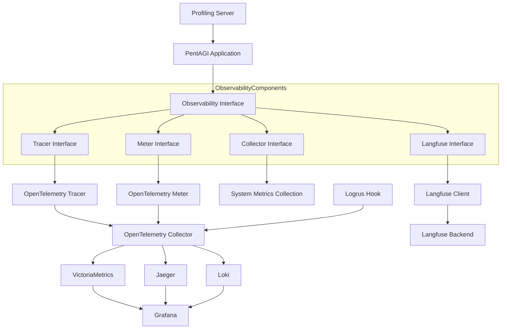
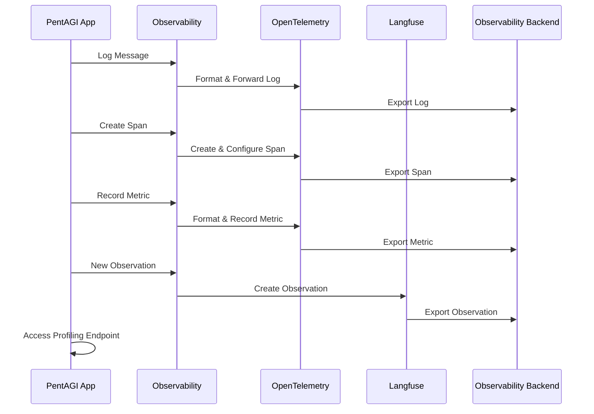

# PentAGI Observability Stack

## Table of Contents
- [PentAGI Observability Stack](#pentagi-observability-stack)
  - [Table of Contents](#table-of-contents)
  - [Overview](#overview)
  - [Architecture](#architecture)
    - [Component Diagram](#component-diagram)
    - [Data Flow](#data-flow)
    - [Key Interfaces](#key-interfaces)
      - [Core Interface](#core-interface)
      - [Tracing Interface](#tracing-interface)
      - [Metrics Interface](#metrics-interface)
      - [Collector Interface](#collector-interface)
      - [Langfuse Interface](#langfuse-interface)
  - [Infrastructure Requirements](#infrastructure-requirements)
    - [Components](#components)
    - [Setup](#setup)
  - [Configuration](#configuration)
    - [Environment Variables](#environment-variables)
    - [Initialization](#initialization)
  - [Developer Guide](#developer-guide)
    - [Logging](#logging)
      - [Logrus Integration](#logrus-integration)
      - [Context-Aware Logging](#context-aware-logging)
      - [Log Correlation with Spans](#log-correlation-with-spans)
    - [Tracing](#tracing)
      - [Span Creation and Sampling](#span-creation-and-sampling)
      - [Context Propagation in Tracing](#context-propagation-in-tracing)
    - [Metrics](#metrics)
    - [Langfuse Integration](#langfuse-integration)
    - [Profiling](#profiling)
  - [Application Instrumentation Patterns](#application-instrumentation-patterns)
    - [HTTP Server Instrumentation](#http-server-instrumentation)
    - [GraphQL Instrumentation](#graphql-instrumentation)
  - [Best Practices](#best-practices)
    - [Context Propagation](#context-propagation)
    - [Structured Logging](#structured-logging)
    - [Meaningful Spans](#meaningful-spans)
    - [Useful Metrics](#useful-metrics)
  - [Use Cases](#use-cases)
    - [Debugging Performance Issues](#debugging-performance-issues)
    - [Monitoring LLM Operations](#monitoring-llm-operations)
    - [System Resource Analysis](#system-resource-analysis)

## Overview

The PentAGI Observability Stack provides comprehensive monitoring, logging, tracing, and metrics collection for the application. It integrates multiple technologies to provide a complete view of the application's behavior, performance, and health:

- **Logging**: Enhanced logrus integration with structured logging and context propagation
- **Tracing**: Distributed tracing with OpenTelemetry and Jaeger
- **Metrics**: Application and system metrics collection
- **Langfuse**: Specialized LLM observability
- **Profiling**: Runtime profiling capabilities

This document explains how the observability stack is designed, configured, and used by developers.

## Architecture

The Observability stack is built as a set of layered interfaces that integrate multiple observability technologies. It uses OpenTelemetry as the foundation for metrics, logs, and traces, with additional integrations for Langfuse (LLM-specific observability) and Go's native profiling.

### Component Diagram



### Data Flow



### Key Interfaces

The observability stack is designed around several interfaces that abstract the underlying implementations:

#### Core Interface

```go
// Observability is the primary interface that combines all observability features
type Observability interface {
    Flush(ctx context.Context) error
    Shutdown(ctx context.Context) error
    Meter
    Tracer
    Collector
    Langfuse
}
```

#### Tracing Interface

```go
// Tracer provides span creation and management
type Tracer interface {
    // NewSpan creates a new span with the given kind and component name
    NewSpan(
        context.Context,
        oteltrace.SpanKind,
        string,
        ...oteltrace.SpanStartOption,
    ) (context.Context, oteltrace.Span)

    // NewSpanWithParent creates a span with explicit parent trace and span IDs
    NewSpanWithParent(
        context.Context,
        oteltrace.SpanKind,
        string,
        string,
        string,
        ...oteltrace.SpanStartOption,
    ) (context.Context, oteltrace.Span)

    // SpanFromContext extracts the current span from context
    SpanFromContext(ctx context.Context) oteltrace.Span

    // SpanContextFromContext extracts span context from context
    SpanContextFromContext(ctx context.Context) oteltrace.SpanContext
}
```

#### Metrics Interface

```go
// Meter provides metric recording capabilities
type Meter interface {
    // Various counter, gauge, and histogram creation methods for
    // both synchronous and asynchronous metrics
    NewInt64Counter(string, ...otelmetric.Int64CounterOption) (otelmetric.Int64Counter, error)
    NewFloat64Counter(string, ...otelmetric.Float64CounterOption) (otelmetric.Float64Counter, error)
    // ... other metric types (removed for brevity)
}
```

#### Collector Interface

```go
// Collector provides system metric collection
type Collector interface {
    // StartProcessMetricCollect starts collecting process metrics
    StartProcessMetricCollect(attrs ...attribute.KeyValue) error

    // StartGoRuntimeMetricCollect starts collecting Go runtime metrics
    StartGoRuntimeMetricCollect(attrs ...attribute.KeyValue) error

    // StartDumperMetricCollect starts collecting metrics from a custom dumper
    StartDumperMetricCollect(stats Dumper, attrs ...attribute.KeyValue) error
}

// Dumper interface for custom metric collection
type Dumper interface {
    DumpStats() (map[string]float64, error)
}
```

#### Langfuse Interface

```go
// Langfuse provides LLM observability
type Langfuse interface {
    // NewObservation creates a new Langfuse observation
    NewObservation(
        context.Context,
        ...langfuse.ObservationContextOption,
    ) (context.Context, langfuse.Observation)
}
```

## Infrastructure Requirements

The observability stack relies on several backend services for storing and visualizing the collected data.

### Components

The infrastructure includes the following components:

- **Grafana**: Visualization and dashboarding
- **VictoriaMetrics**: Time-series database for metrics
- **ClickHouse**: Analytical database for traces and logs
- **Loki**: Log aggregation system
- **Jaeger**: Distributed tracing system
- **OpenTelemetry Collector**: Collects, processes, and exports telemetry data
- **Node Exporter**: Exposes Linux system metrics
- **cAdvisor**: Provides container resource usage metrics

### Setup

The observability stack can be deployed using Docker Compose:

```bash
# Start the observability stack
docker-compose -f docker-compose-observability.yml up -d
```

For detailed setup instructions, refer to the README.md file in the repository.

## Configuration

### Environment Variables

The observability stack is configured through environment variables in the application's configuration:

| Variable | Description | Example Value |
|----------|-------------|---------------|
| `OTEL_HOST` | OpenTelemetry collector endpoint | `otel:4318` |
| `LANGFUSE_BASE_URL` | Langfuse API base URL | `http://langfuse-web:3000` |
| `LANGFUSE_PROJECT_ID` | Langfuse project ID | `cm47619l0000872mcd2dlbqwb` |
| `LANGFUSE_PUBLIC_KEY` | Langfuse public API key | `pk-lf-5946031c-ae6c-4451-98d2-9882a59e1707` |
| `LANGFUSE_SECRET_KEY` | Langfuse secret API key | `sk-lf-d9035680-89dd-4950-8688-7870720bf359` |

### Initialization

The observability stack is initialized in the application through the `InitObserver` function:

```go
// Initialize clients first
lfclient, err := obs.NewLangfuseClient(ctx, cfg)
if err != nil && !errors.Is(err, obs.ErrNotConfigured) {
    log.Fatalf("Unable to create langfuse client: %v\n", err)
}

otelclient, err := obs.NewTelemetryClient(ctx, cfg)
if err != nil && !errors.Is(err, obs.ErrNotConfigured) {
    log.Fatalf("Unable to create telemetry client: %v\n", err)
}

// Initialize the observer
obs.InitObserver(ctx, lfclient, otelclient, []logrus.Level{
    logrus.DebugLevel,
    logrus.InfoLevel,
    logrus.WarnLevel,
    logrus.ErrorLevel,
})

// Start metrics collection
if err := obs.Observer.StartProcessMetricCollect(); err != nil {
    log.Printf("Failed to start process metric collection: %v", err)
}

if err := obs.Observer.StartGoRuntimeMetricCollect(); err != nil {
    log.Printf("Failed to start Go runtime metric collection: %v", err)
}

// Start profiling if needed
go profiling.Start()
```

## Developer Guide

This section explains how to use the observability stack's features in application code.

### Logging

The observability stack integrates deeply with logrus for logging. Logged messages are automatically associated with the current span and exported to the observability backend.

#### Logrus Integration

The observability package implements a logrus hook that captures log entries and incorporates them into the OpenTelemetry tracing and logging systems:

```go
// InitObserver sets up the logrus hook
obs.InitObserver(ctx, lfclient, otelclient, []logrus.Level{
    logrus.DebugLevel,
    logrus.InfoLevel,
    logrus.WarnLevel,
    logrus.ErrorLevel,
})
```

The hook is implemented in the `observer` struct, which automatically:

1. Captures log entries via its `Fire` method
2. Extracts the current span from the log entry's context
3. Creates span events for all logs
4. Translates logrus entries to OpenTelemetry logs
5. Properly formats error logs to include stack traces and error details

The implementation of the logrus hook in the observer:

```go
// Fire is a logrus hook that is fired on a new log entry.
func (obs *observer) Fire(entry *logrus.Entry) error {
    // Extract context or create a new one
    ctx := entry.Context
    if ctx == nil {
        ctx = context.Background()
    }

    // Get current span from context
    span := oteltrace.SpanFromContext(ctx)
    if !span.IsRecording() {
        // Create a new span for logs without a valid span
        component := "internal"
        if op, ok := entry.Data["component"]; ok {
            component = op.(string)
        }
        _, span = obs.NewSpanWithParent(
            ctx,
            oteltrace.SpanKindInternal,
            component,
            // ... span creation details
        )
        defer span.End()
    }

    // Add log as an event to the span
    span.AddEvent("log", oteltrace.WithAttributes(obs.makeAttrs(entry, span)...))

    // Send to OpenTelemetry log pipeline
    obs.logger.Emit(ctx, obs.makeRecord(entry, span))

    return nil
}
```

#### Context-Aware Logging

For proper trace correlation, logs should include the request context. This allows the observability system to associate logs with the correct trace and span:

```go
// WithContext is critical for associating logs with the correct trace
logrus.WithContext(ctx).Info("Operation completed")

// Without context, logs may not be associated with the correct trace
logrus.Info("This log may not be properly correlated") // Avoid this

// Example with error and fields
logrus.WithContext(ctx).WithFields(logrus.Fields{
    "user_id": userID,
    "action": "login",
}).WithError(err).Error("Authentication failed")
```

When a log entry includes a context, the observability system will:

1. Extract the active span from the context
2. Associate the log with that span
3. Include trace and span IDs in the log record
4. Ensure the log appears in the trace timeline in Jaeger

If a log entry does not include a context (or the context has no active span), the system will:

1. Create a new span for the log entry
2. Associate the log with this new span
3. This creates a "span island" that isn't connected to other parts of the trace

#### Log Correlation with Spans

The observability system enriches logs with trace and span information automatically:

```go
// Create a span
ctx, span := obs.Observer.NewSpan(ctx, obs.SpanKindInternal, "process-request")
defer span.End()

// All logs with this context will be associated with the span
logrus.WithContext(ctx).Info("Starting processing")

// Even errors are properly correlated and include stacktraces
if err != nil {
    logrus.WithContext(ctx).WithError(err).Error("Processing failed")
    // The error is automatically added to the span
}
```

The observer converts logrus fields to span attributes and OpenTelemetry log records:

```go
// A log with fields
logrus.WithContext(ctx).WithFields(logrus.Fields{
    "user_id": 1234,
    "request_id": "abc-123",
    "duration_ms": 42,
}).Info("Request processed")

// Results in span attributes:
// - log.severity: INFO
// - log.message: Request processed
// - log.user_id: 1234
// - log.request_id: abc-123
// - log.duration_ms: 42
```

This integration ensures that logs, traces, and metrics all share consistent context, making it easier to correlate events across the system.

### Tracing

Traces provide a way to track the flow of requests through the system.

#### Span Creation and Sampling

Spans should be created for significant operations in the code. Each span represents a unit of work:

```go
// Create a new span for a significant operation
ctx, span := obs.Observer.NewSpan(ctx, obs.SpanKindInternal, "process-request")
defer span.End()

// Always end spans, preferably with defer
```

Span creation follows these principles:

1. **Span Hierarchy**: Spans created with a context containing an active span become child spans
2. **Span Kinds**: Different span kinds represent different types of operations:
   - `SpanKindInternal`: Internal operations (default)
   - `SpanKindServer`: Handling incoming requests
   - `SpanKindClient`: Making outgoing requests
   - `SpanKindProducer`: Sending messages
   - `SpanKindConsumer`: Receiving messages

3. **Component Names**: The third parameter to `NewSpan` identifies the component and becomes the span name

4. **Empty Spans**: Even spans without explicit attributes or events (empty spans) are valuable as they:
   - Show timing of operations
   - Maintain the context propagation chain
   - Provide structure to traces

```go
// Parent operation
ctx, parentSpan := obs.Observer.NewSpan(ctx, obs.SpanKindInternal, "parent-operation")
defer parentSpan.End()

// Child operation - automatically becomes a child span in the trace
ctx, childSpan := obs.Observer.NewSpan(ctx, obs.SpanKindInternal, "child-operation")
defer childSpan.End()
```

#### Context Propagation in Tracing

Context propagation is critical for maintaining trace continuity:

```go
// Create a span in function A
ctx, span := obs.Observer.NewSpan(ctx, obs.SpanKindInternal, "function-a")
defer span.End()

// Pass the context to function B
resultB := functionB(ctx, param1, param2)

// Inside function B, create a child span
func functionB(ctx context.Context, param1, param2 string) Result {
    // This will be a child span of the span in function A
    ctx, span := obs.Observer.NewSpan(ctx, obs.SpanKindInternal, "function-b")
    defer span.End()

    // ...function logic...
}
```

The context carries:
1. Active spans for proper parent-child relationships
2. Trace ID for continuity across the entire request
3. Span ID for linking to the parent span
4. Trace flags (like sampling decisions)

Always use the *updated context* returned from `NewSpan()`:

```go
// CORRECT: Using the updated context
ctx, span := obs.Observer.NewSpan(ctx, obs.SpanKindInternal, "operation")
// Pass the updated ctx to subsequent operations

// INCORRECT: Not using the updated context
_, span := obs.Observer.NewSpan(ctx, obs.SpanKindInternal, "operation")
// Subsequent operations won't be part of the same trace
```

### Metrics

Metrics provide quantitative measurements of the application's behavior:

```go
// Create a counter
requestCounter, _ := obs.Observer.NewInt64Counter(
    "app.requests.total",
    otelmetric.WithDescription("Total number of requests"),
)

// Increment the counter
requestCounter.Add(ctx, 1,
    attribute.String("endpoint", "/api/users"),
    attribute.String("method", "GET"),
)

// Create a histogram for measuring latencies
latencyHistogram, _ := obs.Observer.NewFloat64Histogram(
    "app.request.duration",
    otelmetric.WithDescription("Request duration in seconds"),
)

// Record a duration
startTime := time.Now()
// ... perform operation ...
duration := time.Since(startTime).Seconds()
latencyHistogram.Record(ctx, duration,
    attribute.String("endpoint", "/api/users"),
    attribute.String("method", "GET"),
)
```

### Langfuse Integration

Langfuse provides specialized observability for LLM operations:

```go
// Create a new observation for an LLM operation
ctx, observation := obs.Observer.NewObservation(ctx,
    langfuse.WithObservationTraceContext(
        langfuse.WithTraceName("flow-execution"),
        langfuse.WithTraceUserId(user.Email),
    ),
)

// Create a generation for an LLM request
generation := observation.Generation(
    langfuse.WithStartGenerationName("content-generation"),
    langfuse.WithStartGenerationModel("gpt-4"),
    langfuse.WithStartGenerationInput(prompt),
)

// Complete the generation with result
generation.End(
    langfuse.WithEndGenerationOutput(response),
    langfuse.WithEndGenerationUsage(&langfuse.GenerationUsage{
        Input: promptTokens,
        Output: responseTokens,
        Unit: langfuse.GenerationUsageUnitTokens,
    }),
)
```

### Profiling

The observability stack includes a profiling server that exposes Go's standard profiling endpoints:

```go
// The profiling server starts automatically when profiling.Start() is called
// It runs on port 7777 by default

// Access profiles using:
// - CPU profile: http://localhost:7777/profiler/profile
// - Heap profile: http://localhost:7777/profiler/heap
// - Goroutine profile: http://localhost:7777/profiler/goroutine
// - Block profile: http://localhost:7777/profiler/block
// - Mutex profile: http://localhost:7777/profiler/mutex
// - Execution trace: http://localhost:7777/profiler/trace
```

You can use standard Go tools to collect and analyze profiles:

```bash
# Collect a 30-second CPU profile
go tool pprof http://localhost:7777/profiler/profile

# Collect a heap profile
go tool pprof http://localhost:7777/profiler/heap

# Collect a 5-second execution trace
curl -o trace.out http://localhost:7777/profiler/trace?seconds=5
go tool trace trace.out
```

## Application Instrumentation Patterns

PentAGI uses several patterns for instrumenting different parts of the application. These patterns demonstrate best practices for integrating the observability stack.

### HTTP Server Instrumentation

The PentAGI application uses a Gin middleware to instrument HTTP requests, located in `pkg/server/logger/logger.go`:

```go
// WithGinLogger creates a middleware that logs HTTP requests with tracing
func WithGinLogger(service string) gin.HandlerFunc {
    return func(c *gin.Context) {
        // Record start time for duration calculation
        start := time.Now()

        // Extract URI and query parameters
        uri := c.Request.URL.Path
        raw := c.Request.URL.RawQuery
        if raw != "" {
            uri = uri + "?" + raw
        }

        // Create structured log with HTTP request details
        entry := logrus.WithFields(logrus.Fields{
            "component":      "api",
            "net_peer_ip":    c.ClientIP(),
            "http_uri":       uri,
            "http_path":      c.Request.URL.Path,
            "http_host_name": c.Request.Host,
            "http_method":    c.Request.Method,
        })

        // Add request type information
        if c.FullPath() == "" {
            entry = entry.WithField("request", "proxy handled")
        } else {
            entry = entry.WithField("request", "api handled")
        }

        // Proceed with the request
        c.Next()

        // Include any Gin errors
        if len(c.Errors) > 0 {
            entry = entry.WithField("gin.errors", c.Errors.String())
        }

        // Add response information and duration
        entry = entry.WithFields(logrus.Fields{
            "duration":         time.Since(start).String(),
            "http_status_code": c.Writer.Status(),
            "http_resp_size":   c.Writer.Size(),
        }).WithContext(c.Request.Context())

        // Log appropriate level based on status code
        if c.Writer.Status() >= 400 {
            entry.Error("http request handled error")
        } else {
            entry.Debug("http request handled success")
        }
    }
}
```

This middleware:
1. Creates structured logs with HTTP request and response details
2. Includes the request context for trace correlation
3. Logs errors for failed requests (status >= 400)
4. Measures and logs request duration

To use this middleware in your Gin application:

```go
// Setup the router with the logging middleware
router := gin.New()
router.Use(logger.WithGinLogger("api-service"))
```

### GraphQL Instrumentation

PentAGI also provides instrumentation for GraphQL operations:

```go
// WithGqlLogger creates middleware that instruments GraphQL operations
func WithGqlLogger(service string) func(ctx context.Context, next graphql.ResponseHandler) *graphql.Response {
    return func(ctx context.Context, next graphql.ResponseHandler) *graphql.Response {
        // Create a span for the GraphQL operation
        ctx, span := obs.Observer.NewSpan(ctx, obs.SpanKindServer, "graphql.handler")
        defer span.End()

        // Record start time
        start := time.Now()
        entry := logrus.WithContext(ctx).WithField("component", service)

        // Execute the GraphQL operation
        res := next(ctx)

        // Add operation details to the logs
        op := graphql.GetOperationContext(ctx)
        if op != nil && op.Operation != nil {
            entry = entry.WithFields(logrus.Fields{
                "operation_name": op.OperationName,
                "operation_type": op.Operation.Operation,
            })
        }

        // Add duration information
        entry = entry.WithField("duration", time.Since(start).String())

        // Log errors if present
        if res == nil {
            return res
        }

        if len(res.Errors) > 0 {
            entry = entry.WithField("gql.errors", res.Errors.Error())
            entry.Error("graphql request handled with errors")
        } else {
            entry.Debug("graphql request handled success")
        }

        return res
    }
}
```

This middleware:
1. Creates a span for each GraphQL operation
2. Attaches operation name and type to the logs
3. Records operation duration
4. Logs any GraphQL errors
5. Uses context propagation to maintain the trace

To use this middleware in your GraphQL server:

```go
// Configure the GraphQL server with the logging middleware
srv := handler.NewDefaultServer(generated.NewExecutableSchema(generated.Config{
    Resolvers: &graph.Resolver{},
}))
srv.AroundOperations(logger.WithGqlLogger("graphql-service"))
```

## Best Practices

### Context Propagation

Always propagate context through your application to maintain trace continuity:

```go
// Pass context to functions and methods
func ProcessRequest(ctx context.Context, req Request) {
    // Use the context for spans, logs, etc.
    logrus.WithContext(ctx).Info("Processing request")

    // Pass the context to downstream functions
    result, err := fetchData(ctx, req.ID)
}
```

### Structured Logging

Use structured logging with consistent field names:

```go
// Define common field names
const (
    FieldUserID     = "user_id"
    FieldRequestID  = "request_id"
    FieldComponent  = "component"
)

// Use them consistently
logrus.WithFields(logrus.Fields{
    FieldUserID:    user.ID,
    FieldRequestID: reqID,
    FieldComponent: "auth-service",
}).Info("User authenticated")
```

### Meaningful Spans

Create spans that represent logical operations:

```go
// Good: spans represent logical operations
ctx, span := obs.Observer.NewSpan(ctx, obs.SpanKindInternal, "validate-user-input")
defer span.End()

// Bad: spans are too fine-grained or too coarse
ctx, span := obs.Observer.NewSpan(ctx, obs.SpanKindInternal, "process-entire-request")
defer span.End()
```

### Useful Metrics

Design metrics to answer specific questions:

```go
// Good: metrics that help troubleshoot
cacheHitCounter, _ := obs.Observer.NewInt64Counter("cache.hits")
cacheMissCounter, _ := obs.Observer.NewInt64Counter("cache.misses")

// Good: metrics with dimensions
requestCounter.Add(ctx, 1,
    attribute.String("status", status),
    attribute.String("endpoint", endpoint),
)
```

## Use Cases

### Debugging Performance Issues

When facing performance issues, you can:

1. Check traces to identify slow operations
2. Look at metrics for system resource usage
3. Examine logs for errors or warnings
4. Use the profiling tools to identify CPU, memory, or concurrency bottlenecks

Example workflow:

```bash
# 1. Look at traces in Jaeger UI to identify slow spans

# 2. Check resource metrics in Grafana

# 3. Collect and analyze profiles
go tool pprof http://localhost:7777/profiler/profile
(pprof) top10  # Show the top 10 functions by CPU usage
(pprof) web    # Generate a graph visualization
```

### Monitoring LLM Operations

For LLM-related issues:

1. Check Langfuse observations for specific flows
2. Look at trace spans to understand the context of LLM calls
3. Examine metrics for token usage, latency, and error rates

### System Resource Analysis

To understand system resource usage:

1. Check process metrics in Grafana
2. Look at Go runtime metrics to understand memory usage
3. Use CPU and memory profiles to identify resource-intensive functions

```bash
# Collect a memory profile
go tool pprof http://localhost:7777/profiler/heap
(pprof) top10  # Show the top 10 functions by memory usage
(pprof) list someFunction  # Show memory usage in a specific function
```
