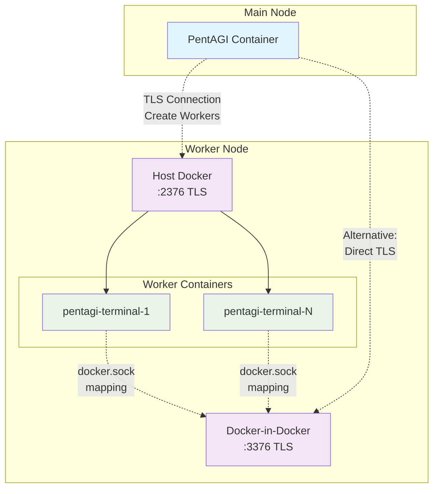

# PentAGI Worker Node Setup

This guide configures a distributed PentAGI deployment where worker node operations are isolated on a separate server for enhanced security. The worker node runs both host Docker and Docker-in-Docker (dind) to provide secure container execution environments.

## Architecture Overview



**Connection Modes:**
- **Standard**: PentAGI → Host Docker (creates workers) → Workers use dind via socket mapping
- **Direct**: PentAGI → dind (creates workers directly, socket mapping disabled)

## Prerequisites

Set the private IP address that will be used throughout this setup:

```bash
export PRIVATE_IP=192.168.10.10  # Replace with your worker node IP
```

## Install Docker on Both Nodes

> **Note:** Docker must be installed on both the **worker node** and the **main node**. Execute the following commands on each node separately.

Install Docker CE following the official Ubuntu installation guide:

```bash
# Add Docker's official GPG key
sudo apt-get update
sudo apt-get install ca-certificates curl
sudo install -m 0755 -d /etc/apt/keyrings
sudo curl -fsSL https://download.docker.com/linux/ubuntu/gpg -o /etc/apt/keyrings/docker.asc
sudo chmod a+r /etc/apt/keyrings/docker.asc

# Add Docker repository to APT sources
echo \
  "deb [arch=$(dpkg --print-architecture) signed-by=/etc/apt/keyrings/docker.asc] https://download.docker.com/linux/ubuntu \
  $(. /etc/os-release && echo "${UBUNTU_CODENAME:-$VERSION_CODENAME}") stable" | \
  sudo tee /etc/apt/sources.list.d/docker.list > /dev/null
sudo apt-get update

# Install Docker CE and plugins
sudo apt-get install docker-ce docker-ce-cli containerd.io docker-buildx-plugin docker-compose-plugin
```

## Configure Host Docker on Worker Node

### Generate TLS Certificates for Host Docker

Configure TLS authentication for secure remote Docker API access:

```bash
# Install easy-rsa for certificate management
sudo apt install easy-rsa

# Create PKI infrastructure for host docker
sudo mkdir -p /etc/easy-rsa/docker-host
cd /etc/easy-rsa/docker-host
sudo /usr/share/easy-rsa/easyrsa init-pki
sudo /usr/share/easy-rsa/easyrsa build-ca nopass

# Generate server certificate with SAN extensions
export EASYRSA_EXTRA_EXTS="subjectAltName = @alt_names

[alt_names]
DNS.1 = localhost
DNS.2 = docker
DNS.3 = docker-host
IP.1 = 127.0.0.1
IP.2 = 0.0.0.0
IP.3 = ${PRIVATE_IP}"
sudo /usr/share/easy-rsa/easyrsa build-server-full server nopass  # Confirm with 'yes'
unset EASYRSA_EXTRA_EXTS

# Generate client certificate
sudo /usr/share/easy-rsa/easyrsa build-client-full client nopass  # Confirm with 'yes'

# Copy server certificates to Docker directory
sudo mkdir -p /etc/docker/certs/server
sudo cp pki/ca.crt /etc/docker/certs/server/ca.pem
sudo cp pki/issued/server.crt /etc/docker/certs/server/cert.pem
sudo cp pki/private/server.key /etc/docker/certs/server/key.pem

# Copy client certificates for remote access
sudo mkdir -p /etc/docker/certs/client
sudo cp pki/ca.crt /etc/docker/certs/client/ca.pem
sudo cp pki/issued/client.crt /etc/docker/certs/client/cert.pem
sudo cp pki/private/client.key /etc/docker/certs/client/key.pem
```

### Configure Docker Daemon with TLS

Enable TLS authentication and remote access for the Docker daemon:

```bash
# Configure Docker daemon with TLS settings
sudo cat > /etc/docker/daemon.json << EOF
{
  "log-driver": "json-file",
  "log-opts": {
    "max-size": "100m",
    "max-file": "2",
    "compress": "true"
  },
  "dns-opts": [
    "ndots:1"
  ],
  "metrics-addr": "${PRIVATE_IP}:9323",
  "tls": true,
  "tlscacert": "/etc/docker/certs/server/ca.pem",
  "tlscert": "/etc/docker/certs/server/cert.pem",
  "tlskey": "/etc/docker/certs/server/key.pem",
  "tlsverify": true
}
EOF

# Enable TCP listening on private IP (required for remote access)
sudo sed -i "s|ExecStart=/usr/bin/dockerd -H fd:// --containerd=/run/containerd/containerd.sock|ExecStart=/usr/bin/dockerd -H fd:// -H tcp://${PRIVATE_IP}:2376 --containerd=/run/containerd/containerd.sock|" /lib/systemd/system/docker.service

# Apply configuration changes
sudo systemctl daemon-reload
sudo systemctl restart docker
```

### Create TLS Access Test Script

Create a utility script to test secure Docker API access:

```bash
sudo cat > /usr/local/bin/docker-host-tls << EOF
#!/bin/bash
# Docker API client wrapper for TLS connections
# Usage: docker-host-tls [docker-commands]

export DOCKER_HOST=tcp://${PRIVATE_IP}:2376
export DOCKER_TLS_VERIFY=1
export DOCKER_CERT_PATH=/etc/docker/certs/client

# Show connection info if no arguments provided
if [ \$# -eq 0 ]; then
    echo "Docker API connection configured:"
    echo "  Host: ${PRIVATE_IP}:2376"
    echo "  TLS: enabled"
    echo "  Certificates: /etc/docker/certs/client/"
    echo ""
    echo "Usage: docker-host-tls [docker-commands]"
    echo "Examples:"
    echo "  docker-host-tls version"
    echo "  docker-host-tls ps"
    echo "  docker-host-tls images"
    exit 0
fi

# Execute docker command with TLS environment
exec docker "\$@"
EOF

sudo chmod +x /usr/local/bin/docker-host-tls

# Test TLS connection
docker-host-tls ps && docker-host-tls info
```

## Configure Docker-in-Docker (dind) on Worker Node

Docker-in-Docker provides an isolated environment for worker containers to execute Docker commands securely.

### Generate TLS Certificates for dind

Create separate certificates for the dind daemon:

```bash
# Create PKI infrastructure for dind
sudo mkdir -p /etc/easy-rsa/docker-dind
cd /etc/easy-rsa/docker-dind
sudo /usr/share/easy-rsa/easyrsa init-pki
sudo /usr/share/easy-rsa/easyrsa build-ca nopass

# Generate server certificate with SAN extensions
export EASYRSA_EXTRA_EXTS="subjectAltName = @alt_names

[alt_names]
DNS.1 = localhost
DNS.2 = docker
DNS.3 = docker-dind
IP.1 = 127.0.0.1
IP.2 = 0.0.0.0
IP.3 = ${PRIVATE_IP}"
sudo /usr/share/easy-rsa/easyrsa build-server-full server nopass  # Confirm with 'yes'
unset EASYRSA_EXTRA_EXTS

# Generate client certificate
sudo /usr/share/easy-rsa/easyrsa build-client-full client nopass  # Confirm with 'yes'

# Create certificate directories
sudo mkdir -p /etc/docker/certs/dind/{ca,client,server}

# Copy CA certificates
sudo cp pki/ca.crt /etc/docker/certs/dind/ca/cert.pem
sudo cp pki/private/ca.key /etc/docker/certs/dind/ca/key.pem

# Copy server certificates
sudo cp pki/ca.crt /etc/docker/certs/dind/server/ca.pem
sudo cp pki/issued/server.crt /etc/docker/certs/dind/server/cert.pem
sudo cp pki/private/server.key /etc/docker/certs/dind/server/key.pem

# Copy client certificates
sudo cp pki/ca.crt /etc/docker/certs/dind/client/ca.pem
sudo cp pki/issued/client.crt /etc/docker/certs/dind/client/cert.pem
sudo cp pki/private/client.key /etc/docker/certs/dind/client/key.pem
```

### Create dind Management Script

Create a script to manage the dind container lifecycle:

```bash
sudo cat > /usr/local/bin/run-dind << EOF
#!/bin/bash

# Check if dind container exists
if docker ps -a --format '{{.Names}}' | grep -q "^docker-dind$"; then
    if ! docker ps --format '{{.Names}}' | grep -q "^docker-dind$"; then
        echo "Starting existing docker-dind container..."
        docker start docker-dind
    else
        echo "docker-dind container is already running."
    fi
else
    echo "Creating new docker-dind container..."
    docker run -d \
        --privileged \
        -v /etc/docker/certs/dind/server:/certs/server:ro \
        -v /var/lib/docker-dind:/var/lib/docker \
        -v /var/run/docker-dind:/var/run/dind \
        -p ${PRIVATE_IP}:3376:2376 \
        -p ${PRIVATE_IP}:9324:9324 \
        --cpus 2 --memory 2G \
        --name docker-dind \
        --restart always \
        --log-opt max-size=50m \
        --log-opt max-file=7 \
        docker:dind \
        --host=unix:///var/run/dind/docker.sock \
        --host=tcp://0.0.0.0:2376 \
        --tls=true \
        --tlscert=/certs/server/cert.pem \
        --tlskey=/certs/server/key.pem \
        --tlscacert=/certs/server/ca.pem \
        --tlsverify=true \
        --metrics-addr=0.0.0.0:9324
    echo "docker-dind container created and started."
fi
EOF

sudo chmod +x /usr/local/bin/run-dind

# Start dind container and verify
run-dind && docker ps
```

### Create dind Access Test Scripts

Create utilities to test dind access via TLS and Unix socket:

**TLS Access Script:**

```bash
sudo cat > /usr/local/bin/docker-dind-tls << EOF
#!/bin/bash
# Docker API client wrapper for dind TLS connections
# Usage: docker-dind-tls [docker-commands]

export DOCKER_HOST=tcp://${PRIVATE_IP}:3376
export DOCKER_TLS_VERIFY=1
export DOCKER_CERT_PATH=/etc/docker/certs/dind/client

# Show connection info if no arguments provided
if [ \$# -eq 0 ]; then
    echo "Docker dind API connection configured:"
    echo "  Host: ${PRIVATE_IP}:3376"
    echo "  TLS: enabled"
    echo "  Certificates: /etc/docker/certs/dind/client/"
    echo ""
    echo "Usage: docker-dind-tls [docker-commands]"
    echo "Examples:"
    echo "  docker-dind-tls version"
    echo "  docker-dind-tls ps"
    echo "  docker-dind-tls images"
    exit 0
fi

# Execute docker command with TLS environment
exec docker "\$@"
EOF

sudo chmod +x /usr/local/bin/docker-dind-tls

# Test dind TLS connection
docker-dind-tls ps && docker-dind-tls info
```

**Unix Socket Access Script:**

```bash
sudo cat > /usr/local/bin/docker-dind-sock << EOF
#!/bin/bash
# Docker API client wrapper for dind socket connections
# Usage: docker-dind-sock [docker-commands]

export DOCKER_HOST=unix:///var/run/docker-dind/docker.sock
export DOCKER_TLS_VERIFY=
export DOCKER_CERT_PATH=

# Show connection info if no arguments provided
if [ \$# -eq 0 ]; then
    echo "Docker dind socket connection configured:"
    echo "  Host: unix:///var/run/docker-dind/docker.sock"
    echo ""
    echo "Usage: docker-dind-sock [docker-commands]"
    echo "Examples:"
    echo "  docker-dind-sock version"
    echo "  docker-dind-sock ps"
    echo "  docker-dind-sock images"
    exit 0
fi

# Execute docker command with socket environment
exec docker "\$@"
EOF

sudo chmod +x /usr/local/bin/docker-dind-sock

# Test dind socket connection
docker-dind-sock ps && docker-dind-sock info
```

## Security & Firewall Configuration

### Required Port Access

The worker node exposes the following services on the private IP address:

| Port | Service | Description |
|------|---------|-------------|
| 2376 | Host Docker API | TLS-secured Docker daemon for worker container management |
| 3376 | dind API | TLS-secured Docker-in-Docker daemon |
| 9323 | Host Docker Metrics | Prometheus metrics endpoint for host Docker |
| 9324 | dind Metrics | Prometheus metrics endpoint for dind |

**Metrics Integration:** The metrics ports (9323, 9324) can be configured in PentAGI's `observability/otel/config.yml` under the `docker-engine-collector` job name for monitoring integration.

### OOB Attack Port Range

Each worker container (`pentagi-terminal-N`) dynamically allocates **2 ports** from the range `28000-30000` on all network interfaces to facilitate Out-of-Band (OOB) attack techniques during penetration testing.

**Firewall Requirements:**
- **Inbound**: Allow access to ports 2376, 3376, 9323, 9324 on `${PRIVATE_IP}` from the main PentAGI node
- **Inbound**: Allow access to port range 28000-30000 from target networks being tested
- Configure perimeter firewall to permit OOB traffic from target networks to worker node

## Transfer Certificates to Main Node

Copy the client certificates from the worker node to the main PentAGI node for secure Docker API access. The certificates need to be transferred to specific directories that the PentAGI installer will recognize.

### Copy Host Docker Client Certificates

Transfer the host Docker client certificates to the main node:

```bash
# On the worker node - create archive with host docker certificates
sudo tar czf docker-host-ssl.tar.gz -C /etc/docker/certs client/

# Transfer to main node (replace <MAIN_NODE_IP> with actual IP)
scp docker-host-ssl.tar.gz root@<MAIN_NODE_IP>:/opt/pentagi/

# On the main node - extract certificates
cd /opt/pentagi
tar xzf docker-host-ssl.tar.gz
mv client docker-host-ssl
rm docker-host-ssl.tar.gz
```

### Copy dind Client Certificates

Transfer the dind client certificates to the main node:

```bash
# On the worker node - create archive with dind certificates
sudo tar czf docker-dind-ssl.tar.gz -C /etc/docker/certs/dind client/

# Transfer to main node (replace <MAIN_NODE_IP> with actual IP)
scp docker-dind-ssl.tar.gz root@<MAIN_NODE_IP>:/opt/pentagi/

# On the main node - extract certificates
cd /opt/pentagi
tar xzf docker-dind-ssl.tar.gz
mv client docker-dind-ssl
rm docker-dind-ssl.tar.gz
```

### Verify Certificate Structure

After transfer, verify the certificate directory structure on the main node:

```bash
# Check certificate directories
ls -la /opt/pentagi/docker-host-ssl/
ls -la /opt/pentagi/docker-dind-ssl/

# Expected files in each directory:
# ca.pem (Certificate Authority)
# cert.pem (Client certificate)
# key.pem (Client private key)
```

These certificate directories will be used by the PentAGI installer to configure secure connections to the worker node Docker services.

## Install PentAGI on Main Node

After completing the worker node setup and transferring certificates, install PentAGI on the main node using the official installer.

### Download and Run Installer

Execute the following commands on the main node to download and run the PentAGI installer:

```bash
# Create installation directory and navigate to it
mkdir -p /opt/pentagi && cd /opt/pentagi

# Download the latest installer
wget -O installer.zip https://pentagi.com/downloads/linux/amd64/installer-latest.zip

# Extract the installer
unzip installer.zip

# Run the installer (interactive setup)
./installer
```

**Prerequisites & Permissions:**

The installer requires appropriate privileges to interact with the Docker API for proper operation. By default, it uses the Docker socket (`/var/run/docker.sock`) which requires either:

- **Option 1 (Recommended for production):** Run the installer as root:
  ```bash
  sudo ./installer
  ```

- **Option 2 (Development environments):** Grant your user access to the Docker socket by adding them to the `docker` group:
  ```bash
  # Add your user to the docker group
  sudo usermod -aG docker $USER
  
  # Log out and log back in, or activate the group immediately
  newgrp docker
  
  # Verify Docker access (should run without sudo)
  docker ps
  ```

  ⚠️ **Security Note:** Adding a user to the `docker` group grants root-equivalent privileges. Only do this for trusted users in controlled environments. For production deployments, consider using rootless Docker mode or running the installer with sudo.

### Configure Docker Environment

After the installer completes and PentAGI is running, manually configure the Docker environment through the web interface:

1. **Access PentAGI Installer** via `./installer`
2. **Navigate to Tools → Docker Environment**
3. **Fill in the Docker Environment Configuration fields:**

**For Standard Mode (Host Docker):**
- **Docker Access**: `true` (enable Docker access for workers)
- **Network Admin**: `true` (enable network scanning capabilities)
- **Docker Socket**: `/var/run/docker-dind/docker.sock` (path inside worker containers)
- **Docker Network**: `pentagi-network` (custom network name)
- **Public IP Address**: `${PRIVATE_IP}` (worker node IP a front of tested network for OOB attacks)
- **Work Directory**: Leave empty (use default Docker volumes)
- **Default Image**: `debian:latest` (or leave empty)
- **Pentesting Image**: `vxcontrol/kali-linux` (or leave empty)
- **Docker Host**: `tcp://${PRIVATE_IP}:2376` (TLS connection to host Docker)
- **TLS Verification**: `1` (enable TLS verification)
- **TLS Certificates**: `/opt/pentagi/docker-host-ssl` (path to client certificates)

**For Direct Mode (dind only):**
- Use the same configuration but change:
- **Docker Host**: `tcp://${PRIVATE_IP}:3376` (TLS connection to dind)
- **TLS Certificates**: `/opt/pentagi/docker-dind-ssl` (path to dind client certificates)
- **Docker Socket**: Leave empty (no socket mapping needed)

The certificate directories `/opt/pentagi/docker-host-ssl/` and `/opt/pentagi/docker-dind-ssl/` will be automatically mounted into the PentAGI container for secure TLS authentication.
