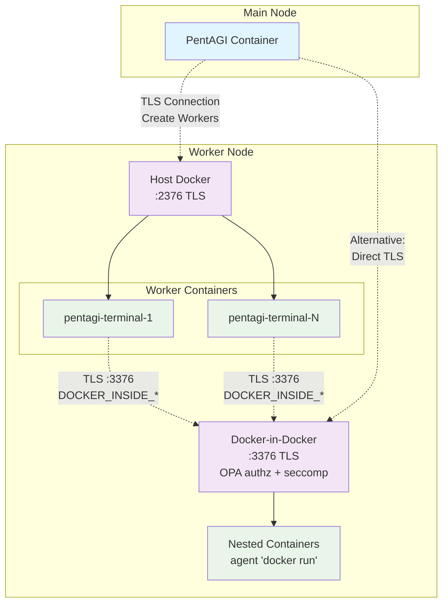

# PentAGI Worker Node Setup

This guide configures a distributed PentAGI deployment where worker node operations are isolated on a separate server for enhanced security. The worker node runs both host Docker and a hardened Docker-in-Docker (dind) daemon, which gives agents a sandboxed Docker environment of their own.

## Architecture Overview


```mermaid
graph TB
    subgraph "Main Node"
        PA[PentAGI Container]
    end

    subgraph "Worker Node"
        HD[Host Docker<br/>:2376 TLS]
        DIND[Docker-in-Docker<br/>:3376 TLS<br/>OPA authz + seccomp]

        subgraph "Worker Containers"
            WC1[pentagi-terminal-1]
            WC2[pentagi-terminal-N]
        end

        NC[Nested Containers<br/>agent 'docker run']
    end

    PA -.->|"TLS Connection<br/>Create Workers"| HD
    HD --> WC1
    HD --> WC2
    WC1 -.->|"TLS :3376<br/>DOCKER_INSIDE_*"| DIND
    WC2 -.->|"TLS :3376<br/>DOCKER_INSIDE_*"| DIND
    DIND --> NC

    PA -.->|"Alternative:<br/>Direct TLS"| DIND

    classDef main fill:#e1f5fe
    classDef worker fill:#f3e5f5
    classDef container fill:#e8f5e8

    class PA main
    class HD,DIND worker
    class WC1,WC2,NC container
```

**Connection Modes:**
- **Standard** (recommended): PentAGI → Host Docker (creates workers) → Workers reach dind over its **TLS endpoint**, configured through `DOCKER_INSIDE_HOST` / `DOCKER_INSIDE_TLS_VERIFY` / `DOCKER_INSIDE_CERT_PATH`. Agents keep full Docker access, and every container they create is policed by the dind authorization policy.
- **Direct**: PentAGI → dind (creates workers directly). Worker containers become nested containers, so the policy applies to them too: host bind-mounts are denied, which means **Docker Access must be disabled** and the work directory must be left empty (PentAGI then uses a Docker volume). Agents get no nested Docker in this mode.

### Why workers reach dind over TLS instead of a mounted socket

Earlier revisions of this guide mounted `/var/run/docker-dind/docker.sock` into each worker container. That works while everything is already running, but it has two failure modes that the TLS endpoint does not.

**Boot-order race.** A bind-mount whose source does not exist is created by Docker as a **directory**. Worker containers carry a `on-failure` restart policy, so after a worker-node reboot one of them can start before dind has recreated its socket. Docker then materialises a *directory* at `/var/run/docker-dind/docker.sock`, and dind cannot bind its socket at that path any more — the daemon fails to start until someone removes the directory by hand, and every agent in the meantime has a useless mount.

**Blast radius.** The race is only reliably avoided when the mounted socket belongs to the **host** daemon, because that one exists before anything else starts. But that hands an autonomous agent the host daemon: it can launch a privileged container, mount `/`, and take over the node — PentAGI, the other flows' containers, and the certificates on it included. That is precisely the risk this two-node architecture exists to remove.

Pointing workers at `tcp://${PRIVATE_IP}:3376` avoids both: there is no mount to race on, and every request the agent makes passes through the dind authorization policy. Client certificates are mounted read-only, so an agent can use them but not rewrite them.

`DOCKER_SOCKET` remains supported for single-node setups where the host daemon is already trusted, but it is not recommended here.

## Prerequisites

Set the private IP address that will be used throughout this setup, the metrics bind address, and the location of the configuration files shipped with this guide:

```bash
export PRIVATE_IP=192.168.10.10  # Replace with your worker node IP
export METRICS_IP=127.0.0.1     # Bind address for metrics ports 8080 / 9100 / 9323 / 9324
export GUIDE_URL=https://raw.githubusercontent.com/vxcontrol/pentagi/main/examples/guides/worker_node
```

`METRICS_IP` defaults to `127.0.0.1` so Prometheus metrics (Docker daemon, dind, cAdvisor, node-exporter) stay local to the worker node. Set it to `${PRIVATE_IP}` only if a remote scraper must reach ports `8080`, `9100`, `9323` / `9324`.

## Install Docker on Both Nodes

> **Note:** Docker must be installed on both the **worker node** and the **main node**. Execute the following commands on each node separately.

Install Docker CE following the official Ubuntu installation guide:

```bash
# Add Docker's official GPG key
sudo apt-get update
sudo apt-get install ca-certificates curl
sudo install -m 0755 -d /etc/apt/keyrings
sudo curl -fsSL https://download.docker.com/linux/ubuntu/gpg -o /etc/apt/keyrings/docker.asc
sudo chmod a+r /etc/apt/keyrings/docker.asc

# Add Docker repository to APT sources
echo \
  "deb [arch=$(dpkg --print-architecture) signed-by=/etc/apt/keyrings/docker.asc] https://download.docker.com/linux/ubuntu \
  $(. /etc/os-release && echo "${UBUNTU_CODENAME:-$VERSION_CODENAME}") stable" | \
  sudo tee /etc/apt/sources.list.d/docker.list > /dev/null
sudo apt-get update

# Install Docker CE and plugins
sudo apt-get install docker-ce docker-ce-cli containerd.io docker-buildx-plugin docker-compose-plugin
```

## Configure Host Docker on Worker Node

### Generate TLS Certificates for Host Docker

Configure TLS authentication for secure remote Docker API access:

```bash
# Install easy-rsa for certificate management
sudo apt install easy-rsa

# Create PKI infrastructure for host docker
sudo mkdir -p /etc/easy-rsa/docker-host
cd /etc/easy-rsa/docker-host
sudo /usr/share/easy-rsa/easyrsa init-pki
sudo /usr/share/easy-rsa/easyrsa build-ca nopass

# Generate server certificate with SAN extensions
export EASYRSA_EXTRA_EXTS="subjectAltName = @alt_names

[alt_names]
DNS.1 = localhost
DNS.2 = docker
DNS.3 = docker-host
IP.1 = 127.0.0.1
IP.2 = ${PRIVATE_IP}"
sudo -E /usr/share/easy-rsa/easyrsa build-server-full server nopass  # Confirm with 'yes'
unset EASYRSA_EXTRA_EXTS

# Generate client certificate
sudo /usr/share/easy-rsa/easyrsa build-client-full client nopass  # Confirm with 'yes'

# Copy server certificates to Docker directory
sudo mkdir -p /etc/docker/certs/server
sudo install -m 0444 pki/ca.crt             /etc/docker/certs/server/ca.pem
sudo install -m 0444 pki/issued/server.crt  /etc/docker/certs/server/cert.pem
sudo install -m 0400 pki/private/server.key /etc/docker/certs/server/key.pem

# Copy client certificates for remote access
sudo mkdir -p /etc/docker/certs/client
sudo install -m 0444 pki/ca.crt             /etc/docker/certs/client/ca.pem
sudo install -m 0444 pki/issued/client.crt  /etc/docker/certs/client/cert.pem
sudo install -m 0400 pki/private/client.key /etc/docker/certs/client/key.pem
```

> `sudo -E` is required so that `EASYRSA_EXTRA_EXTS` survives into the easy-rsa call; without it the server certificate is issued without SANs and every TLS client rejects it.

### Configure Docker Daemon with TLS

Enable TLS authentication and remote access for the Docker daemon:

```bash
# Configure Docker daemon with TLS settings
sudo tee /etc/docker/daemon.json > /dev/null << EOF
{
  "log-driver": "json-file",
  "log-opts": {
    "max-size": "100m",
    "max-file": "2",
    "compress": "true"
  },
  "dns-opts": [
    "ndots:1"
  ],
  "metrics-addr": "${METRICS_IP}:9323",
  "tls": true,
  "tlscacert": "/etc/docker/certs/server/ca.pem",
  "tlscert": "/etc/docker/certs/server/cert.pem",
  "tlskey": "/etc/docker/certs/server/key.pem",
  "tlsverify": true
}
EOF

# Enable TCP listening on private IP (required for remote access)
sudo sed -i "s|ExecStart=/usr/bin/dockerd -H fd:// --containerd=/run/containerd/containerd.sock|ExecStart=/usr/bin/dockerd -H fd:// -H tcp://${PRIVATE_IP}:2376 --containerd=/run/containerd/containerd.sock|" /lib/systemd/system/docker.service

# Apply configuration changes
sudo systemctl daemon-reload
sudo systemctl restart docker
```

### Create TLS Access Test Script

Create a utility script to test secure Docker API access:

```bash
sudo tee /usr/local/bin/docker-host-tls > /dev/null << EOF
#!/bin/bash
# Docker API client wrapper for TLS connections
# Usage: docker-host-tls [docker-commands]

export DOCKER_HOST=tcp://${PRIVATE_IP}:2376
export DOCKER_TLS_VERIFY=1
export DOCKER_CERT_PATH=/etc/docker/certs/client

# Show connection info if no arguments provided
if [ \$# -eq 0 ]; then
    echo "Docker API connection configured:"
    echo "  Host: ${PRIVATE_IP}:2376"
    echo "  TLS: enabled"
    echo "  Certificates: /etc/docker/certs/client/"
    echo ""
    echo "Usage: docker-host-tls [docker-commands]"
    echo "Examples:"
    echo "  docker-host-tls version"
    echo "  docker-host-tls ps"
    echo "  docker-host-tls images"
    exit 0
fi

# Execute docker command with TLS environment
exec docker "\$@"
EOF

sudo chmod +x /usr/local/bin/docker-host-tls

# Test TLS connection
docker-host-tls ps && docker-host-tls info
```

## Configure Hardened Docker-in-Docker (dind) on Worker Node

The dind daemon is the Docker endpoint agents actually talk to, so it is treated as hostile-input-facing and hardened on three independent layers:

| Layer | Control | Purpose |
|---|---|---|
| Container | explicit capability set instead of `--privileged` | dind itself runs with the minimum `dockerd` needs |
| Daemon API | OPA authorization plugin (`authz.rego`), fail-closed | denies escape primitives in every nested `containers/create` and `exec` |
| Kernel | daemon-wide seccomp profile (`seccomp.json`) | blocks block-device `mknod`, the primary confirmed escape vector |

The files referenced below ship with this guide in [`examples/guides/worker_node/`](https://github.com/vxcontrol/pentagi/tree/main/examples/guides/worker_node).

### Generate TLS Certificates for dind

Create a separate PKI for the dind daemon — it must not share a CA with host Docker:

```bash
# Create PKI infrastructure for dind
sudo mkdir -p /etc/easy-rsa/docker-dind
cd /etc/easy-rsa/docker-dind
sudo /usr/share/easy-rsa/easyrsa init-pki
sudo /usr/share/easy-rsa/easyrsa build-ca nopass

# Generate server certificate with SAN extensions
export EASYRSA_EXTRA_EXTS="subjectAltName = @alt_names

[alt_names]
DNS.1 = localhost
DNS.2 = docker-dind
IP.1 = 127.0.0.1
IP.2 = ${PRIVATE_IP}"
sudo -E /usr/share/easy-rsa/easyrsa build-server-full server nopass  # Confirm with 'yes'
unset EASYRSA_EXTRA_EXTS

# Generate client certificate
sudo /usr/share/easy-rsa/easyrsa build-client-full client nopass  # Confirm with 'yes'

# Create the directory layout dind expects
sudo mkdir -p /etc/docker/dind/{scripts,authz,certs/{ca,server,client}} \
              /var/lib/docker-dind /var/run/docker-dind

# Publish certificates (the CA private key stays in the PKI, never in /certs)
sudo install -m 0444 pki/ca.crt             /etc/docker/dind/certs/ca/cert.pem
sudo install -m 0444 pki/ca.crt             /etc/docker/dind/certs/server/ca.pem
sudo install -m 0444 pki/issued/server.crt  /etc/docker/dind/certs/server/cert.pem
sudo install -m 0400 pki/private/server.key /etc/docker/dind/certs/server/key.pem
sudo install -m 0444 pki/ca.crt             /etc/docker/dind/certs/client/ca.pem
sudo install -m 0444 pki/issued/client.crt  /etc/docker/dind/certs/client/cert.pem
sudo install -m 0400 pki/private/client.key /etc/docker/dind/certs/client/key.pem
```

The dind entrypoint detects this complete set and uses it as-is instead of generating self-signed certificates on every start.

### Deploy Configuration Files

```bash
cd /tmp
for f in authz.rego daemon.json seccomp.json dockerd-entrypoint.sh \
         run-dind.sh docker-dind-tls.sh docker-dind-sock.sh \
         dind-cleanup.sh dind-cleanup.service dind-cleanup.timer policy-tests.sh; do
    curl -fsSL -o "$f" "${GUIDE_URL}/${f}"
done

# Daemon policy files — mounted read-only as /etc/docker inside dind
sudo install -m 0644 authz.rego daemon.json seccomp.json /etc/docker/dind/authz/

# Custom entrypoint (adds DOCKER_API_HOST and DOCKER_DNS_SERVERS support)
sudo install -m 0755 dockerd-entrypoint.sh /etc/docker/dind/scripts/

# Management, wrapper, and maintenance scripts
sudo install -m 0755 run-dind.sh         /usr/local/bin/run-dind
sudo install -m 0755 docker-dind-tls.sh  /usr/local/bin/docker-dind-tls
sudo install -m 0755 docker-dind-sock.sh /usr/local/bin/docker-dind-sock
sudo install -m 0755 dind-cleanup.sh     /usr/local/bin/dind-cleanup
sudo install -m 0755 policy-tests.sh     /usr/local/bin/dind-policy-tests
sudo install -m 0644 dind-cleanup.service dind-cleanup.timer /etc/systemd/system/
```

All scripts read their settings from `/etc/docker/dind/dind.env`, which is the only file you need to edit per host:

```bash
sudo tee /etc/docker/dind/dind.env > /dev/null << EOF
API_ADDRESS=${PRIVATE_IP}
DOCKER_PORT=3376
METRICS_ADDRESS=${METRICS_IP}
METRICS_PORT=9324
CPU_LIMIT=2
MEMORY_LIMIT=4G
MAX_AGE_HOURS=24
EOF
```

| Variable | Default | Description |
|---|---|---|
| `API_ADDRESS` / `DOCKER_PORT` | `0.0.0.0` / `3376` | dind TLS API bind address and port |
| `METRICS_ADDRESS` / `METRICS_PORT` | `127.0.0.1` / `9324` | Prometheus metrics endpoint (use `${METRICS_IP}`) |
| `NETWORK` | `host` | `host` binds directly on `API_ADDRESS`; `bridge` publishes ports instead |
| `CPU_LIMIT` / `MEMORY_LIMIT` / `PIDS_LIMIT` | `2` / `4G` / `2048` | dind container resource limits |
| `DNS_SERVERS` | empty | Comma-separated DNS servers for all nested containers |
| `MAX_AGE_HOURS` | `24` | Age threshold used by the cleanup timer |

> dind runs with `--network host` by default, so its port **must differ** from the host Docker daemon's `2376`. Keep `3376` unless you also change the host daemon.

### Start dind

```bash
sudo run-dind
```

The first run performs a two-phase bootstrap: dind starts without authorization, the managed OPA plugin is downloaded and installed into the dind daemon, then dind restarts with `--authorization-plugin` enabled (fail-closed). The plugin persists in `/var/lib/docker-dind`, so later starts come up with the policy active immediately.

Verify the daemon, the policy plugin, and both access paths:

```bash
docker ps | grep docker-dind          # dind container is up
docker-dind-sock plugin ls            # opa-docker-authz is enabled
docker-dind-sock run --rm hello-world # nested containers work
docker-dind-tls version               # TLS endpoint answers
curl -s http://${METRICS_IP}:9324/metrics | head -5
```

### Security Model

**dind container.** It runs without `--privileged`: every capability is dropped, then only what `dockerd` needs is added back — `SYS_ADMIN`, `NET_ADMIN`, `NET_RAW`, `SETUID`, `SETGID`, `MKNOD`, `FOWNER`, `DAC_OVERRIDE`, `CHOWN`, `AUDIT_WRITE`, `KILL`, `SYS_CHROOT`, `FSETID`, `SETFCAP`, `SETPCAP`, `NET_BIND_SERVICE`.

**Nested containers.** The OPA policy defaults to `allow = false` and inspects `containers/create` and `exec`; other request types are either allowed untouched or denied outright:

| Denied for nested containers | Covers |
|---|---|
| `--privileged` | container create and exec |
| `--cap-add` outside the whitelist | `SYS_ADMIN`, `MKNOD`, `ALL`, etc. |
| `--device`, `--device-cgroup-rule` | block/char device passthrough and cgroup rule injection |
| `--security-opt` | seccomp / AppArmor / systempaths overrides |
| `--pid`, `--ipc`, `--userns`, `--cgroupns`, `--uts` sharing | host and cross-container namespaces |
| Explicit `MaskedPaths` / `ReadonlyPaths` | removes `/proc/sys` protection → `modprobe_path` host escape |
| Host bind-mounts | **all** of them, both `-v /host:/dest` and `--mount type=bind` |
| `--sysctl`, `DeviceRequests`, non-`runc` `--runtime`, `CgroupParent` | remaining escalation fields |
| `docker cp`, `commit`, `build`, `image load`, `plugin install`, Swarm | endpoints that bypass the create gate |
| `volume create` with bind emulation, `network create` with macvlan/ipvlan | mount and L2 passthrough emulation |

Allowed, so agent workloads keep working: the default capability set plus `NET_ADMIN`/`NET_RAW`, Docker-managed named and anonymous volumes, tmpfs mounts, `docker pull`, the full container lifecycle, bridge networks, and `--network host`.

**Block-device escape, dual enforcement.** `MKNOD` stays in Docker's default capability set and cannot be removed without recompiling Docker, so it is closed twice: `seccomp.json` blocks `mknod`/`mknodat` with the `S_IFBLK` flag at the kernel level (set daemon-wide via `daemon.json`), and `authz.rego` blocks both explicit `--cap-add MKNOD` and every `--security-opt` override, so the profile cannot be replaced or disabled. Together these deny `mknod /dev/sda b 8 0` + `debugfs` raw host-disk reads.

> **`--network host` is intentionally allowed** — pentest tooling needs raw sockets and host-local targets. A nested container using it reaches every service on the worker node's network stack, including the host Docker daemon's TLS port. Never store outer-daemon client certificates on the worker node, and never expose a plaintext HTTP service there that serves files.

### Update the Policy

`run-dind` records the SHA-256 of `authz.rego` in `/var/lib/docker-dind/.authz-policy-hash`. When the hash changes, it starts dind without authorization, force-removes **all** nested containers, and restarts with the new policy — containers created under the previous policy keep their original `HostConfig` and would otherwise survive a restart with superseded privileges.

```bash
# After editing /etc/docker/dind/authz/authz.rego
sudo docker rm -f docker-dind && sudo run-dind

# Force a purge without a policy change
sudo env PURGE=yes /usr/local/bin/run-dind
```

### Enable Automatic Cleanup

Worker containers are short-lived; the timer force-removes anything older than `MAX_AGE_HOURS`:

```bash
sudo systemctl daemon-reload
sudo systemctl enable --now dind-cleanup.timer

systemctl status dind-cleanup.timer      # check schedule
journalctl -u dind-cleanup.service -n 50 # review last run
sudo env MAX_AGE_HOURS=1 /usr/local/bin/dind-cleanup  # run manually with an override
```

### Verify Isolation

`dind-policy-tests` is a full test suite that exercises the authorization policy and the seccomp profile from inside a container wired exactly like a real PentAGI worker. Run it once after setup and after every policy change.

The suite probes a plaintext HTTP service on the node. Install Python on the host first if it is not already present, then start a throwaway server bound to `${PRIVATE_IP}:8080`:

```bash
sudo apt-get install -y python3

python3 -m http.server 8080 --bind "${PRIVATE_IP}" >/tmp/dind-test-http.log 2>&1 &
HTTP_PID=$!

docker run --rm -it \
    --name pentagi-terminal-test \
    --network host \
    --cap-add NET_ADMIN --cap-add NET_RAW \
    -e TARGET_IP=${PRIVATE_IP} \
    -e HTTP_PORT=8080 \
    -e DIND_TLS_PORT=3376 \
    -e OUTER_TLS_PORT=2376 \
    -e DOCKER_HOST=tcp://${PRIVATE_IP}:3376 \
    -e DOCKER_TLS_VERIFY=1 \
    -e DOCKER_CERT_PATH=/etc/docker/dind/certs/client \
    -v /usr/local/bin/dind-policy-tests:/work/policy-tests.sh:ro \
    -v /etc/docker/dind/certs/client:/etc/docker/dind/certs/client:ro \
    -w /work \
    vxcontrol/kali-linux \
    bash /work/policy-tests.sh

kill "${HTTP_PID}" 2>/dev/null || true
```

This invocation mirrors exactly what PentAGI does for a real worker container: the dind endpoint and its client certificates are supplied through the environment, and no Docker socket is mounted. (If you still run the socket-mapping layout, replace the three `DOCKER_*` variables and the certificate mount with `-v /var/run/docker-dind/docker.sock:/var/run/docker.sock`.)

Positive tests cover legitimate workloads (nmap, masscan, curl, sqlmap, nginx, volumes, tmpfs, container lifecycle); negative tests cover escape primitives (privileged containers, dangerous capabilities, host namespaces, bind-mounts, block-device `mknod`, `nsenter`). Every test should report `[ PASS ]` or `[ SKIP ]`, and the exit code is `0` when nothing failed. **A failed negative test is an isolation gap; a failed positive test is a false positive that will break agent workloads.**

### Troubleshooting

```bash
docker logs docker-dind                        # dind daemon output
docker-dind-sock info | grep -A 20 "Security"  # confirm seccomp profile is active
docker-dind-sock plugin ls                     # confirm authz plugin is enabled

# Re-bootstrap the plugin from scratch
sudo rm -f /var/lib/docker-dind/.authz-plugin-installed \
           /var/lib/docker-dind/.authz-policy-hash
sudo docker rm -f docker-dind && sudo run-dind
```

If `run-dind` fails with a missing `/dev/fuse`, load the module first: `sudo modprobe fuse`.

## Deploy Scraper on Worker Node (Host Docker)

Run the browser scraper on the **worker node's host Docker** (outside dind), bound to `${PRIVATE_IP}:9443`. PentAGI on the main node will call it the same way as the local compose `scraper` service: HTTPS with Basic Auth embedded in the URL, TLS verification skipped for the scraper's self-signed certificate (`backend/pkg/tools/browser.go`).

Under the hood this is Browserless + Chrome, so the container needs a large `/dev/shm` (`--shm-size 2g`). Keep it off `--network host`, do not mount the Docker socket, and apply light hardening — enough to raise the escape bar without breaking Chrome.

### Set Scraper Credentials

Pick a strong username/password and export them before creating the launcher (they are baked into the script at create time). Avoid shell-special characters (`'`, `"`, `$`, `` ` ``, `\`, `@`, `:`) so the URL form stays unambiguous:

```bash
export SCRAPER_USERNAME=pentagi
export SCRAPER_PASSWORD="$(openssl rand -base64 24 | tr -dc 'A-Za-z0-9' | head -c 32)"
echo "SCRAPER_USERNAME=${SCRAPER_USERNAME}"
echo "SCRAPER_PASSWORD=${SCRAPER_PASSWORD}"   # save this; needed on the main node later
```

### Create and Install `run-scraper`

```bash
sudo tee /usr/local/bin/run-scraper > /dev/null << EOF
#!/bin/bash
# Launch the hardened browser scraper on the worker host Docker daemon.
# Credentials and listen address are baked in at install time.
# Usage: run-scraper

set -e

CONTAINER_NAME=scraper
IMAGE=vxcontrol/scraper:latest
LISTEN_IP=${PRIVATE_IP}
LISTEN_PORT=9443
USERNAME=${SCRAPER_USERNAME}
PASSWORD=${SCRAPER_PASSWORD}
MAX_CONCURRENT_SESSIONS=10
CPU_LIMIT=2
MEMORY_LIMIT=4G
PIDS_LIMIT=2048
SHM_SIZE=2g
RESTART_POLICY=always
LOG_MAX_SIZE=50m
LOG_MAX_FILE=7
SSL_VOLUME=scraper-ssl

if docker ps --format '{{.Names}}' | grep -q "^\${CONTAINER_NAME}\$"; then
    echo "container \${CONTAINER_NAME} is already running"
    echo "to recreate, first remove: docker rm -f \${CONTAINER_NAME}"
    exit 0
fi

docker rm "\${CONTAINER_NAME}" >/dev/null 2>&1 || true
docker volume create "\${SSL_VOLUME}" >/dev/null

docker run -d \\
    --name "\${CONTAINER_NAME}" \\
    --hostname scraper \\
    --restart "\${RESTART_POLICY}" \\
    --shm-size "\${SHM_SIZE}" \\
    --pids-limit "\${PIDS_LIMIT}" \\
    --cpus "\${CPU_LIMIT}" \\
    --memory "\${MEMORY_LIMIT}" \\
    --cap-drop ALL \\
    --cap-add CHOWN \\
    --cap-add SETUID \\
    --cap-add SETGID \\
    --cap-add DAC_OVERRIDE \\
    --cap-add FOWNER \\
    --cap-add SYS_CHROOT \\
    --cap-add KILL \\
    --cap-add AUDIT_WRITE \\
    --cap-add NET_BIND_SERVICE \\
    --security-opt no-new-privileges:true \\
    -p "\${LISTEN_IP}:\${LISTEN_PORT}:443" \\
    -e "USERNAME=\${USERNAME}" \\
    -e "PASSWORD=\${PASSWORD}" \\
    -e "MAX_CONCURRENT_SESSIONS=\${MAX_CONCURRENT_SESSIONS}" \\
    -v "\${SSL_VOLUME}:/usr/src/app/ssl" \\
    --log-opt "max-size=\${LOG_MAX_SIZE}" \\
    --log-opt "max-file=\${LOG_MAX_FILE}" \\
    "\${IMAGE}"

echo "scraper listening on https://\${LISTEN_IP}:\${LISTEN_PORT}"
EOF

sudo chmod +x /usr/local/bin/run-scraper
```

### Start and Verify

```bash
sudo run-scraper

# Same request shape PentAGI uses (browser.go): GET /markdown?url=…
# Auth is HTTP Basic (-u); TLS cert is self-signed → -k
# First pull + cold start can take a minute — retry until HTTP 200
for i in $(seq 1 60); do
    code=$(curl -k -sS -o /tmp/scraper-md.txt -w '%{http_code}' \
        -u "${SCRAPER_USERNAME}:${SCRAPER_PASSWORD}" \
        "https://${PRIVATE_IP}:9443/markdown?url=https://example.com" || true)
    if [ "$code" = "200" ]; then
        echo "scraper OK (HTTP 200)"
        head -c 400 /tmp/scraper-md.txt; echo
        break
    fi
    echo "waiting for scraper... attempt ${i}/60 (HTTP ${code:-000})"
    sleep 2
done
[ "${code:-}" = "200" ] && echo "scraper is ready" || echo "scraper failed to become ready"
```

A HTTP 200 with markdown body means the scraper is ready. On the main node, point PentAGI at this endpoint (see [Equivalent `.env` Configuration](#equivalent-env-configuration)):

```bash
# On the main node — credentials must match what you baked into run-scraper
SCRAPER_PUBLIC_URL=https://${SCRAPER_USERNAME}:${SCRAPER_PASSWORD}@${PRIVATE_IP}:9443
SCRAPER_PRIVATE_URL=https://${SCRAPER_USERNAME}:${SCRAPER_PASSWORD}@${PRIVATE_IP}:9443
```

> Nested containers may use `--network host` and can therefore reach `${PRIVATE_IP}:9443`. Basic Auth is the gate — keep the password strong and do not expose 9443 beyond the main PentAGI node.

## Deploy Monitoring Exporters on Worker Node (Host Docker)

Run cAdvisor (per-container metrics) and node-exporter (host-level metrics) on the **worker node's host Docker** (outside dind), bound to `${METRICS_IP}` — the same bind address already used for the Docker daemon and dind metrics endpoints (`9323`/`9324`). PentAGI's bundled [observability stack](mdc:observability/otel/config.yml) scrapes both under the `docker-container-collector` and `otel-collector` job names; on a distributed setup point those Prometheus targets at `${METRICS_IP}:8080` and `${METRICS_IP}:9100` instead of the in-network container names.

Both exporters are read-only introspection tools with no PentAGI-specific credentials, so — unlike the scraper — they need no secrets step.

### Create and Install `run-cadvisor`

```bash
sudo tee /usr/local/bin/run-cadvisor > /dev/null << EOF
#!/bin/bash
# Launch the cAdvisor container-metrics exporter on the worker host Docker daemon.
# Usage: run-cadvisor

set -e

CONTAINER_NAME=cadvisor
IMAGE=ghcr.io/google/cadvisor:0.56.2
LISTEN_IP=${METRICS_IP}
LISTEN_PORT=8080
RESTART_POLICY=unless-stopped
LOG_MAX_SIZE=50m
LOG_MAX_FILE=7

if docker ps --format '{{.Names}}' | grep -q "^\${CONTAINER_NAME}\$"; then
    echo "container \${CONTAINER_NAME} is already running"
    echo "to recreate, first remove: docker rm -f \${CONTAINER_NAME}"
    exit 0
fi

docker rm "\${CONTAINER_NAME}" >/dev/null 2>&1 || true

docker run -d \\
    --name "\${CONTAINER_NAME}" \\
    --hostname cadvisor \\
    --restart "\${RESTART_POLICY}" \\
    -p "\${LISTEN_IP}:\${LISTEN_PORT}:8080" \\
    -v /:/rootfs:ro \\
    -v /var/run:/var/run:rw \\
    -v /sys:/sys:ro \\
    -v /var/lib/docker/:/var/lib/docker:ro \\
    --log-opt "max-size=\${LOG_MAX_SIZE}" \\
    --log-opt "max-file=\${LOG_MAX_FILE}" \\
    "\${IMAGE}" \\
    --store_container_labels=false \\
    --docker_only=true \\
    --disable_root_cgroup_stats=true

echo "cadvisor metrics listening on http://\${LISTEN_IP}:\${LISTEN_PORT}/metrics"
EOF

sudo chmod +x /usr/local/bin/run-cadvisor
```

> cAdvisor needs read-write access to `/var/run` to reach `docker.sock` for container metadata — the same trust level the host Docker daemon itself already extends to anything on this node. Keep `${METRICS_IP}` at the default `127.0.0.1` unless a remote scraper needs it.

### Create and Install `run-node-exporter`

```bash
sudo tee /usr/local/bin/run-node-exporter > /dev/null << EOF
#!/bin/bash
# Launch the Prometheus node-exporter host-metrics exporter on the worker host Docker daemon.
# Usage: run-node-exporter

set -e

CONTAINER_NAME=node_exporter
IMAGE=prom/node-exporter:v1.5.0
LISTEN_IP=${METRICS_IP}
LISTEN_PORT=9100
TEXTFILE_DIR=/var/lib/node_exporter/textfile_collector
RESTART_POLICY=unless-stopped
LOG_MAX_SIZE=50m
LOG_MAX_FILE=7

if docker ps --format '{{.Names}}' | grep -q "^\${CONTAINER_NAME}\$"; then
    echo "container \${CONTAINER_NAME} is already running"
    echo "to recreate, first remove: docker rm -f \${CONTAINER_NAME}"
    exit 0
fi

sudo mkdir -p "\${TEXTFILE_DIR}"
docker rm "\${CONTAINER_NAME}" >/dev/null 2>&1 || true

docker run -d \\
    --name "\${CONTAINER_NAME}" \\
    --hostname node-exporter \\
    --restart "\${RESTART_POLICY}" \\
    -p "\${LISTEN_IP}:\${LISTEN_PORT}:9100" \\
    -v /proc:/host/proc:ro \\
    -v /sys:/host/sys:ro \\
    -v /:/rootfs:ro \\
    -v "\${TEXTFILE_DIR}:/textfile_collector:ro" \\
    --log-opt "max-size=\${LOG_MAX_SIZE}" \\
    --log-opt "max-file=\${LOG_MAX_FILE}" \\
    "\${IMAGE}" \\
    --path.procfs=/host/proc \\
    --path.sysfs=/host/sys \\
    --path.rootfs=/rootfs \\
    --collector.filesystem.mount-points-exclude \\
    '^/(dev|proc|sys|run|var/lib/docker/.+|var/lib/containers/storage/.+)($|/)' \\
    --collector.filesystem.fs-types-exclude \\
    '^(autofs|binfmt_misc|bpf|cgroup2?|configfs|debugfs|devpts|devtmpfs|efivarfs|fusectl|hugetlbfs|mqueue|nsfs|overlay|proc|pstore|ramfs|rpc_pipefs|securityfs|squashfs|sysfs|tmpfs|tracefs)$' \\
    --collector.textfile.directory=/textfile_collector

echo "node-exporter metrics listening on http://\${LISTEN_IP}:\${LISTEN_PORT}/metrics"
EOF

sudo chmod +x /usr/local/bin/run-node-exporter
```

> The compose reference this is derived from sets `deploy: mode: global`, a Swarm-only directive with no equivalent for a plain `docker run` container — one instance per worker node is already what this script produces.

### Start and Verify

```bash
sudo run-cadvisor
sudo run-node-exporter

curl -s "http://${METRICS_IP}:8080/metrics" | head -5
curl -s "http://${METRICS_IP}:9100/metrics" | head -5
```

Both endpoints should return Prometheus-formatted `# HELP` / `# TYPE` lines immediately — neither exporter has the cold-start delay the scraper's browser backend has.

## Security & Firewall Configuration

### Required Port Access

The worker node exposes the following services:

| Port | Bind address | Service | Description |
|------|--------------|---------|-------------|
| 2376 | `${PRIVATE_IP}` | Host Docker API | TLS-secured Docker daemon for worker container management |
| 3376 | `${PRIVATE_IP}` | dind API | TLS-secured Docker-in-Docker daemon |
| 9443 | `${PRIVATE_IP}` | Scraper (Browserless) | HTTPS browser scraper for PentAGI browser tool |
| 9323 | `${METRICS_IP}` | Host Docker Metrics | Prometheus metrics endpoint for host Docker |
| 9324 | `${METRICS_IP}` | dind Metrics | Prometheus metrics endpoint for dind |
| 8080 | `${METRICS_IP}` | cAdvisor Metrics | Prometheus per-container metrics (`run-cadvisor`) |
| 9100 | `${METRICS_IP}` | node-exporter Metrics | Prometheus host-level metrics (`run-node-exporter`) |

With the default `METRICS_IP=127.0.0.1`, metrics are reachable only from the worker node itself. Set `METRICS_IP=${PRIVATE_IP}` if a remote metrics scraper must reach them.

**Metrics Integration:** The metrics ports (9323, 9324, 8080, 9100) can be configured in PentAGI's `observability/otel/config.yml` under the `docker-engine-collector`, `docker-container-collector` and `otel-collector` job names for monitoring integration — point their `targets` at `${METRICS_IP}:<port>` instead of the in-network container names when the worker node is remote.

### OOB Attack Port Range

Each worker container (`pentagi-terminal-N`) dynamically allocates **2 ports** from the range `28000-30000` on all network interfaces to facilitate Out-of-Band (OOB) attack techniques during penetration testing.

**Firewall Requirements:**
- **Inbound**: Allow access to ports 2376, 3376, 9443 on `${PRIVATE_IP}` from the main PentAGI node
- **Inbound**: If `METRICS_IP=${PRIVATE_IP}`, also allow 9323, 9324, 8080, 9100 on `${PRIVATE_IP}` from the metrics scraper host; with the default `127.0.0.1` no remote metrics access is needed
- **Inbound**: Allow access to port range 28000-30000 from target networks being tested
- Configure perimeter firewall to permit OOB traffic from target networks to worker node

Both Docker APIs and the scraper must be reachable **only** from the main node — nested containers may use `--network host` and can therefore probe every port on this node. The same applies to cAdvisor and node-exporter: cAdvisor mounts `docker.sock`, so exposing `8080` beyond the metrics scraper host would hand any reachable client the same access level as the host Docker daemon.

## Transfer Certificates to Main Node

Copy the client certificates from the worker node to the main PentAGI node for secure Docker API access. The certificates need to be transferred to specific directories that the PentAGI installer will recognize.

### Copy Host Docker Client Certificates

Transfer the host Docker client certificates to the main node:

```bash
# On the worker node - create archive with host docker certificates
sudo tar czf docker-host-ssl.tar.gz -C /etc/docker/certs client/

# Transfer to main node (replace <MAIN_NODE_IP> with actual IP)
scp docker-host-ssl.tar.gz root@<MAIN_NODE_IP>:/opt/pentagi/

# On the main node - extract certificates
cd /opt/pentagi
tar xzf docker-host-ssl.tar.gz
mv client docker-host-ssl
rm docker-host-ssl.tar.gz
```

### Copy dind Client Certificates

Transfer the dind client certificates to the main node:

```bash
# On the worker node - create archive with dind certificates
sudo tar czf docker-dind-ssl.tar.gz -C /etc/docker/dind/certs client/

# Transfer to main node (replace <MAIN_NODE_IP> with actual IP)
scp docker-dind-ssl.tar.gz root@<MAIN_NODE_IP>:/opt/pentagi/

# On the main node - extract certificates
cd /opt/pentagi
tar xzf docker-dind-ssl.tar.gz
mv client docker-dind-ssl
rm docker-dind-ssl.tar.gz
```

### Verify Certificate Structure

After transfer, verify the certificate directory structure on the main node:

```bash
# Check certificate directories
ls -la /opt/pentagi/docker-host-ssl/
ls -la /opt/pentagi/docker-dind-ssl/

# Expected files in each directory:
# ca.pem (Certificate Authority)
# cert.pem (Client certificate)
# key.pem (Client private key)
```

These certificate directories will be used by the PentAGI installer to configure secure connections to the worker node Docker services. Keep them readable by root only, and outside any directory served over HTTP.

## Install PentAGI on Main Node

After completing the worker node setup and transferring certificates, install PentAGI on the main node using the official installer.

### Download and Run Installer

Execute the following commands on the main node to download and run the PentAGI installer:

```bash
# Create installation directory and navigate to it
mkdir -p /opt/pentagi && cd /opt/pentagi

# Download the latest installer
wget -O installer.zip https://pentagi.com/downloads/linux/amd64/installer-latest.zip

# Extract the installer
unzip installer.zip

# Run the installer (interactive setup)
./installer
```

**Prerequisites & Permissions:**

The installer requires appropriate privileges to interact with the Docker API for proper operation. By default, it uses the Docker socket (`/var/run/docker.sock`) which requires either:

- **Option 1 (Recommended for production):** Run the installer as root:
  ```bash
  sudo ./installer
  ```

- **Option 2 (Development environments):** Grant your user access to the Docker socket by adding them to the `docker` group:
  ```bash
  # Add your user to the docker group
  sudo usermod -aG docker $USER

  # Log out and log back in, or activate the group immediately
  newgrp docker

  # Verify Docker access (should run without sudo)
  docker ps
  ```

  ⚠️ **Security Note:** Adding a user to the `docker` group grants root-equivalent privileges. Only do this for trusted users in controlled environments. For production deployments, consider using rootless Docker mode or running the installer with sudo.

### Configure Docker Environment

After the installer completes and PentAGI is running, manually configure the Docker environment through the web interface:

1. **Access PentAGI Installer** via `./installer`
2. **Navigate to Tools → Docker Environment**
3. **Fill in the Docker Environment Configuration fields:**

**For Standard Mode (Host Docker) — recommended:**

*How PentAGI reaches the worker node:*
- **Docker Host**: `tcp://${PRIVATE_IP}:2376` (TLS connection to host Docker)
- **TLS Verification**: `1` (enable TLS verification)
- **TLS Certificates**: `/opt/pentagi/docker-host-ssl` (path on the **main node**)

*How worker containers reach dind:*
- **Docker Access**: `true` (agents get Docker)
- **Docker Socket**: leave **empty** — no socket is mounted, see [the rationale above](#why-workers-reach-dind-over-tls-instead-of-a-mounted-socket)
- **Worker Docker Daemon Host**: `tcp://${PRIVATE_IP}:3376` (dind TLS endpoint)
- **Worker Docker TLS Verify**: enabled
- **Worker Docker Certificate Path**: `/etc/docker/dind/certs/client` (path on the **worker node**)

*Everything else:*
- **Network Admin**: `true` (enable network scanning capabilities)
- **Docker Network**: `pentagi-network` (custom network name)
- **Public IP Address**: `${PRIVATE_IP}` (worker node IP in front of the tested network, for OOB attacks)
- **Work Directory**: Leave empty (use default Docker volumes)
- **Default Image**: `debian:latest` (or leave empty)
- **Pentesting Image**: `vxcontrol/kali-linux` (or leave empty)

Note the two different certificate locations, and that they are **not** interchangeable:

| Setting | Certificates for | Path resolved on |
|---|---|---|
| TLS Certificates | host Docker `:2376` | main node — mounted into the PentAGI container |
| Worker Docker Certificate Path | dind `:3376` | worker node — mounted read-only into each worker container |

The dind client certificates are already in place at `/etc/docker/dind/certs/client` from the dind setup above, so nothing needs to be copied for this. PentAGI bind-mounts that directory read-only at the identical path inside every worker container and injects `DOCKER_HOST`, `DOCKER_TLS_VERIFY` and `DOCKER_CERT_PATH` accordingly, so `docker` just works inside the sandbox.

> **Never point Worker Docker Certificate Path at `/etc/docker/certs/client`.** Those are the *host* daemon's client certificates. Handing them to an agent grants it the host Docker API on `:2376`, which defeats the entire isolation model — nested containers may use `--network host` and can already reach that port. Only the dind certificates belong in a worker container.

**For Direct Mode (dind only):**
- Use the same configuration but change:
- **Docker Host**: `tcp://${PRIVATE_IP}:3376` (TLS connection to dind)
- **TLS Certificates**: `/opt/pentagi/docker-dind-ssl` (path to dind client certificates on the main node)
- **Docker Access**: `false`, **Docker Socket** and all **Worker Docker \*** fields: leave empty — worker containers are nested containers here, and the authorization policy denies both the socket bind-mount and the certificate bind-mount
- **Work Directory**: must stay empty, so PentAGI uses a Docker volume instead of a denied host bind-mount

The certificate directories `/opt/pentagi/docker-host-ssl/` and `/opt/pentagi/docker-dind-ssl/` will be automatically mounted into the PentAGI container for secure TLS authentication.

### Equivalent `.env` Configuration

If you configure the main node by hand instead of through the installer:

```bash
## How PentAGI reaches the worker node's host Docker
DOCKER_HOST=tcp://${PRIVATE_IP}:2376
DOCKER_TLS_VERIFY=1
PENTAGI_DOCKER_CERT_PATH=/opt/pentagi/docker-host-ssl   # path on the MAIN node

## How worker containers reach dind
DOCKER_INSIDE=true
DOCKER_SOCKET=                                          # empty: mount no socket
DOCKER_INSIDE_HOST=tcp://${PRIVATE_IP}:3376
DOCKER_INSIDE_TLS_VERIFY=1
DOCKER_INSIDE_CERT_PATH=/etc/docker/dind/certs/client   # path on the WORKER node

## Browser scraper on the worker node (Basic Auth in the URL; TLS is self-signed)
SCRAPER_PUBLIC_URL=https://${SCRAPER_USERNAME}:${SCRAPER_PASSWORD}@${PRIVATE_IP}:9443/
SCRAPER_PRIVATE_URL=https://${SCRAPER_USERNAME}:${SCRAPER_PASSWORD}@${PRIVATE_IP}:9443/

DOCKER_NET_ADMIN=true
DOCKER_NETWORK=pentagi-network
DOCKER_PUBLIC_IP=${PRIVATE_IP}
```

Verify from inside a running worker container:

```bash
docker-host-tls exec -it pentagi-terminal-1 docker version   # talks to dind, not the host
docker-host-tls exec -it pentagi-terminal-1 env | grep DOCKER_
```

The second command should show `DOCKER_HOST`, `DOCKER_TLS_VERIFY` and `DOCKER_CERT_PATH` — with no `_INSIDE_` in the names — and there must be **no** `/var/run/docker.sock` inside the container.
